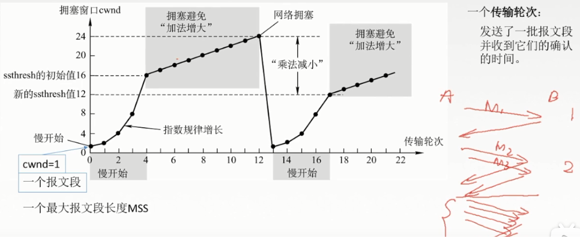

# 第一章 计算机网络

## 1.计算机网络概述

### 1.1 七层作用

应用层：应用层是网络体系中最高的一层，也是唯一面向用户的一层，也可视为为用户提供常用的应用程序。

表示层：主要负责数据格式的转换，编码转换，数据解析，管理数据的解密和加密。

会话层：负责网络中两节点的建立，维护计算机网络里两台计算机之间的通信连接，并决定何时终止通信。

传输层：保证数据可靠地从发送结点发送到目标结点，处理数据包的错误等传输问题。

网络层：进行IP寻址、路由选择、流量控制、连接的建立和终止等。

数据链路层：是处于网络层和物理层的传输服务，保证其可靠性。进行MAC寻址、链路控制、流量控制、差错控制。

物理层：主要是进行信号转换，将0/1这样的数字信号与电信号或者光信号互相转化，传输的格式是比特流。

### 1.2 套接字Socket

socket通常称为“套接字”，**用于描述IP地址和端口**，服务器和客户端通过socket进行交互，套接字之间的连接过程可以分为三个步骤：

1. 服务器监听：是服务器端套接字并不定位具体的客户端套接字，而是处于等待连接的状态，实时监控网络状态。
2. 客户端请求：是指由客户端的套接字向服务端的套接字发出连接请求。
3. 连接确认：是指当服务器端套接字监听到或者接收到客户端套接字的连接请求，它就会做出响应建立一个新的线程，把服务器端套接字的描述发给客户端，一旦客户端确认了此描述，连接就建立好了。而服务器端套接字继续处于监听状态，继续接收其他客户端套接字的连接请求。

### 1.3 Socket和http区别

**socket连接**：

- socket不属于协议范畴，而是一个**调用接口**，是对TCP/IP协议的封装。实现服务器与客户端之间的物理连接，并进行数据传输。
- socket连接是**长连接**，理论上客户端和服务器端一旦建立起连接将不会主动断掉。
- socket传输数据量小，可以加密，数据安全性高。

**http连接**：

- HTTP是基于TCP/IP协议的**应用层**协议，定义的是传输数据的内容的规范。
- HTTP**短连接**，即客户端向服务器端发送一次请求，服务器端响应后连接即会断掉。
- HTTP是**无状态**的协议，针对其无状态特性，在实际应用中又需要有状态的形式，因此一般会通过session/cookie技术来解决此问题。
- HTTP的传输速度慢，数据包大，数据传输安全性差。

### 1.4 socket和http的应用场景

- socket一般用于比较**即时的通信和实时性较高**的情况，比如推送，聊天，保持心跳长连接等
- http一般用于**实时性要求不那么高的情况**，比如信息反馈，图片上传，获取新闻信息等。

## 2.物理层

### 2.1 单工、半双攻、全双工

1.单工:数据只能往一个方向传输，不能实现双发通信。

2.半双工:它可以在两个方向上输，但不能同一时间只允许数据在一个方向传输。

3.全双工:可在信号载波的两个方向同时传输。

## 3.数据链路层

### 3.1 路由器和交换机的区别

**交换机：**

一个交换机有多个网口，计算机的网卡通过网线连接到交换机网口上，这个端口是一个确定的物理位置，交换机会根据数据包的mac地址找到他对应的物理端口，就能正确的把数据发给它。所以在交换机中有一张端口和mac地址的映射关系表。一个数据包有源mac和目标mac，交换机根据目标mac查找发出端口，如果查询到了就直接发送；如果没有查询到关联端口则向其他所有端口进行群发，这种行为称之为**“泛洪”**。由此可见，交换机只会关心数据包中的mac地址，而不会关心ip地址。

**路由器：**

路由器有LAN口和WAN口。LAN口可以有多个，用来接家庭网络设备；WAN口只有一个，用来接入运营商网络。 

路由器的LAN口和WAN口属于不同的子网，所以从内网访问互联网就是跨网络的行为，需要路由器担任网关的角色。

网关：子网划分就是把ip地址与子网掩码相与的结果。我们常用的子网掩码255.255.255.0，对应二进制就是11111111,11111111,11111111，00000000，所以其他ip地址与子网掩码按位与一定是前三个字节(24位)不变而最后一个字节是0。我们把（ip&子网掩码）结果相同的认为在同一子网中。

所以，子网1中的计算机A发送数据包时，首先计算机A会根据目标ip判断是否跟自己属于是同一个子网，是的话直接发出，不是的话需要把数据包的目标mac地址改为网关mac，然后发送给网关。网关拿到这一包数据通过路由表，查询到这包数据属于子网2，网关修改目标mac地址为计算机B的mac地址，修改源mac为自己的mac，再发出。以上的行为称之为**“路由“**。

> 路由器和交换机的区别：
>
> - 交换机主要是实现大家通过一根网线上网，但是大家上网是分别拨号的，各自使用自己的宽带，大家各自上网没有影响，哪怕其他人在下载，对自己上网也没有影响，并且所有使用同一条交换机的电脑都是在同一个局域网内。
> - 路由器比交换机多了一个虚拟拨号功能，通过同一台路由器上网的电脑是共用一个宽带账号，大家之间上网是相互影响的，比如一台电脑在下载，那么同一个路由器上的其他电脑会很明显的感觉到网速很慢。同一台路由器上的电脑也是在一个局域网内的。

### 3.2 ALOHA协议

**纯ALOHA协议工作原理**

- 任何一个站都可以在帧生成后立即发送（可能冲突），并通过信号的反馈检测信道以确定发送是否成功

- 如发送失败，则经随机延时后再发送

  

**时隙ALOHA工作原理**

- 时隙ALOHA是把时间分成时间片，时间片的长度对应一帧的传输时间


### 3.3 CSMA协议

CS：多个计算机在发送数据帧前，首先帧听是否空闲，如果空闲，则发送数据帧；否则等待，继续帧听直到信道空闲。

MA：许多计算机以多点接入方式连接在一根总线上，都有访问总线的权利。

协议思想：发送帧之前，监听信道

- CSMA/CA是对碰撞的避免
- CSMA/CD是对碰撞的检测

### 3.4 PPP协议

PPP是现在最流行的点对点链路控制协议，是为在同等单元之间传输数据包这样的简单链路设计的链路层协议，这种链路提供全双工操作，并按照顺序传递数据包。

- 简单：在同一条物理链路上进行点对点的数据传输，对数据链路层的帧不进行纠错，不需要序号，不需要流量控制。
- 封装成帧：加入帧界定符。
- 透明性：字节填充法。

- 多种网络层协议：在同一条物理链路上同时支持多种网络层协议的运行。

- 多种链路类型：PPP必须能够在多种类型的链路上运行，例如串行或并行链路。

- 差错检测：接收方收到一个帧后进行检验，若正确就收下，反之则丢弃。

- 检测连接状态：自动检测链路是否处于正常工作状态。

### 3.5 HDLC协议

HDLC就是一种面向比特的网络节点之间同步传输数据的数据链路层协议。用以实现远程用户间资源共享以及信息交互。HDLC协议用以保证传送到下一层的数据在传输过程中能够准确地被接收，也就是差错释放中没有任何损失，并且序列正确。HDLC协议的另一个重要功能是流量控制，即一旦接收端收到数据，便能立即进行传输。

- 对于任何一种比特流都可透明传输。
- 较高的数据链路传输效率。
- 所有的帧都有帧校验序列，传输可靠性高。
- 用统一的帧格式来实现传输。

## 4.网络层

### 4.1 IPv4

每一台接入互联网的计算机都有自己对应的ip地址，可以唯一标识一台主机。

### 4.2 IPv6

- IPv4协议具有32位（4字节）地址长度

  IPv6协议具有128位（16字节）地址长度

- IPv4协议的地址可以通过手动或DHCP配置的

  Pv6协议的地址自动配置

- Pv6提供身份验证和加密，但IPv4不提供。

- IPv4协议的数据包需要576个字节，碎片可选 。

  IPv6协议的数据包需要1280个字节，不会碎片

### 4.3 ARP协和RARP协议

**ARP即地址解析协议**：是根据IP地址获取物理地址

**RARP即逆地址解析协议：**功能和ARP协议相对，其将局域网中某个主机的物理地址转换为IP地址

ARP协议工作流程：

### 4.4 ICMP协议

一个新搭建好的网络，往往需要先进行一个简单的测试，来验证网络是否畅通；但是IP协议并不提供可靠传输。如果丢包了，IP协议并不能通知传输层是否丢包以及丢包的原因。 所以我们就需要一种协议来完成这样的功能ICMP协议。

### 4.5 Nginx

**正向代理：**

Nginx 不仅可以做反向代理，实现负载均衡。还能用作正向代理来进行上网等功能。
正向代理：如果把局域网外的 Internet 想象成一个巨大的资源库，则局域网中的客户端要访问 Internet，则需要通过代理服务器来访问，这种代理服务就称为正向代理。 

用途：

- 访问原来无法访问的资源，如google

- 可以做缓存，加速访问资源

- 对客户端访问授权，上网进行认证

- 代理可以记录用户访问记录（上网行为管理），对外隐藏用户信息

---

**反向代理**：

其实客户端对代理是无感知的，我们只需要将请求发送到反向代理服务器，由反向代理服务器去选择目标服务器获取数据后，在返回给客户端。此时反向代理服务器和目标服务器对外就是一个服务器，**暴露的是代理服务器地址**，**隐藏了真实服务器 IP 地址**。  


作用：

- 保证内网的安全，阻止web攻击，大型网站，通常将反向代理作为公网访问地址，Web服务器是内网

- 负载均衡，通过反向代理服务器来优化网站的负载

---

**负载均衡**

客户端发送多个请求到服务器，服务器处理完毕后，再将结果返回给客户端。这种架构模式对于早期的系统相对单一，并发请求相对较少的情况下是比较适合的，成本也低。但是随着信息数量的不断增长，访问量和数据量的飞速增长，以及系统业务的复杂度增加，这种架构在并发量特别大的时候，易造成服务器直接崩溃。
我们可以升级服务器的配置，比如提高 CPU 执行频率，加大内存等提高机器的物理性能来解决此问题，但是这种方法不是最好的解决方式。
这时候集群的概念产生了，**单个服务器解决不了，我们增加服务器的数量，然后将请求分发到各个服务器上，将原先请求集中到单个服务器上的情况改为将请求分发到多个服务器上，将负载分发到不同的服务器，也就是我们所说的负载均衡  。**

---

**动静分离**

为了加快网站的解析速度，可以把动态页面和静态页面由不同的服务器来解析，加快解析速度。降低原来单个服务器的压力。  

## 5.传输层

### 5.1 UDP协议

**UDP协议概要：**

1. 是无连接的（减少开销和发送数据的时延）

   进行发送或者接收的时候都没有向对方发出请求或者应答，而是直接发送，它并不关心数据是否到达。另外UDP并不会维护唯一的目的地址，它可以有目的地址通配，这就决定了UDP能够运用于广播和多播

2. 不保证可靠性，无拥塞控制，适合很多实时应用

   > 一次性不要传输太多，可能丢失

3. 是面向报文的，适合一次性传输少量数据。

   > 应用层给UDP多长的报文，UDP就会照常发送，所以太大的话传输到网络层可能还要分片

   发送端调用了几次write，接收端必须用相同次数的read读完。UPD是基于报文的，在接收的时候，每次最多只能读取一个报文，报文和报文是不会合并的，如果缓冲区小于报文长度，则多出的部分会被丢弃。

   原因：UDP是无连接的协议，也就是说只要知道接收端的IP和端口，且网络是可达的，任何主机都可以向接收端发送数据。这时候，如果一次能读取超过一个报文的数据，则会乱套。比如主机A向发送了报文P1，主机B发送了报文P2，如果能够读取超过一个报文的数据，那么就会将P1和P2的数据可能合并在一起。

**UDP首部格式：**

- 源端口和目的端口：一个16位，共占32位
- 16位UDP长度：UDP用户数据报的整个长度
- 16位UDP检验：检验整个UDP是否正确，错误抛弃

### 5.2 TCP协议

#### 5.2.1 TCP协议概要

1. TCP是面向连接的传输层协议。

   虚连接：非直接物理连接，不是把数据报加上各个层次的首部后放到链路传输

   面向连接的好处是一旦连接建立，每个报文的转发都很快，而且安全也容易保证，但容易出现单点故障。

   无连接的好处是没有建立连接的开销，对小数据量传输效率高，且因为每个报文独立路由，一个路由器出现故障不影响通信，但安全很难保证。

2. TCP提供可靠、有序、无差错的传输服务。

   校验、序号、重传、流量控制、拥塞控制

3. TCP是面向字节流的。

   通过TCP连接给另一端发送数据，我们可以只调用了一次write发送了100个字节，而对方可以分10次收完，每次10个字节；我们也可以调用10次write每次发送10个字节，假设发送的数据量不大于对方的接收缓存，这种情况下对方是可以一次就收完的。如果硬是要发送过量数据，则对方的缓存满了就会把多出的数据丢弃。

   TCP中的流是指流入进程或者从进程中流出的字节序列。所以向Java，golang等高级语言在进行TCP通信是都需要将相应的实体序列化才能进行传输。还有Redis底层网络通讯协议就是通过TCP完成的，所以需要将放入Redis的数据序列化才可以通信。

   原因：TCP是面向连接的，也就是说，在连接持续的过程中，socket中收到的数据都是由同一台主机发出的（劫持什么的不考虑），因此知道保证数据是有序的到达就行了，至于每次读取多少数据自己看着办。

4. TCP协议的通信是全双工的

   TCP协议允许通信双方的应用程序在任何时候都能发送数据。TCP 连接的两端都设有发送缓冲区和接收缓冲区，用来临时存放双向通信的数据。发送数据时，应用程序把数据传送给TCP的缓冲后，就可以做自己的事情，而TCP在合适的时候将数据发送出去。在接收的时候，TCP把收到的数据放入接收缓冲区，上层应用在合适的时候读取数据。

#### 5.2.2 TCP首部格式


- 源端口和目的端口：一个16位，共占32位
- 序号：传送的字节流中的每一个字节都按序编号，本字段表示报文段发送数据的第一个字节序号。
- 确认号：期望收到对方下一个报文段的第一个数据字节的序号。若确认号为N，则证明收到序号N-1为止的所有数据。
- 数据偏移（首部长度）：TCP首部长度。
- 确认位：TCP连接中的ACK。
- 同步位：TCP连接中的SYN。
- 终止位：TCP连接中的FIN。
- 窗口：根据接收方窗口大小调整发送缓存。
- 紧急位：表示紧急数据，不用排队。
- 紧急指针：表示紧急数据所在的位置。

#### 5.2.3 TCP可靠传输

1. **校验：**

   接收端对数据包进行一些位运算进行验证，**目的是检测数据在传输过程中的任何变化**。如果收到段的检验和有差错，TCP将丢弃这个报文段和不确认收到此报文段。

2. **确认应答+序号**

   TCP面向字节流，会把字节放在一起组成一个报文段发送出去，报文段大小划分取决于链路层的最大传输单元。

   客户端发送的报文字段含有字节序号，服务器收到客户端的报文段后会返回一个确认报文段，含有下一次传送报文的开头序号。

3. **重传**

   客户端在规定的时间内没有收到确认就要重传已发送的报文。

   - 重传时间：TCP采用了自适应算法，动态改变重传时间，是一种加权平均往返时间。
   - 冗余确认：每当客户端收到比期望序号大的报文时，发送一个冗余ACK，指明期望的下一个字节序号。

4. **流量控制**

   TCP使用滑动窗口实现流量控制。

   接收方每次收到数据包，可以在发送确定报文的时候，同时告诉发送方自己的缓存区还剩余多少是空闲的，我们也把缓存区的剩余大小称之为接收窗口大小，

   发送方收到之后，便会调整自己的发送速率，也就是调整自己发送窗口的大小，当发送方收到接收窗口的大小为0时，发送方就会停止发送数据，防止出现大量丢包情况的发生。

   **问题：**当发送方停止发送数据后，该怎样才能知道自己可以继续发送数据？

   我们可以采用这样的策略：当接收方处理好数据，接受窗口 win > 0 时，接收方发个通知报文去通知发送方，告诉他可以继续发送数据了。当发送方收到窗口大于0的报文时，就继续发送数据。不过这时候可能会遇到一个问题，假如接收方发送的通知报文，由于某种网络原因，这个报文丢失了，这时候就会引发一个问题：接收方发了通知报文后，继续等待发送方发送数据，而发送方则在等待接收方的通知报文，此时双方会陷入一种僵局。

   **解决：**我们采用了另外一种策略：当发送方收到接受窗口 win = 0 时，这时发送方停止发送报文，并且同时开启一个定时器，每隔一段时间就发个测试报文去询问接收方，打听是否可以继续发送数据了，如果可以，接收方就告诉他此时接受窗口的大小；如果接受窗口大小还是为0，则发送方再次刷新启动定时器。

5. **拥塞控制**

   对资源的需求总和小于可用资源的时候就会发生，比如链路带宽不够，需要拥塞控制防止过多数据注入网络中影响性能。

   由于讨论的是拥塞控制，那么假设发送窗口只受拥塞窗口（客户端根据估算网络拥塞程度而设置的窗口值）的影响，不受接收窗口（服务器根据接收缓存设置的值告知对方大小）的影响。

   - **慢开始、拥塞避免**：开始的时候先发送少量报文段，试探网络情况，如果网络情况较好就开始指数级别增加发送窗口。到慢开始沦陷值后进入拥塞避免，客户端发送的报文大小会变为线程增长，发现网络拥塞就重新从1开始，把拥塞窗口除2定位新的沦陷值。重复这样的操作.....



**快重传、快回复**：先还是慢开始，收到3个冗余ACK执行快重传算法，拥塞窗口不用降到1，而是降到收到3个冗余ACK时的拥塞窗口除以2的地方，然后线性加法增大拥塞窗口。


### 5.3 三次握手和四次挥手


**三次握手**：

SYN：同步序列编号（Synchronize Sequence Numbers），序列号、长度、数据内容

ACK：确认字符(Acknowledge character），序列号和长度

1、**客户端向服务器发出连接请求数据，一个SYN包。**客户端**同步已发送**状态，等待服务器的确认；

 2、服务器收到SYN包，**给客户端发送SYN/ACK包**，服务器进入**同步收到**状态；

  3、客户端收到SYN/ACK包，**向服务器发送新的ACK确认包**，此包发送完毕；客户端和服务器进**已建立连接**状态，通信成功，完成三次握手。

- 为什么需要握手？

  同步序列号，同步报文等。

  TCP有一个重要的特性就是可靠性，发一个消息给对方，需要对方做出响应，如果没有收到消息就需要不停重发。那么怎么判断消息发过去了？需要对每个消息做一个序列号，客户端和服务器通讯之前就要获取对方的序列号，三次握手就是用来获取序列号的。

- 为什么不是二次？

  为了防止已经失效的请求报文突然又传到服务器引起错误。

  假设两次握手建立连接，客户端向服务器发送了一个SYN包，由于网络原因没有到达服务器在中间某个网络节点产生了滞留，为了建立连接客户端会重复发送SYN包，这次的数据包正常送达，服务端恢复SYN+ACK包建立起了连接。但是第一包被阻塞的网络节点恢复正常，第一个SYN包又送达服务端，这是服务端会认为这是客户端发送的新的连接，又给客户端发送SYN+ACK包进入等待状态。服务端认为是两个连接，而客户端认为是一个连接，造成了状态不一致现象。

- 为什么不是四次？                                                                                                                                                                                                                                                                                                                                                                                                                                                                                                                                                                                                                                                                                                                                                                                                                                                                                                                                                                                                                                                                                                                                                                                                                                                                                                                                                                                                                                                                                                                                                                                                                                                                                                                                                                                                                                                                                                                                                                                                                                                                                                                                                                                                                                                                                                                                                                                                                                                                                                                                                                                                                                                                                                                                                                                                                                                                                                                   

  因为建立连接的时候TCP不允许半打开状态，客户端发送ACK之后关闭连接。而关连接的时候可以让连接处于半打开状态，符合协议的情况下可以让客户端长时间发送消息，并且Linux系统下永远不会对半打开状态设置超时时间，可以无限打开。

  还有就是经历了三次握手之后，就可以确保双方可以进行通信，没必要四次握手。

---

**四次挥手：**

客户端和服务端都可以发送请求连接关闭。

1. 客户端给服务端发送FIN包，自己进入**终止等待1状态**
2. 服务端收到FIN包，发送一份ACK包，自己进入关闭等待状态，客户端进入终止**等待2状态**（客户端收到服务到的ACK包）
3. 服务端发送一份FIN包，进入最后确认状态
4. 客户端收到后发送一份ACK包，进入超时等待状态。

客户端经过超时等待关闭连接，而服务端收到ACK包后立即关闭连接。

- 为什么Client要进入超时等待？

  这是为了保证对方已经收到ACK包。假设客户端发送完最后一个ACK包就释放了连接，一旦ACK包在网络中丢失服务端会一直停留在最后确认状态

- 为什么四次挥手？

  **因为TCP是全双工模式**，所以当客户端发出FIN报文段时，只是表示客户端已经没有数据要发送了。但此时客户端还是可以接受服务器的数据，当服务器发送ACK报文段时，表示它已经知道客户端没有数据发送了，但是服务器此时还是可以发送数据到客户端的。当服务器也发送了FIN报文段时，这个时候就表示服务器也没有数据要发送了，之后客户端返回ACK报文，进入超时等待，表示中断这次TCP连接。

### 5.4 最大传输单元和粘包

**最大传输单元：**

网络上调用send发送数据，假设数据大小为1024KB，下层会把这个1024KB的数据封装成多个TCP包进行发送，单个TCP每次打包1448字节的数据进行发送。

以太网最大数据帧是是1518字节，而以太网的帧头和帧尾一共18字节，剩下承载上层协议的地方就是Data域最大只剩1518-18=1500字节，这个值我们称为**MTU**

由于IP头是20字节，TCP头是20字节，所以单个TCP包实际传输的最大数据量就是1500-20=1460字节，这个值我们成为**MSS**。

而真实传输的数据是mss减去tcp12字节长度的选项时间戳，1460-12=1448字节

MSS就是TCP数据包每次能够传输的最大数据分段。为了达到最佳的传输效能TCP协议在建立连接的时候通常要协商双方的MSS值，通讯双方会根据双方提供的MSS值的最小值确定为这次连接的最大MSS值。

**什么是粘包、拆包**：


假设客户端分别发送了两个数据包，D1和D2给服务端，由于服务端一次读取到的字节数是不确定的，故可能存在以下情况：

- 服务端分别收到了D1和D2，没有粘包和拆包
- 服务端一次性收到了D1和D2，称为TCP粘包
- 服务端两次读取到了两个数据包，第一次读到了D1的完整部分和D2的部分数据，第二次读到了D2的剩余部分。 这称为TCP拆包
- 服务端两次读取到两个数据包，第一次是D1的部分，第二次是D1的剩余部分和D2的完整部分

**产生tcp粘包和拆包的原因**：

我们知道tcp是以流动的方式传输数据，传输的最小单位为一个报文段，连接层每次传输的数据有最大限制为MTU，一般是1500字节，超过这个量要分成多个报文段，mss则是这个最大限制减去IP头和TCP头，光是要传输的数据的大小，一般为1460字节。tcp为提高性能，发送端会将需要发送的数据发送到缓冲区，等待缓冲区满了之后，再将缓冲中的数据发送到接收方。同理，接收方也有缓冲区这样的机制，来接收数据。

发生TCP粘包、拆包主要是由于下面一些原因：

1. 接收方法不及时读取套接字缓冲区数据，这将发生粘包
2. 应用程序写入数据小于套接字缓冲区大小，网卡将应用多次写入的数据发送到网络上，这将会发生粘包。
3. 进行mss大小的TCP分段，当TCP报文长度-TCP头部长度>mss的时候将发生拆包。
4. 应用程序写入的数据大于套接字缓冲区大小，这将会发生拆包。

**解决：**

1. 使用带消息头的协议、消息头存储消息开始标识及消息长度信息，服务端获取消息头的时候解析出消息长度，然后向后读取该长度的内容。
2. 设置消息定长，例如每个报文固定200字节，如果不够，空位补空格
3. 设置消息边界，在包尾增加回车换行符进行分割
4. 更为复杂的协议，比如协议808,809协议。

**UDP是否存在粘包问题：**

UDP则是面向消息传输的，是有保护消息边界的，接收方一次只接受一条独立的信息，所以不存在粘包问题。

举个例子：有三个数据包，大小分别为2k、4k、6k，如果采用UDP发送的话，不管接受方的接收缓存有多大，我们必须要进行至少三次以上的发送才能把数据包发送完，但是使用TCP协议发送的话，我们只需要接受方的接收缓存有12k的大小，就可以一次把这3个数据包全部发送完毕。

## 6.应用层

### 6.1 DNS寻址过程

- 第一阶段：本地主机上

  在浏览器中输入www.xxx.com域名，操作系统检查本地hosts文件是否目标域名的映射关系，如果有，就调用这个IP地址映射，完成解析。

- 第二阶段：本地服务器上

  首先会找本地DNS服务器的配置资源区中寻找目标域名的映射关系，有则返回解析结果给客户机，完成域名解析，此解析具有权威性。

  如果没有找到就会在本地DNS服务器缓存中查找目标域名的映射关系，则完成域名解析，此解析不具有权威性。

- 第三阶段：网络服务器之间

  如果采用转发模式，本地DNS服务器就会把请求转发至上一级DNS服务器，如果上一级DNS服务器不能解析，则继续向上请求，完成解析。

  如果没有采用转发模式，本地DNS就把请求发至13台根DNS，根DNS服务器收到请求后，会判断这个域名是由谁管理的并返回一个负责该顶级域名的服务器IP给本地DNS服务器，本地DNS服务器收到顶级域名服务器IP后，继续向该顶级域名服务器IP发送请求。该服务器如果无法解析，则会找到负责目标域名的下一级DNS服务器IP给本地DNS服务器，循环往复直至查询到映射。

**递归查询：**

​	主机向本地域名服务器的查询一般都是采用递归查询。

​    所谓递归查询就是：如果主机所询问的本地域名服务器不知道被查询的域名的IP地址，那么本地域名服务器就以DNS客户的身份，向其它根域名服务器继续发出查询请求报文，而不是让主机自己进行下一步查询。因此，递归查询的查询结果是所要查询的IP地址，或者是报错，表示无法查询到所需的IP地址。

**迭代查询：**

​	本地域名服务器向根域名服务器的查询的迭代查询。

​	当根域名服务器收到本地域名服务器发出的迭代查询请求报文时，要么给出所要查询的IP地址，要么告诉本地服务器：“你下一步应当向哪一个域名服务器进行查询”。然后让本地服务器进行后续的查询。根域名服务器通常是把自己知道的顶级域名服务器的IP地址告诉本地域名服务器，让本地域名服务器再向顶级域名服务器查询。顶级域名服务器在收到本地域名服务器的查询请求后，要么给出所要查询的IP地址，要么告诉本地服务器下一步应当向哪一个权限域名服务器进行查询。最后，知道了所要解析的IP地址或报错，然后把这个结果返回给发起查询的主机。

**协议：**DNS在区域传输的时候使用TCP协议，其他时候使用UDP协议。

DNS区域传输的时候使用TCP协议：

- TCP是一种可靠连接，保证了数据的准确性。

域名解析时使用UDP协议：

- 客户端向DNS服务器查询域名，一般返回的内容都不超过512字节，用UDP传输即可。不用经过三次握手，这样DNS服务器负载更低，响应更快。

### 6.2 URI/URL/URN

URI包括URL和URN

URL：比如需要找到某网站的一个图片的URL是https://www.baidu.com/image1.jpg，那么可以根据这个地址找到这张图片；

URN：比如一张图片的标识符为0x011reoimage001，那么可以根据这个名称找到这个图片；

可以看粗，如果要用URN的方式需要给每一个资源制定一个表示，并为表示定制一个解析器，而这是很困难的，所以URN目前还是一种理想化的形式。

### 6.3 HTTP

客户端过点击超链接或者输入URL获取资源，这些资源通过http传输协议给使用者。

**步骤：**

1. DNS解析
2. TCP连接 
3. 客户端发送HTTP请求 
4. 服务器处理请求并返回HTTP报文 
5. 浏览器解析并渲染页面

**特点：**

- **无状态**：

  同一个客户端第二次访问服务器的时候，服务器的响应是和第一次访问一样的，每个请求都是独立的，没有记忆的。

  但常常服务器需要记住用户的身份，比如购物车。所以就有了Cookie和Session，Cookie 和 Session都是用来跟踪浏览器用户身份的会话方式，但是两者的应用场景不太一样。

  - Cookie是存储于用户主机的文本文件，实现一些功能，比如：
    1.  Cookie 中保存已经登录过得用户信息，下次访问网站的时候页面可以自动填写登录信息。
    2.  下次访问网站不需要重新登录，因为客户端被存放了一个 Token在Cookie 中，下次登录的时候只需要根据 Token 值来查找用户即可。
    3.  可以获取Cookie写爬虫绕过登录。

  - Session 数据保存在服务器端。
    1. 用户第一次请求服务器时，服务器端会生成一个sessionid并通过set-cookie将生成的sessionid返回给客户端。
    2. 客户端收到sessionid会将它保存在cookie中，当客户端再次访问服务端时会带上这个sessionid
    3. 当服务端再次接收到来自客户端的请求时，会先去检查是否存在sessionid，不存在就新建一个sessionid重复1,2的流程，如果存在就去遍历服务端的session文件，找到与这个sessionid相对应的文件，文件中的键便是sessionid，值为当前用户的一些信息。
    4. 此后的请求都会交换这个 Sessionid，进行有状态的会话。

- **短连接**：

  http采用TCP作为传输层协议，但Http本身是无连接的（通信双方在交换Http报文之前不需要先建立http连接）无连接的含义是限制每次连接只处理一个请求，服务器处理完客户的请求，并收到客户的应答后，即断开连接。采用这种方式可以节省传输时间。也称为短连接。

  而HTTP真正的连接，根据计算机网络体系的协议栈可知，是通过运输层的TCP协议实现的，下层向上层提供了可靠的连接，上层屏蔽了下层的具体实现，所有的操作均在可靠的连接基础之上。HTTP使用TCP的目的是为了保证数据传输的可靠性和完整性。

- **请求报文：**

  - 请求行：
    1. 请求方法：post，get，put，delete...
    2. 请求URL：index.html
    3. 版本
  - 请求头：
    1. 编码格式：gzip，utf-8
    2. 连接状态：keep-alive，close
    3. Host：访问的主机名（www.baidu.com）
    4. Accept
  - 请求体：如果get就没，post比如登录就有账号密码。

- **响应报文：**

  - 版本

  - 状态码：200、404、409请求资源与资源当前状态发生冲突、410表示服务器上的某个资源被永久性的删除、500服务器错误等

    1提示信息，2成功，3,重定向，4请求错误，5服务器错误

  - 响应体：相应数据

### 6.4 HTTPS

**HTTP 与 HTTPS 区别：**

1. http和https使用的是完全不同的连接方式，用的端口也不一样，前者是80，后者是443但是会从80端口拿数据。
2. http是超文本传输协议，信息是明文传输，https则是具有安全性的ssl加密传输协议。
3. https协议需要得到CA认证的申请证书，一般免费证书较少，因而需要一定费用。

### 6.5 SSL/TLS

SSL/TLS：安全套接层

**加密传输过程：**

1. 客户端提交支持加密算法列表
2. 服务器收到请求，从加密算法列表选一个加密套件下发，包含公钥数字证书等。
3. 客户端生成秘钥并用公钥加密发送给服务器，服务器使用私钥获取秘钥
4. 双方可以使用对称加密算法进行加密双向传输。

**加密方式：**

- **对称加密：**加密和解密时候用相同的秘钥进行位运算
- **非对称加密：**使用公钥加密，要使用私钥解密；使用私钥加密，要使用公钥解密。

**怎么知道数据被篡改：**

1. 拿到证书里面明文的hash算法并对内容进行hash运算，得到A 。
2. 用CA的公钥解密签名得到B 。
3. 比较A 和 B，如果相等，说明没有被篡改，否则浏览器提示证书不可信。

**为什么要对称加密：**

- 非对称加密的加解密效率是非常低的，而http的应用场景中通常端与端之间存在大量的交互，非对称加密的效率是无法接受的。
- 在 HTTPS 的场景中只有服务端保存了私钥，一对公私钥只能实现单向的加解密，所以 HTTPS 中内容传输加密采取的是对称加密，而不是非对称加密。

### 6.6 HTTP1.0/1.1/2.0

HTTP1.0最早在网页中使用是在1996年，那个时候只是使用一些较为简单的网页上和网络请求上，而HTTP1.1则在1999年才开始广泛应用于现在的各大浏览器网络请求中，同时HTTP1.1也是当前使用最为广泛的HTTP协议。 主要区别主要体现在：

1. **缓存处理**

   在HTTP1.0中主要使用header里的信息来做为缓存判断的标准，

   HTTP1.1则引入了更多的缓存控制策略例。

2. **带宽优化及网络连接的使用**

   HTTP1.0中，存在一些浪费带宽的现象，例如客户端只是需要某个对象的一部分，而服务器却将整个对象送过来了

   HTTP1.1则它允许只请求资源的某个部分，这样便于充分利用带宽和连接。

3. **错误通知的管理**

   在HTTP1.1中新增了24个错误状态响应码，如409表示请求资源与资源当前状态发生冲突；410表示服务器上的某个资源被永久性的删除。

4. **长连接**

   在HTTP1.1中默认开启Connection： keep-alive，一定程度上弥补了HTTP1.0每次请求都要创建连接的缺点

### 6.7 HTTP2

- **新的二进制格式：**

  HTTP1的解析是基于文本

  HTTP2.0的解析决定采用二进制格式，实现方便且健壮。

- **多路复用：**

  即连接共享，接收方可以根据request的id将request再归属到各自不同的服务端请求里面。

- **header压缩：**

  HTTP1的header带有大量信息，而且每次都要重复发送

  HTTP2.0减少需要传输的header大小，既避免了重复header的传输，又减小了需要传输的大小。

### 6.8 长连接、短连接

- **短连接：**在HTTP/1.0中默认使用短连接。也就是说，客户端和服务器每进行一次HTTP操作，就建立一次连接，任务结束就中断连接。当客户端浏览器访问的某个HTML或其他类型的Web页中包含有其他的Web资源（如JavaScript文件、图像文件、CSS文件等），每遇到这样一个Web资源，浏览器就会重新建立一个HTTP会话。

  **好处**：短连接对于服务器来说管理较为简单，存在的连接都是有用的连接，不需要额外的控制手段。

  **坏处：**但如果客户请求频繁，将在TCP的建立和关闭操作上浪费时间和带宽。

  **用处：**WEB网站的http服务一般都用短链接，因为长连接对于服务端来说会耗费一定的资源，像WEB网站这么频繁的成千上万甚至上亿客户端的连接用短连接会更省一些资源，如果用长连接，而且同时有成千上万的用户，如果每个用户都占用一个连接的话，会造成服务器压力过大的情况。所以并发量大，但每个用户无需频繁操作情况下需用短连好。

- **长连接：**从HTTP/1.1起，默认使用长连接，用以保持连接特性。使用长连接的HTTP协议，会在响应头加入这行代码：Connection:keep-alive

  在使用长连接的情况下，当一个网页打开完成后，客户端和服务器之间用于传输HTTP数据的TCP连接不会关闭，客户端再次访问这个服务器时，会继续使用这一条已经建立的连接。Keep-Alive不会永久保持连接，它有一个保持时间，可以在不同的服务器软件（如Apache）中设定这个时间。实现长连接需要客户端和服务端都支持长连接。

  **好处：**长连接可以省去较多的TCP建立和关闭的操作，减少浪费，节约时间。对于频繁请求资源的客户端适合使用长连接。

  **坏处：**在长连接的应用场景下，client端一般不会主动关闭连接，当client与server之间的连接一直不关闭，随着客户端连接越来越多，server会保持过多连接。这时候server端需要采取一些策略，如关闭一些长时间没有请求发生的连接，这样可以避免一些恶意连接导致server端服务受损；如果条件允许则可以限制每个客户端的最大长连接数，这样可以完全避免恶意的客户端拖垮整体后端服务。

  **用处：**长连接多用于操作频繁，点对点的通讯，而且连接数不能太多情况。每个TCP连接都需要三步握手，这需要时间，如果每个操作都是先连接，再操作的话那么处理速度会降低很多，所以每个操作完后都不断开，次处理时直接发送数据包就OK了。例如：数据库的连接用长连接， 如果用短连接频繁的通信会造成socket错误，而且频繁的socket 创建也是对资源的浪费。

HTTP协议的长连接和短连接，实质上是TCP协议的长连接和短连接。

# 第二章 计算机操作系统

## 1.操作系统概述

### 1.1 大内核和微内核

- 大内核，就是将操作系统的全部功能都放进内核里面，包括**调度、文件系统、网络、设备驱动器、存储管理**等等，组成一个紧密连接整体。大内核的优点就是效率高，但是很难定位bug，拓展性比较差，每次需要增加新的功能，都要将新的代码和原来的内核代码重新编译。
- 微内核只是将操作中最核心的功能加入内核，包括**地址空间分配、基本调度等**，这些东西都在内核态运行，其他功能作为模块被内核调用，并且是在用户空间运行。微内核比较好维护和拓展，但是效率可能不高，因为需要频繁地在内核态和用户态之间切换。

### 1.2 内核态和用户态

**内核态：**

不仅能访问用户存储空间，也能访问系统存储空间，可以使用特权指令（访问IO设备、内存清理、设置时钟、停机等）。

**用户态：**

它只能完成一般性的操作和任务，不能对系统中的硬件和软件直接进行访问，其对内存的访问范围也局限于用户空间。

### 1.3 分时系统和实时系统

- 分时系统就是系统把CPU时间分成很短的时间片，轮流地分配给多个作业。

  它的优点就是对多个用户的多个作业都能保证足够快的响应时间，并且有效提高了资源的利用率。

- 实时系统是系统对外部输入的信息，能够在规定的时间内处理完毕并做出反应。

  它的优点是能够集中地及时地处理并作出反应，高可靠性，安全性。

### 1.4 并发和并行

- 并发：指的是两个或者多个时间在**同一时间间隔内**发生。
- 并行：两个或者多个事件在**同一时刻**发生。

操作系统的并发性指的是计算机系统中同时存在着多个运行着的程序。

### 1.5 同步和异步

- 同步：同步**就是调用某个方法，调用方得等待这个调用返回结果才能继续往后执行**。

  这样用户在线等待的时间太长，给用户一种卡死了的感觉。

- 异步：异步和同步相反，**调用方不会等待得到结果**，而是在**调用发出后调用者可用继续执行后续操作**，**被调用者通过状体或通过回掉函数来处理这个调用**。


### 1.6 系统如何提高并发性

- 多进程&多线程

- 减少进程切换

- 减少使用不必要的锁

- 考虑进程优先级

- 改进I/O模型


### 1.7 进程控制块PCB

Process Control Block，进程控制块中的信息，里面有：

- **进程标识符**：描述进程的家族关系，设置父进程标识及子进程标识，还可设置用户标识，以指示拥有该进程的用户。

- 处理机状态信息：主要是由处理机的各种寄存器中的内容组成的，处理机被中断时，所有这些信息都必须保存在 PCB 中，以便在该进程重新执行时，能从断点继续执行。

- 进程调度信息：进程状态、进程优先级、进程调度所需的其它信息

- 进程控制信息：程序和数据的地址。

### 1.8 计算机64位和32位

1. 运行能力不同：

   64位可以一次性可以处理8个字节的数据量，而32位一次性只可以处理4个字节的数据量，因此64位比32位的运行能力提高了一倍。

2. 内存寻址不同：

   64位最大寻址空间为2的64次方，理论值直接达到了16TB，而32位的最大寻址空间为2的32次方，为4GB。

   换而言之，就是说32位系统的处理器最大只支持到4G内存，而64位系统最大支持的内存高达亿位数。  

3. 运行软件不同：

   由于32位和64位CPU的指令集是不同的。所以需要区分32位和64位版本的软件。
   为了保证兼容性，64位CPU上也能运行老的32位指令。于是实际上我们可以在64位CPU上运行32位程序，但是反过来不行。

   简而言之就是64位的操作系统可以兼容运行32位的软件，反过来32位系统不可以运行64位的软件。

## 2.进程和线程关

| 多进程                            | 多线程                            |
| --------------------------------- | --------------------------------- |
| 占用内存多，切换复杂，CPU利用率低 | 占用内存少，切换简单，CPU利用率高 |
| 创建销毁、切换复杂，速度慢        | 创建销毁、切换简单，速度快        |
| 进程间不会相互影响                | 一个线程挂掉将导致整个进程挂掉    |

### 2.1进程、线程、协程、轻量级进程

进程：指在系统中正在运行的一个应用程序。由于进程比较重量，占据独立的内存，所以上下文进程间的切换开销（栈、寄存器、虚拟内存、文件句柄等）比较大，但相对比较稳定安全。**进程——资源分配的最小单位。**

---

线程：系统分配处理器时间资源的基本单元，线程自己基本上不拥有系统资源,只拥有一点在运行中必不可少的资源(如程序计数器,一组寄存器和栈)，但是它可与同属一个进程的其他的线程共享进程所拥有的全部资源。线程间通信主要通过共享内存，上下文切换很快，资源开销较少，但相比进程不够稳定容易丢失数据。**线程——程序执行的最小单位**

---

协程：由线程创建的执行体，线程记录了它们的标识符、执行入口、执行现场等等。因为用户程序不能操作内核空间，所以只能给协程分配用户栈，而操作系统对协程一无所知，所以协程又被称为“用户态线程”。这样就通过协程实现了轻量级又灵活的由用户态进行调度的多任务模型。

---

轻量级进程：没有自己独立的地址空间

### 2.2进程状态


进程一共有5中状态，分别是创建、就绪、运行、阻塞、终止。

- 创建态→就绪态：系统完成创建检查的相关工作。

- **就绪态→运行态**：时间片分发到位，进程被调度。

- **运行态→阻塞态**：请求等待某个事件发生。调用了sleep方法，执行p操作，当前进程可能进入信号量队列而阻塞。
- **阻塞态→就绪态**：资源分配到位，等待的事件发生。
- **运行态→就绪态**：时间片用完，或CPU被其他优先级高的进程抢占。
- 运行态→终止态：进程运行结束，或遇到不可修复的错误

### 2.3阻塞和挂起

线程与进程的阻塞（被动）：

- 线程：阻塞状态的线程的特点是：该线程放弃CPU的使用，暂停运行，只有等到导致阻塞的原因消除之后才回复运行。

- 进程：正在执行的进程由于发生某种事件（如I/O请求、申请缓冲区失败等）暂时无法继续执行。此时引起进程调度，OS把处理机分配给另一个就绪进程，而让受阻进程处于暂停状态，一般将这种状态称为阻塞状态。

挂起（主动）：

挂起进程在操作系统中可以定义为暂时被淘汰出内存的进程，机器的资源是有限的，在资源不足的情况下，操作系统对在内存中的程序进行合理的安排，其中有的进程被暂时调离出内存但保留其PCB，当条件允许的时候，会被操作系统再次调回内存，重新进入等待被执行的状态即就绪态。

不同点： 

   - 对系统资源占用不同：虽然都释放了CPU，但阻塞的进程仍处于内存，挂起的进程通过“对换”技术被换出到外存中。 
   - 阻塞一般在进程等待资源（IO资源、信号量等）时发生；而挂起是由于用户和系统的需要如OS为了提高内存利用率需要将暂时不能运行的进程调出到外存。
   - 恢复时机不同：阻塞要在等待的资源得到满足（例如获得了锁）后，才会进入就绪状态，等待被调度而执行；被挂起的进程由将其挂起的对象（如用户、系统）在时机符合时将其主动激活。

### 2.4进程之间的通讯方式

**管道**（队列内核缓冲区）：

​	管道是半双工的，数据在同一时间只能向一个方向流动；如果需要双方通信时，需要建立起两个管道。

​	它实质是一个内核缓冲区，进程以先进先出的方式从缓冲区存取数据，管道一端的进程顺序的将数据写入缓冲区，另一端的进程则顺序的读出数据。


**命名管道**：

​	命名管道不同于管道的地方，在于它提供了一个路径名与之关联，命名管道的名字存在于文件系统中，但内容存放在内存中。

​	这样进程只要可以访问文件系统中的这个路径，就能够彼此通过命名管道相互通信。

**消息队列**（链表）：

​	消息队列允许一个或多个进程向它写入与读取消息，所以可以实现进程间的通讯方式。


**共享内存**：

​	每个进程在访问内存的时候都有一个虚拟内存地址和物理内存地址的映射，一般两个进程的虚拟地址可以一样但物理内存地址不一样，共享内存是让他们映射到同一片物理内存，就可以实现通信了。


**套接字：**

​	比如访问mysql数据库，通过3306端口。访问数据库的进程和数据库的进程就是通过3306这个端口建立起TCP的套接字。

**信号量**：

​	信号量是一个计数器，可以用来控制多个进程对共享资源的访问。

​	它是一种类似于锁的机制，就是防止某进程正在访问共享资源时，其他进程也访问该资源。 

- 对于自减P操作，如果执行操作后信号量小于 0，那么执行该操作的进程就会阻塞，否则继续执行；

- 对于自增V操作，如果操作之后的信号量小于等于0，那么就会从阻塞队列唤醒一个进程。

### 2.5进程之间的同步方式

**临界区：**

​	临界区是一段代码，在临界区内进程将访问临界资源，任何时候最多只有一个进程可以进入临界区。

**互斥量：**

​	使用一个互斥的变量来直接制约多个进程，每个进程只有拥有这个变量才具有访问公共资源的权限，因为互斥量只有一个，所以能保证资源的正确访问。

**信号量**：

​	信号量是一个整型变量，可以对其执行自增和自减操作，自减操作通常也叫做`P`操作，自增操作也称为`V`操作。这两个操作需要被设计成原语，是不可分割。

- 对于自减P操作，如果执行操作后信号量小于 0，那么执行该操作的进程就会阻塞，否则继续执行；
- 对于自增V操作，如果操作之后的信号量小于等于0，那么就会从阻塞队列唤醒一个进程。

 **管程：**

​	管程使用的是面向对象思想，将表示共享资源的数据结构还有相关的操作，包括同步机制，都集中并封装到一起。

​	所有进程都只能通过管程间接访问临界资源，而管程只允许一个进程进入并执行操作，从而实现进程互斥。

### 2.6孤儿进程、僵尸进程、守护进程

- 孤儿进程：就是说一个父进程退出，而他的一个或多个子进程还在运行，那么这些子进程将成为孤儿进程。

  孤儿进程将被init进程(进程ID为1的进程)所收养并掉它们完成状态收集工作，所以孤儿进程不会对系统造成危害。

- 僵尸进程：如果子进程已经结束，而父进程并没有调用wait()或waitpid()，那么子进程的进程描述符仍然保存在系统中，这种进程称为僵尸进程继续占用的资源。僵尸进程通过ps命令显示的状态为Z。如果要消灭系统中大量的僵尸进程，只需要将其父进程杀死，此时僵尸进程就会变成孤儿进程，从而被init进程所收养。

- 守护进程是运行在后台的一种特殊进程，他是独立于控制终端的，并周期性地执行某些任务。

### 2.7进程调度算法

- **先来先服务**：非抢占式的调度算法，按照请求的顺序进行调度。

  有利于长作业，但不利于短作业，因为短作业必须一直等待前面的长作业执行完毕才能执行，而长作业又需要执行很长时间，造成了短作业等待时间过长。

- **短作业优先**：非抢占式的调度算法，按估计运行时间最短的顺序进行调度。

  长作业有可能会饿死，处于一直等待短作业执行完毕的状态。因为如果一直有短作业到来，那么长作业永远得不到调度。

- **最短剩余时间优先**：最短作业优先的抢占式版本，按剩余运行时间的顺序进行调度。

  这种方式这种方式可以使新的短作业获得良好的服务。

- **时间片轮转**：将所有就绪进程按先来先服务的原则排成一个队列，每次调度时，把 CPU 时间分配给队首进程，该进程可以执行一个时间片。当时间片用完时，由计时器发出时钟中断，调度程序便停止该进程的执行，并将它送往就绪队列的末尾，同时继续把 CPU时间分配给队首的进程。

- **优先级调度**：为每个进程分配一个优先级，按优先级进行调度。

**延伸问题：什么是抢占式调度？什么是非抢占式调度？**

- **抢占式**就是操作系统将正在运行的进程强行暂停，由调度器将CPU分配给其他就绪进程。
- **非抢占式**就是操作系统让进程后一直运行下去，直到进程运行完成或发生进程调度事件而阻塞时，才把处理机分配给另一个进程

### 2.8哲学家进餐、死锁


**哲学家进餐：**

有五个哲学家，他们的生活方式是交替地进行思考和进餐。他们共用一张圆桌，分别坐在五张椅子上。

在圆桌上有五个碗和五支筷子，平时一个哲学家进行思考，饥饿时便试图取用其左、右最靠近他的筷子，只有在他拿到两支筷子时才能进餐。进餐完毕，放下筷子又继续思考。

- 破坏死锁四大必要条件之一——破坏循环等待条件：最多只允许四位哲学家同时去拿左筷子，最终能保证至少有一位哲学家能进餐，并在用完后释放两只筷子供他人使用。
- 破坏死锁四大必要条件之一——破坏请求和保持条件：仅当哲学家的左右手筷子都拿起时才允许进餐，不会出现某个哲学家拿一个筷子等一个筷子的情况，必须同时拿两个！
- 方法三：规定奇数号哲学家先拿左筷子再拿右筷子，而偶数号哲学家相反。

**产生条件：**

1. 互斥条件：一个资源每次只能被一个进程使用。
2. 请求与保持条件：一个进程因请求资源而阻塞时，对已获得的资源保持不放。
3. 不可剥夺条件：对进程已获得的资源，在末使用完之前，不能强行剥夺。
4. 循环等待条件：若干进程之间形成一种头尾相接的循环等待资源关系。

**解决死锁：**

**1、死锁预防 ----- 确保系统永远不会进入死锁状态**
产生死锁需要四个条件，那么只要这四个条件中至少有一个条件得不到满足，就不可能发生死锁了。

由于互斥条件是非共享资源所必须的，不仅不能改变，还应加以保证，所以，主要是破坏产生死锁的其他三个条件。

- 破坏“请求与保持“条件
      方法1：所有的进程在开始运行之前，必须一次性地申请其在整个运行过程中所需要的全部资源。

  > 优点：简单易实施且安全。
  > 缺点：因为某项资源不满足，进程无法启动，而其他已经满足了的资源也不会得到利用，严重降低了资源的利用率，使进程经常发生饥饿现象。

  ​     方法2：允许进程只获得运行初期需要的资源便开始运行，在运行过程中逐步释放掉分配到的已经使用完毕的资源，然后再去请求新的资源。

- 破坏“不剥夺”条件
      当一个已经持有一些资源的进程在提出新的资源请求没有得到满足时，它必须释放已经保持的所有资源，待以后需要使用的时候再重新申请。

  > 该种方法实现起来比较复杂，且代价也比较大。
  >
  > 释放已经保持的资源很有可能会导致进程之前的工作实效等，反复的申请和释放资源这不仅会延长进程的周转周期，还会影响系统的吞吐量。

- 破坏“循环等待”条件
      可以将每个资源进行编号，避免头尾相接。

**2、避免死锁 ----- 在使用前进行判断，只允许不会产生死锁的进程申请资源**
通常用到的是银行家算法。

**3、死锁检测与解除 **

如果利用死锁检测算法检测出系统已经出现了死锁 ，那么此时就需要对系统采取相应的措施。

- 抢占资源：从一个或多个进程中抢占足够数量的资源分配给死锁进程，以解除死锁状态。
- 终止进程：终止系统中的一个或多个死锁进程，直至打破死锁状态。

### 2.9线程和进程的切换开销

- 进程： 一个程序进行起来后，会使用很多资源，比如使用寄存器，内存，文件等。每当切换进程时，必须要考虑保存当前进程的状态。状态包括存放在内存中的程序的代码和数据，它的栈、通用目的寄存器的内容、程序计数器、环境变量以及打开的文件描述符的集合，这个状态叫做上下文（Context）。可见，想要切换进程，保存的状态还不少。
- 同样线程有自己的上下文，包括唯一的整数线程ID， 栈、栈指针、程序计数器等。可以理解为线程上下文是进程上下文的子集。

## 3.内存相关

### 3.1内存扩充技术

- 覆盖技术：比如程序中不能同时被访问的程序段A为10K，B为8K，那么可以让他们共享一个大小为10K的覆盖区。
- 交换技术：当运行内存不够的时候，可以将某些进程保存PCB后，暂时换出到外存（挂起），把外存中的某些已具备运行条件的进程换入内存。

### 3.2内存传统管理方式

1. 连续分配方式：

   - 单一连续分配：内存被分为系统区和用户区，内存空间中只能有一道用户程序。

     优点是无外部碎片且易实现，缺点是有内部碎片且只能用于单用户、单任务的操作系统中。

   - 固定内存分配：将用户区分为若干个大小固定的分区，在每个分区中装入一道作业。

     优点是无外部碎片且易实现，缺点是会产生内部碎片且利用率低。

   - 动态分区分配：不会预先划分内存分区，而是在进程装入内存时根据进程大小动态建立内存。

     优点是无内部碎片且灵活，缺点是会产生外部碎片。

2.非连续分配方式：

- 页式存储：连续分配方式会形成许多“碎片”，虽然可通过“紧凑”方法将许多碎片拼接成可用的大块空间，但须为之付出很大开销，则可以将一个进程直接分散地装入到许多不相邻的分区中，提高内存利用率。

  优点是提高空间利用率且不会产生外部碎片，只有少量页内碎片，缺点是不方便实现信息共享和保护。

- 分段存储：引入分段存储管理方式的目的主要是为了满足用户程序员在编程和使用上多方面的要求，把程序按内容或过程函数关系分成段，每段有自己的名字

  优点是方便实现信息共享和保护，缺点是如果段长过大为其分配连续空间不方便且可能产生外部碎片。

- 段页式存储：即先将用户程序分成若干个段，再把每个段分成若干个页，并为每一个段赋予一个段名。

### 3.3虚拟内存管理方式

传统管理特点：

- 一次性：作业必须一次性全部装入后才开始运作，可能导致大作业装不下无法运行，比如60G游戏不能运行在4G内存中。
- 驻留性：一旦作业被装入内存就会一直驻留在内存中，直到作业运行结束。事实上，在一个时间段内可能只需要访问作业的一小部分内存数据就可以运行，就导致了浪费内存资源。

局部性原理：

- 时间局部性：如果程序执行了某条指令，那么不久后这条指令可能再次被执行；如果某个数据被访问过，那么不久这个数据可能再次被访问。
- 空间局部性：程序访问了某个存储单元后，不久后可能访问其附近的存储单元。

虚拟内存技术：基于局部性原理，在程序装入时，可以将程序中很快会用到的部分装入内存，暂时用不到的部分留在外存, 就可以让程序开始执行。在程序执行过程中，当所访问的信息不在内存时，由操作系统负责将所需信息从外存调入内存，然后继续 执行程序。若内存空间不够，由操作系统负责将内存中暂时用不到的信息换出到外存。在操作系统的管理下，在用户看来似乎有一个比实际内存大得多的内存，这就是虚拟内存。

### 3.4页面置换算法

地址映射过程中，若在页面中发现所要访问的页面不在内存中，则产生缺页中断。当发生缺页中断时，如果操作系统内存中没有空闲页面，则操作系统必须在内存选择一个页面将其移出内存，以便为即将调入的页面让出空间。而用来选择淘汰哪一页的规则叫做页面置换算法。

1. 最佳置换算法（OPT）：

   从主存中移出永远不再需要的页面；如果没有这样的页面存在，则选择最长时间不需要访问的页面。所选择的被淘汰页面将是以后永不使用的，或者是在最长时间内不再被访问的页面，这样可以保证获得最低的缺页率。 

2. 先进先出置换算法（FIFO）：

   是最简单的页面置换算法。这种算法的基本思想是：当需要淘汰一个页面时，总是选择驻留主存时间最长的页面进行淘汰，即先进入主存的页面先淘汰。其理由是：最早调入主存的页面不再被使用的可能性最大。 

3. 时钟置换算法（CLOCK)）：

   将所有页面保存在一个类似时钟面环形链表中，一个表针指向最老的页面。当发生中断时，同第二次机会置换一样，如果R位为0，则插入新页面，并把表针移动一个位置。如果R位为1,就清除R位同时移动表针。

4. **最近最久未使用（LRU）算法**：

   这种算法的基本思想是：利用局部性原理，根据一个作业在执行过程中过去的页面访问历史来推测未来的行为。它认为过去一段时间里不曾被访问过的页面，在最近的将来可能也不会再被访问。所以，这种算法的实质是：当需要淘汰一个页面时，总是选择在最近一段时间内最久不用的页面予以淘汰。 

   底层数据结构是hash表+双向链表，用哈希表来辅助维护里面的节点位置，在Redis中也有用到。

   - 插入：先看看哈希表里有键值冲突，没有的话冲突，用键值新构造一个节点，插入到链表中，并移到链表头，再看看有没有越界，越了的话要把尾部节点删除；同时放入哈希表中。有的话冲突，用新值代替旧值，然后移到链表头。

   - 读取：判断键对应的节点存不存在，存在的话读值并把节点移到头部。其中涉及到把节点移到链表头、删除链表尾的操作。

## 4.磁盘和IO模型

### 4.1 有哪些磁盘调度算法

- 先来先服务：按照磁盘请求的顺序进行调度。

  优点是公平和简单。缺点也很明显，因为未对寻道做任何优化，使平均寻道时间可能较长。

- 最短寻道时间优先：优先调度与当前磁头所在磁道距离最近的磁道。

  虽然平均寻道时间比较低，但是不够公平。如果新到达的磁道请求总是比一个在等待的磁道请求近，那么在等待的磁道请求会一直等待下去，也就是出现饥饿现象。一般来说，两端的磁道请求更容易出现饥饿现象。

- 电梯算法：电梯算法就是说读写磁头总是保持一个方向运行，直到该方向没有请求为止，然后改变运行方向。

  因为考虑了移动方向，因此所有的磁盘请求都会被满足，解决了最短寻道时间优先的饥饿问题。

### 4.2 硬链接和软链接

- 硬链接(hard link)：A是B的硬链接，则A的目录项中的inode（文件在文件系统上的唯一标识）节点号与B的目录项中的inode节点号相同，即一个inode节点对应两个不同的文件名，两个文件名指向同一个文件。A和B对文件系统来说是完全平等的。如果删除了其中一个，对另外一个没有影响。

- 软链接(soft link)：A是B的软链接（A和B都是文件名），A的目录项中的inode节点号与B的目录项中的inode节点号不相同，A和B指向的是两个不同的inode，继而指向两块不同的数据块。A和B之间是“主从”关系，如果B被删除了，A仍然存在（因为两个是不同的文件），但指向的是一个无效的链接。A被删除，那么B就变成了死链接。

### 4.3 IO同步和异步

在IO模型里面如果请求方从发起请求到完成的这一段过程中都需要自己参与，那么这种我们称为同步请求；

反之，如果请求方发送完指令后就不再参与过程了，只需要等待最终完成结果的通知，那么这就属于异步。

### 4.4 IO模型有哪些

- BIO（blocking IO）：同步并阻塞，就是当应用B发起读取数据申请时，在内核数据没有准备好之前，应用B会一直处于等待数据状态，直到内核把数据准备好了交给应用B才结束。

- NIO（nonblocking IO）：同步非阻塞，非阻塞IO就是当应用B发起读取数据申请时，如果内核数据没有准备好会即刻告诉应用B，不会让B在这里等待。

  > 如果在并发的环境下，可能会有成百上千的人向应用发送消息，这种情况下我们的应用就必须创建成百上千个线程去读取数据，每个线程都会请求数据，先不说服务器能不能扛得住这么多线程，就算扛得住那么很明显这种方式也太浪费资源。所以，我们提供一种方式，可以由线程监控多个网络请求，这样就可以只需要一个或几个线程就可以完成数据状态询问的操作，当有数据准备就绪之后再分配对应的线程去读取数据。这么做就可以节省出大量的线程资源出来，这个就是IO复用模型的思路。

- IO复用模型（IO multiplexing）：系统提供了一种函数可以同时监控多个网络请求的操作，这种函数就是我们常说到的select、poll、epoll函数。应用线程通过调用select函数就可以同时监控多个网络请求，多个网络请求中只要有任何一个数据状态准备就绪了，select函数就会返回可读状态，这时再去通知读取数据的线程。

  > 复用IO模型解决了一个线程可以监控多个网络请求的问题，但是select是采用轮询的方式来监控多个网络请求的，但是因为大部分情况下的轮询都是无效的，所以我们可以总是去问你是否数据准备就绪，而是发出请求后等你数据准备好了就通知我，所以就衍生了信号驱动IO模型。

- 信号驱动IO（signal driven IO）：让读取数据线程和内核数据区建立一个SIGIO的信号联系，当内核数据准备好之后再通过SIGIO信号通知读取数据线程，当线程收到可读状态的信号后，此时再向内核发起读取数据的请求。

  > 通过观察我们发现，不管是IO复用还是信号驱动，我们要读取一个数据总是要发起两阶段的请求，第一次发送询问数据状态是否准备好，第二次发送recevform请求读取数据。我们想只要发送一个请求我告诉内核我要读取数据，然后我就什么都不管了，然后内核去帮我去完成剩下的所有事情，所以就衍生了异步IO。

- AIO（asynchronous IO）：异步IO，用只需要向内核发送一个read 请求，告诉内核它要读取数据后即刻返回；内核收到请求后会建立一个信号联系，当数据准备就绪，内核会主动把数据从内核复制到用户空间。这种方式线程只向内核发起了一次请求。    

### 4.5 select/poll/epoll

每一个网络连接在Linux下都是文件描述符的形式，

**select：**参数rset是一个**bitmap**，它的大小1024，所以一个bitmap可以监听1024个文件描述符。它能够确定监听文件描述符，我们的程序运行在用户态空间的，select函数运行的时候会把用户态空间的rset拷贝到内核态，内核判断每一个文件描述符是否有数据准备好，内核态效率高。没有数据准备好的话会一直阻塞。有数据准备好的话select函数首先会将准备好数据的fd置位，然后返回。但是我们不知道是哪几个fd被置位了，所以我们需要通过遍历（O(n)）确定是哪一个fd被置位，可以把它的数据读出来。

**poll：**有一个pollfd的结构体，poll函数中传入的是pollfd的**数组**。当数据准备好后悔给pollfd中的revents进行置位，然后poll方法返回，之后读处理函数会把revents恢复成0。解决了select函数的fdset不可重用和bitmap只能存储1024个字节的容量问题。（O(n)）

**epoll：**epfd是由**红黑树**实现的，它是内核态用户态共享的，数据没准备好的时候它和select、poll一样是阻塞的。数据准备好，epoll函数就会重排，将数据准备好的fd放到最前面的位置，并且触发函数的计数器进行++，可以得到一共有多少个fd准备好了数据，所以它的遍历复杂度是O(1)。

## 5.Linux

### 5.1 chmod 777/755/644

Linux文件权限一共有9位数字，前三位表示文件所有者权限，中间三位表示同组用户权限，最后三位表示其他用户权限

而chmod后面三个数组分别表示前三位的和，中间三位的和，最后三位的和。

而具体的权限是由数字决定的，4代表读取权限、2代表写入权限、1代表执行权限，所以可以通过4、2、1的组合得到几种权限。

- 775就是：

  所有者具有读取、写入、执行；

  同组用户具有读取、写入、执行；

  其他用户具有读取、执行权限；

- 777就是：

  所有者具有读取、写入、执行；

  同组用户具有读取、写入、执行；

  其他用户具有读取、写入、执行；

- 644就是：

  所有者具有读取、写入；

  同组用户具有读取；

  其他用户具有读取；

# 第三章 数据库

## 1.三大范式

- 第一范式：要求任何一张表必须有主键，每一个字段原子性不可再分。

- 第二范式：建立在第一范式的基础之上，要求所有非主键字段完全依赖主键，不要产生部分依赖。（消除第一范式部分依赖）

  > 学生编号+教师编号(pk)		学生姓名  教师姓名
  >
  > 1001			001				张三			王老师
  > 1002			002				李四			赵老师
  > 1003			001				王五			王老师
  > 1001			002				张三			赵老师
  >
  > 产生了部分依赖，学生依赖学生编号，教师依赖教师编号，正确的方式是“多对多，三张表，关系表俩外键”
  >
  > ---
  >
  > ​	学生表
  > ​	学生编号(pk)		学生名字
  >
  > ​	1001					张三
  > ​	1002					李四
  > ​	1003					王五	
  >
  > ------
  >
  > ​	教师表
  > ​	教师编号(pk)		教师姓名
  >
  > ​	001					王老师
  > ​	002					赵老师
  >
  > ------
  >
  > ​	学生教师关系表
  > ​	id(pk)			学生编号(fk)			教师编号(fk)
  >
  > ​	1						1001						001
  > ​	2						1002						002
  > ​	3						1003						001
  > ​	4						1001						002

- 第三范式：建立在第二范式的基础之上，要求所有非主键字段直接依赖主键，不要产生传递依赖。（消除第一范式传递依赖）

  > 学生编号（PK） 学生姓名 班级编号  班级名称
  >
  > ​	1001				张三		01			一年一班
  > ​	1002				李四		02			一年二班
  > ​	1003				王五		03			一年三班
  > ​	1004				赵六		03			一年三班
  >
  > 一年一班依赖01，01依赖1001，产生了传递依赖。

设计数据库表的时候，按照以上的范式进行，可以避免表中数据的冗余，空间的浪费。

## 2.索引

​	单一索引：一个字段上添加索引。
​	复合索引：两个字段或者更多的字段上添加索引。

​	主键索引：主键上添加索引。
​	唯一性索引：具有unique约束的字段上添加索引。

### 2.1 索引原理

在任何数据库中主键和被unique约束列都会自动添加索引对象，也会自动创建索引对象，索引底层是一个B+树。

不用hash索引是因为hash值是无序的，既然是无序的那么就不能提供范围查找，因为数据库里面有很多大于、小于、排序等操作。

不用平衡二叉树是因为随着树的高度查找速度就会变得越来越慢，最致命的问题是如果要查找大于某个数的操作它要进行回旋操作，这样会遍历很多无关的节点。

不用B树是因为尽管B树的高度比较矮，查找速度就会比平衡二叉树快，但是它还是存在回旋的问题。

使用B+树的原因是B+树的叶子节点被一个单向链表串联，而且它的叶子节点存放着非叶子节点的值，而且它已经帮我们排好序了。

### 2.2 索引失效

原理：在联合索引（a，b）中，我们可以发现叶子节点中a字段都是有序的，而b字段都是无序的。但是a字段相同的情况下，b字段有序。


最佳左前缀：即最左优先，在检索数据时从联合索引的最左边开始匹配。

- 使用复合索引的时候，使用右边的列进行查找，索引失效

  如果使用左边的列进行查找，由于a字段在B+树上是有序的，我们可以通过二分法查找到a字段，因为在a相等的条件下b也是有序的，我们就可以在a的基础上用二分查找法查找这个b，这种情况下b也是有序的所有也可以查找到。

  如果使用右边的列进行查找，就相当于在联合索引（a，b）把a干掉了，在没有a的情况下b是无序的，所以索引就会失效。

- 范围查找大于号的右边，索引失效。（a>1 and b=1）

  因为a>1的数据不止一个，可能有2,3等等，因此大于1对应的这些b数据是没有顺序的，所以索引失效。

- 模糊匹配当中以“%”开头，索引失效。

  因为以%开头的数据可能有多个，也就是说有多个a的情况下a不确定到底是几，就也不遵循最佳左前缀法则，索引失效。

- 如果使用or的时候只有一边有索引，索引失效。

- 使用in，索引失效。

- 在where当中索引列参加了运算，索引失效。

- 在where当中索引列使用了函数，索引失效。

索引失效还会把行锁升级成表锁。

### 2.3 聚簇索引和非聚簇索引


---

**聚簇索引：**将数据和索引放在了一起，索引结构的**叶子节点保存了行数据**。

**规则：**聚簇索引默认是主键；如果表中没有主键，InnoDB会选择一个唯一的非空索引代替；如果没有这样的索引，InnoDB会在内部生成一个隐式的聚簇索引。而聚簇索引之上创建的索引（像复合索引、前缀索引、唯一索引等等）称之为**辅助索引**。

**查找过程：**根据聚簇索引查找直接通过叶子节点就可以找到存储的数据，而辅助索引需要先查找到叶子结点存储的主键key，再通过key找到对应的数据。

---

**非聚簇索引**：将数据和索引分为两个部分进行存储，索引结构的**叶子节点指向了数据对应的位置**。

**查找过程**：通过叶子节点的指针在对应数据文件中找到对应数据的

---

### 2.4 建立索引原则

1. 对于查询频率高的字段创建索引；
2. 表的主键、外键必须有索引
3. 索引的数目不宜太多
4. 单表数据太少，不适合建索引
5. 索引字段不能太长
6. 不能用性别当做索引
7. 联合索引的建立需要进行仔细分析，可能引起索引失效。

### 2.5 不建议性别做索引

因为访问索引需要付出额外的IO开销，从索引中拿到的只是地址，要想真正访问到数据还是要对表进行一次IO。假如你要从表的100万行数据中取几个数据，那么利用索引迅速定位，访问索引的这IO开销就非常值了。但如果你是从100万行数据中取50万行数据，就比如性别字段，那你相对需要访问50万次索引，再访问50万次表，加起来的开销并不会比直接对表进行一次完整扫描小。

当然凡事不是绝对，如果把性别字段设为表的聚集索引，那么就肯定能加快大约一半该字段的查询速度了。聚集索引指的是表本身中数据按哪个字段的值来进行排序。因此，聚集索引只能有一个，而且使用聚集索引不会付出额外IO开销。当然你得能舍得把聚集索引这么宝贵资源用到性别字段上。

### 2.6 索引字段不益过长

身份证号id_code是一个比较长的字符串，每个索引都存储这个值，在数据量大，内存珍贵的情况下，MySQL有限的缓冲区，存储的索引与数据会减少，磁盘IO的概率会增加。同时，索引占用的磁盘空间也会增加。

### 2.7 text字段上添加索引

全文索引，elasticSearch。

## 3.事务

一个事务其实就是一个完整的业务逻辑，是一个最小的工作单元，不可再分。

开启事务：

```mysql
Start stransaction
执行的Sql语句
commit
```

### 3.1 原子性

事务是不可再分的最小工作单元 

undo log实现的。

原子性的体现主要是在回滚方面。当事务对数据库进行修改的时候，InnoDB就会生成对应的undo log日志，它会记录sql执行的相关信息，如果sql出错那么就会回滚到之前的状态，InnoDB会根据undo log的内容去做相反的工作。

### 3.2 持久性

一个事务一旦提交，他对数据库的改变就是永久性的。

redo log实现的。

数据库的数据进行修改的时候，不但要经过buffer还要把这次操作记录到redo log中，如果mysql宕机了那么还有redo log可以去恢复数据。而且redo log还是一种预写式日志，会将所有的修改先写入到日志中再更新到buffer里面，这样就保证了持久性。另外redo log写入数据到磁盘的速度比直接将buffer的数据写入到磁盘的速度快，主要有两个原因：①是buffer中的数据持久化是随机写的io，每次修改数据的位置都是随机的；但是redo log它是追加模式，它属于一种顺序io的操作。②是buffer数据持久化是以这个数据页page为单位的，mysql默认page页大小为16k，一个数据页小小的修改要把整个数据页写入，而redo log只用写入真正的需要写入的部分就可以了，无效io也就大大减少了。

redo log持久化机制有三个策略：①表示当事务提交的时候，并不将缓存区的redo log写入磁盘的日志文件，而是等待主线程每秒刷新进行同步。②事务提交时候会把缓存区的redo log日志同步写入磁盘中。③事务提交的时候会把缓存区的redo log日志异步写入到磁盘中。

### 3.3 隔离性

通过加锁和MVCC实现的。

A事务和B事务之间具有一定的隔离。

问题：

- 脏读：发生在一个事务A读取了被另一个事务B修改，但是还未提交的数据。

  比如银行取钱，一共1000块，事务B开启事务-->取走100块，但是没有提交。此时事务A读取的还是1000块。

- 不可重复读：同样的条件, 读取过的数据，再次读取出来发现值不一样了（update）

  比如事务A查询学生表id为1的学生名称为张三，事务B把id为1的学生名称改为了李四，事务A再次查询后发现id为1的学生名称变成了李四。对于事务A来说，他没有对名字做出调整，按照预期处理事务没结束前，无论查询多少遍都应该是张三，这就是可重复读。但是这个例子事务B对数据进行调整影响到了事务A，导致了事务A第一次查询到的是张三，而之后查询到的是李四，所以是不重复的，是不可重读。

- 幻读：数据条数变化，同样的条件，第1次和第2次读出来的记录数不一样（insert、delete）

  事务A-->清空了学生表的所有信息，此时事务B插入了一条学生数据。此时切换回事物A，对于事物A来说它清空了表按照预期表应该没有任何数据，但是它此时它一查发现了还有一条数据，这就是幻读，就好像发生了幻觉一样。

#### 3.3.1 隔离级别

- 读未提交：事务A可以读取到事务B未提交的数据。

- 读已提交：事务A只能读取到事务B提交之后的数据，解决了脏读。

- 可重复读：可重复读取是事务A开启之后，不管是多久，每一次在事务A中读取到的数据都是一致的，解决了不可重复读。

  可能出现幻读，但是InnoDB通过MVCC解决了这个问题。

- 可串行读：serializable

  吞吐量和并发性最低的，因为会在读取数据时候加入读锁，加入读锁其他线程会阻塞。

#### 3.3.2 锁

**按锁粒度分类：**

- 行级锁：

  行级锁是锁定粒度最细的一种锁。表示只针对当前操作的行进行加锁。

  缺点：开销大，加锁慢，会出现死锁。

  优点：发生锁冲突的概率最低，并发度也最高。

  ```mysql
  select .. in share model;//共享锁
  select .. for update;//独占锁
  ```

  索引失效会把行锁升级成表锁。

- 表级锁

  表级锁是锁定粒度最大的一种锁，表示对当前操作的整张表加锁。

  缺点：发生锁冲突的概率最高，并发度也最低。

  优点：它实现简单，开销小，加锁快，不会出现死锁，被大部分mysql引擎支持。

  ```mysql
  lock table table_name read//共享读锁，会阻塞写
  lock table table_name write//独占写锁，会阻塞读
  unlock  tables//释放锁
  ```

- 间隙锁

  数据库id只有1,3,5，范围查询1-5，就不能插入id为2,4。

- 页级锁

  页级锁是锁定粒度介于行级锁和表级锁中间的一种锁。

  优点：表级锁速度快

  缺点：但冲突多，会出现死锁，但速度慢。

**锁级别分类：**

- 读锁：

  读锁是共享锁，所有事务可以并发读取数据，但任何事务更新表会阻塞

  ```mysql
  lock table my_student read;
  ```

- 写锁：

  写锁是独占锁，当前事务可以进行读写，则其他事务不能读写

  ```mysql
  lock table my_student write;
  ```

- 意向锁：

  意向锁是表级锁。

  事务A锁住了表中的一行为只读。之后事务B申请整个表的写锁，事务B就会被阻塞。事务B要判断是否有表锁，是否每一行有行锁，效率低。于是有了意向锁，事务A首先申请意向锁，那么事务B只需要判断其有没有意向锁就行。

#### 3.3.3 MVCC

多版本并发控制


比如一张表的同一个id对应的name字段，第一次插入张三、第二次更改为李四、第三次更改成王五、第四次更改为赵六。那么最新的数据是赵六，而张三、李四、王五这些历史数据被记录到undoLog里面去。这些记录里面除了数据，还有事务自增id（trx_id）、事务回滚指针（roll_pointer），是用来回滚到上一个版本用的，它指向了前一个历史版本，这样就构成了版本链。

当执行查询sql的时候会生成ReadView，它的作用就是让我们知道在版本链中应该去选择哪一条记录。ReadView是"快照读"SQL执行时MVCC提取数据的依据，快照读就是最普通的select查询sql语句，而当前读是指insert、update、delete需要先查出来再操作的sql语句。ReadView它包含四个字段，分别是：

- m_ids：当前活跃事务的id列表，就是没用commit的事务id
- min_trx_id：最小活跃事务id
- max_trx_id：预分配事务id，即当前最大事务id+1
- creator_trx_id：ReadView创建者的事务id

ReadView如何判断版本链中哪个版本可用？trx_id指的是版本链中的id。

- 当trx_id = creator_trx_id：可以访问这个版本，说明这个事务是自己本身的，当然可以访问
- 当trx_id < min_trx_id：可以访问这个版本，说明当前trx_id是commit提交了的，当然可以访问
- 当trx_id > max_trx_id：不可以访问这个版本，max_trx_id是即将分配给下一个事务id，都已经超出了版本链
- 当min_trx_id <= trx_id <= max_trx_id：如果trx_id在m_ids中是不可以访问这个版本的，因为m_ids是当前活跃的事务id列表，否则可以访问。

### 3.4 一致性

通过前三种特性保证

所有操作必须同时成功或同时失败。

## 4.存储引擎

 MyIsam和InnoDB：

- 事务方面：InnoDB支持事务；而MyIsam不支持事务，这是Mysql将默认引擎从MyIsam改为InnoDB的主要原因。
- 外键方面：InnoDB支持外键；而Mylasm不支持外键。
- 索引方面：InnoDB是聚簇索引但是他不支持全文索引，但它可以通过插件支持全文索引；而Mylasm是非聚簇索引且支持全文索引。
- 锁粒度方面：InnoDB最小粒度是行锁；而Mylasm最小粒度是表锁。

## 5.性能优化

### 5.1 语法配置优化

- **慢查询：**

  开启慢查询日志，设置阈值，比如超过三秒就是慢，找出有问题的SQL语句

  比如：

  - 使用in关键字时候，使用小表驱动大表
  - 使用索引查询遵循最佳左前缀
  - 使用一条语句插入多条数据
  - 单条查询最后增加 LIMIT 1，停止全表扫描

- **连接数**：

  一种是访问量确实很高，MySQL服务器抗不住，这个时候就要考虑增加从服务器分散读压力，另外一种情况是MySQL配置文件中max_connections值过小

- **充分使用索引：**

  添加必要的索引

- **其他：**

  使用 IP 而不是域名做数据库路径，避免 DNS 解析问题

### 5.2 redis做缓存

### 5.3 主从复制

### 5.4 分库分表

### 5.2 快速插入大量数据

- 一条SQL语句插入多条数据

  ```sql
  INSERT INTO `insert_table` (`datetime`, `uid`,  `type`)  VALUES ('0', 0, 'content_0', 0);
  INSERT INTO `insert_table` (`datetime`, `uid`, `content`, `type`)  VALUES ('1', 1, 'content_1', 1);
  改为：
  INSERT INTO `insert_table` (`datetime`, `uid`, `content`, `type`) VALUES ('0', 0, 'content_0', 0), ('1', 1, 'content_1', 1);
  ```

- 在事务中进行插入处理

  ```sql
  START TRANSACTION;
  INSERT INTO `insert_table` (`datetime`, `uid`, `content`, `type`)  VALUES ('0', 'userid_0', 'content_0', 0);
  INSERT INTO `insert_table` (`datetime`, `uid`, `content`, `type`)  VALUES ('1', 'userid_1', 'content_1', 1);
  ...
  COMMIT;
  ```

- 数据有序插入

  数据有序的插入是指插入记录在主键上是有序排列

### 5.4 防止sql注入

在用JDBC进行连接时使用PreparedStatement类去代替Statement

用mybatis时，则尽量使用#{param}占位符的方式去避免sql注入，其实jdbc和mybatis的原理是一致的。

```java
String sql = "select * from user where username='"+user+"' and password = '"+password+"'";
//select * from user where username='user' and password = 'adasdsa' or '1'='1'
String sql2 = "select * from user where user = ? and password =?";
//预编译sql语句
```

我们都知道当我们使用PreparedStatement去写sql语句时，程序会对该条sql首先进行预编译，然后会将传入的字符串参数以字符串的形式去处理，即会在参数的两边自动加上单引号（’param’），而Statement则是直接简单粗暴地通过人工的字符串拼接的方式去写sql，那这样就很容易被sql注入。 

## 6.视图

视图是一个**虚拟表**，是sql的查询结果，其内容由查询定义。同真实的表一样，视图包含一系列带有名称的列和行数据，在使用视图时动态生成。基表的数据变化会影响到视图，视图的数据变化也会影响到基表。

**作用：**

- **安全性**：比如某几个列允许用户查询，但是某些列不允许被查询，可以通过视图开放其中的列。
- **简单性**：那些被经常使用的查询可以被定义为视图，从而不必为以后的操作每次指定全部的条件。
- **逻辑数据独立性**：数据的物理独立性是指用户的应用程序不依赖于数据库的物理结构。数据的逻辑独立性是指当数据库重构造时，如对原有的关系增加新的字段，用户的应用程序不会受影响。

# 第四章 数据结构

## 1.排序


### 1.1 直接插入排序

例子： 序列{49,38,65,97,76,13,27,49}

- 49                                                38 65 97 76 13 27 49
- 38 49                                           68 97 76 13 27 49
- 38 49 68                                      97 76 13 27 49
- 38 49 68 97                                 76 13 27 49
- 38 49 68 76 97                            13 27 49
- 13 38 49 68 76 97                       27 49
- 13 27 38 49 68 76 97                  49
- 13 27 38 49 49 68 76 97

### 1.2 折半插入排序

折半插入和直接插入的区别是：折半插入在寻找插入位置使用的是二分法思想。

### 1.3 希尔排序

例子： 序列{49,38,65,97,76,13,27,49,55,04}

**每次增量为length/2向上取整**

1. 以5为增量

   49	38	65	97	76	13	27	49	55	04

   13									  49

   ​		 27									 38

   ​				 49									  65

   ​						  55									  97

   ​								    04									76

   一趟结果为{13,27,49,55,04,49,38,65,97,76}								  

2. 增量为3

3. 增量为1

结果排序完成。

### 1.4 冒泡排序

例子： 序列{49,38,65,97,76,13,27,49}，**标黑表示将要比较**

- **49	38**	65	97	76	13	27	49
- 38	**49	65**	97	73	13	27	49
- 38	49	**65	97**	73	13	27	49
- 38	49	65	**79	97**	13	27	49
- 38	49	65	79	**13	97**	27	49
- 38	49	65	79	13	**97	27**	49
- 38	49	65	79	13	27	**97	49**
- 38	49	65	79	13	27	49	97

这样就完成一趟排序，需要再继续进行下去...

### 1.5 快速排序

例子： 序列{49,38,65,97,76,13,27,49}，**标黑表示游标**

49	38	65	97	76	13	27	49	55	04

**i**																			**j**

以第一个数49位枢轴，j向后扫描，遇到比49小的就交换，然后换i往前面扫，遇到比49大的就交换。

### 1.6 简单选择排序

思想：选择一个最小的放到有序序列，并把第一个和最小的的那个位置交换。

序列{49,38,65,97,76,13,27,49}，**标黑表示有序**

49	38	65	97	76	13	27	49

**13**	38	65	97	76	49	27	49

**13	27**	38	65	97	76	49	49

**13	27	38**	65	97	76	49	49

.....

直到完成。

### 1.7 堆排序

序列{49,38,65,97,76,13,27,49}

第一步：先直接搞成二叉树。

第二步：调整为大顶堆，调整顺序为自下而上，自右而左。

最后要确保每课子树的根节点都是大于孩子节点。

### 1.8 二路归并排序

序列{49,38,65,97,76,13,27,49}

1. 两两归并

   - 38	 49
   - 65     97
   - 13     76
   - 27

2. 两两归并

   - 38     49     65     97
   - 13     27     76

3. 两两归并

   13	27	38	49	65	76	97


## 2.查找

### 2.1 顺序查找

时间复杂度为O(n)

### 2.2 二分法查找

时间复杂度O(log以2为底的n)

### 2.3 二叉排序树

且具有以下性质：

1. 若左子树不空，则左子树上所有结点的值均小于它的根结点的值；
2. 若右子树不空，则右子树上所有结点的值均大于或等于它的根结点的值；
3. 左、右子树也分别为二叉排序树；

**缺点：有可能会退化成链表**

时间复杂度：log以2为底的n

### 2.4 平衡二叉树

且具有以下性质：

1. 它是一 棵空树或它的左右两个子树的高度差的绝对值不超过1，并且左右两个子树都是一棵平衡二叉树。
2. 具有二叉查找树的所有特点

**缺点是随着树的高度增加，查找时间会变久，可能产生回旋（在数据库中查找>5的元素，遍历的时候已经遍历过>5的元素了）**

时间复杂度：log以2为底的n

### 2.5 B树

B树中的节点可以有多个关键字，n个关键字的节点就有n+1个分支，一个节点有多少个关键字就称之为几阶B树

**缺点是可能产生回旋（在数据库中查找>5的元素，遍历的时候已经遍历过>5的元素了）**

时间复杂度：log以2为底的n

### 2.6 B+树

B+树中，有n个关键字的节点就有n个分支，而且它的叶子节点是一个单向链表，可以解决B树中的回旋问题。

而且B树叶子节点是被一个链表串联起来，里面还存放着父节点的值。 


时间复杂度：log以2为底的n

### 2.7 红黑树

 红黑树顾名思义就是节点是红色或者黑色的平衡二叉树，它通过颜色的约束来维持着二叉树的平衡。对于一棵有效的红黑树二叉树而言我们必须增加如下

**规则：**

1. 每个节点都只能是红色或者黑色
2. 根节点是黑色
3. 叶节点是黑色的
4. 红色结点的两个子结点是黑色。
5. **任意一结点到每个叶子结点的路径都包含数量相同的黑结点。**
   - 路过的节点数相同（都是黑节点）
   - 路过的节点数差一倍（红黑相间）

插入的时候复杂度降低，因为条件宽松，不是绝对的平衡，而搜索还是可以达到O(logn)。

**平衡二叉树时间复杂度**：

时间复杂度取决于树的深度，二叉树的总节点数和树的深度关系是2<sup>n</sup>-1，那么树的深度为log<sub>2</sub>n+1,1是常数忽略。所以平衡二叉树的时间复杂度为log<sub>2</sub>n

**红黑树的时间复杂度**：

当不考虑红节点时，红黑树可以看成一个平衡二叉树，那么它的深度为log<sub>2</sub>n黑
在最差的情况下n红=n黑，那么考虑到红节点最差的情况是会导致树的高度增加一倍，那么深度为2log<sub>2</sub>(n/2)
因为总结点数n总=n红+n黑，又刚说到n红=n黑，那么树的深度为2log<sub>2</sub>(n/2)，根据底数运算法则，2log<sub>2</sub>n-2log<sub>2</sub>2=2log<sub>2</sub>n-2=log<sub>2</sub>n

### 2.8 DFS和BFS

- DFS：深度优先遍历

  对应二叉树的先序遍历，可以用递归实现

- BFS：广度优先遍历

  对应二叉树的层次遍历，可以用队列实现

## 3.链表队列栈

### 3.1 优先队列

普通的队列是一种先进先出的数据结构，元素在队列尾追加，而从队列头删除。在优先队列中，元素被赋予优先级。当访问元素时，具有最高优先级的元素最先删除，通常采用堆数据结构来实现。

### 3.2 阻塞队列

阻塞队列的典型使用场景就是 **生产者/消费者模式**

优点：

- 降低多线程开发的难度
  jdk中由于阻塞队列本身是线程安全的，而不需要自己去考虑更多的线程安全问题。 隔离代码，实现业务代码解耦

  队列还能起到一个隔离的作用。比如说我们开发一个银行转账的程序，只需要把转账任务，如账户和金额等信息放到（put）队列中就可以，而不需要去关心银行这个类如何实现具体的转账业务。而作为银行这个类来讲，它会去从队列里（take）取出来将要执行的具体的任务，再去通过自己的各种方法来完成本次转账。这样就实现了具体任务与执行任务类之间的解耦，任务被放在了阻塞队列中，而负责放任务的线程是无法直接访问到我们银行具体实现转账操作的对象的，实现了隔离，提高了安全性。
  

### 3.1 跳表

Redis有序集合（orderSet）用在比如排行榜。

跳跃表是一个有层数关系的双向链表，是一种空间换时间的数据结构。


查找O(logn)

插入过程根据随机函数，每插入一个节点有50%概率加一级（1/4概率加两级、1/8概率加三级...），这样的随机函数符合理想跳表的最大数学期望

## 4.动态规划

### 4.2.1 小偷

大规模问题转换成小规模问题


普通递归：

```java
public class 我是小偷 {
    static int[] nums={1,23,34,343,23,11,332};

    public static int rec(int index){
        if (index == 0){
            return nums[0];
        }
        if(index == 1){
            return Math.max(nums[0],nums[1]);
        }
        //index-2是因为需要隔离，选当前值，那么就要隔离。
        //不选就直接index-1
        return Math.max(rec(index-2)+nums[index],rec(index-1));
    }

    public static void main(String[] args) {
        System.out.println(rec(nums.length-1));
    }
}
```

### 4.2.2 工作最优解


## 5.LRU

最近最久未使用：底层数据结构是hash表+双向链表

最近最少使用机制，是操作系统中用来实现页面替换的一种优秀的算法 。本质上是一种双向链表的数据结构，用哈希表来辅助维护里面的节点位置。

**插入：**先看看哈希表里有键值冲突，没有的话冲突，用键值新构造一个节点，插入到链表中，并移到链表头，再看看有没有越界，越了的话要把尾部节点删除；同时放入哈希表中。有的话冲突，用新值代替旧值，然后移到链表头。

**读取：**判断键对应的节点存不存在，存在的话读值并把节点移到头部。其中涉及到把节点移到链表头、删除链表尾的操作。

```java
public class LRU缓存结构{
    class LRUCache {
        class DLNode{
            int key;
            int value;
            DLNode next;
            DLNode prev;
            DLNode(){}
            DLNode(int key,int value){
                this.key=key;
                this.value=value;
            }
        }

        private HashMap<Integer,DLNode> cache = new HashMap<>();
        private DLNode head;
        private DLNode tail;
        int size;
        int capacity;

        public LRUCache(int capacity){
            this.capacity=capacity;
            head=new DLNode();
            tail=new DLNode();
            head.next=tail;
            tail.prev=head;
        }

        public int get(int key){
            DLNode node = cache.get(key);
            if(node==null){
                return -1;
            }else{
                moveToHead(node);
                return node.value;
            }
        }

        public void put(int key,int value){
            DLNode node = cache.get(key);
            if(node!=null){
                node.value=value;
                moveToHead(node);
            }else{
                DLNode newNode = new DLNode(key,value);
                cache.put(key,newNode);
                addToHead(newNode);
                size++;
                if(size>capacity){
                    DLNode tail = removeTail();
                    cache.remove(tail.key);
                    size--;
                }
            }
        }

        public void addToHead(DLNode node){
            node.prev=head;
            node.next=head.next;
            head.next.prev=node;
            head.next=node;
        }

        public void moveToHead(DLNode node){
            removeNode(node);
            addToHead(node);
        }

        public void removeNode(DLNode node){
            node.prev.next=node.next;
            node.next.prev=node.prev;
        }
        public DLNode removeTail(){
            DLNode tailNode = tail.prev;
            removeNode(tailNode);
            return tailNode;
        }
    }
}
```

# 第五章 Redis

## 1.Redis概述

redis是中央缓存，如果是在做集群的一个项目中，同一个服务被部署了多份，比如都是用户服务部署了a服务和b服务，如果用传统的map来存或者传统的mybatis二级缓存，这时候它缓存仅仅缓存在了本地节点，所以下次别人访问另外的节点就是没有缓存的，所以我们的思想就是把缓存到一个公共的地方，那就是a服务和b服务最终缓存都是方法redis服务器中去，由于redis都是公共的缓存。这时候a服务放了b服务也可以拿到。所以中央缓存就体现在集中管理缓存而不是各自节点进行管理的一个效果。

### 1.1 为什么redis这么快

- 基于内存存储
  Redis是一个在存中的进行操作，数据不需要写到磁盘中，那么去除了磁盘的IO时间。

  redis也提供持久化的选项可以持久话到磁盘里面（可以通过命令）。

- 单线程
  避免了不必要的上下文切换和竞争条件，也不存在多进程或者多线程导致的切换而消耗 CPU，不用去考虑各种锁的问题，不存在加锁释放锁操作，没有因为可能出现死锁而导致的性能消耗。

- IO多路复用 
  是一种非阻塞IO，系统提供了一种函数可以同时监控多个网络请求的操作，这种函数就是我们常说到的select、poll、epoll函数。应用线程通过调用select函数就可以同时监控多个网络请求，多个网络请求中只要有任何一个数据状态准备就绪了，select函数就会返回可读状态，这时询问线程再去通知处理数据的线程，这种做法就避免了大量的无用操作。

- Redis是C语言实现的，天生就快

- 丰富的数据结构：

  集群：一致哈希算法

  zset：跳表

  删除策略：LRU算法，底层是双向链表+hash表

  通信：TCP

  IO多路复用：epoll函数，底层是红黑树

### 1.2 Redis逐出算法

Redis使用内存存储数据，在执行每一个命令前，会调用freeMemoryIfNeeded()检测内存是否充足。如果内存不满足新加入数据的最低存储要求， redis要临时删除一些数据为当前指令清理存储空间。清理数据的策略称为逐出算法。
注意：逐出数据的过程不是100%能够清理出足够的可使用的内存空间，如果不成功则反复执行。当对所有数据尝试完毕后，如果不能达到内存清理的要求，将出现错误信息。

**LRU算法**：LRU的设计原理就是，当数据在最近一段时间经常被访问，那么它在以后也会经常被访问。这就意味着，如果经常访问的数据，我们需要然其能够快速命中，而不常访问的数据，我们在容量超出限制内，要将其淘汰。底层是双向链表和hash表。

**近似 LRU 算法：**之所以不使用 LRU算法，是因为需要消耗大量的额外的内存，需要对现有的数据结构进行较大的改造。在现有数据结构的基础上使用随机采样法来淘汰元素，能达到和LRU算法非常近似的效果。给每个 key 增加了一个额外的小字段，这个字段的长度是24个bit，也就是最后一次被访问的时间戳。它的处理方式只有懒惰处理。当 Redis 执行写操作时，发现内存超出 maxmemory，就会执行一次LRU淘汰算法。就是随机采样出 5个key，然后淘汰掉最旧的 key，如果淘汰后内存还是超出 maxmemory，那就继续随机采样淘汰，直到内存低于maxmemory 为止。


### 1.3 Redis五大数据类型

同时设置、获取多个键值：mset mget

1. 字符串类型 String 添加操作：set

   - 使用setnx实现分布式锁
   - 结合INCR（自增） items可以统计商品的点击率

2. 哈希对象 hash 添加操作： hset

   redis hash -> java Map<string,map<k,v>>

   实现购物车，UserId是大Map的key，商品信息是大Map的value，其中商品id是小map的key，选择商品数量是小map的value

3. 列表对象 list 添加操作： lpush

   有点像java的list。

   比如微信用户喜欢的公众号，UserId：公众号1，公众号2....

4. 集合对象 set 添加操作：sadd

   实现点赞、签到

5. 有序集合对象 zset（跳表） 添加操作： zadd

   实现排行榜

为什么用跳表而不用红黑树呢？

- 在做范围查找的时候，平衡树比skiplist操作要复杂。在平衡树上，我们找到指定范围的小值之后，还需要以中序遍历的顺序继续寻找其它不超过大值的节点。如果不对平衡树进行一定的改造，这里的中序遍历并不容易实现。而在skiplist上进行范围查找就非常简单，只需要在找到小值之后，对第1层链表进行若干步的遍历就可以实现。
- 平衡树的插入和删除操作可能引发子树的调整，逻辑复杂，而skiplist的插入和删除只需要修改相邻节点的指针，操作简单又快速。
- 从算法实现难度上来比较，skiplist比平衡树要简单得多。

### 1.4 redis过期策略

定时删除：在设置key的过期时间的同时，为该key创建一个定时器，让定时器在key的过期时间来临时，对key进行删除

- 优点：保证内存被尽快释放
- 缺点：若过期key很多，删除这些key会占用很多的CPU时间

惰性删除：每次从数据库获取key的时候去检查是否过期，若过期，则删除，返回null。

- 优点：删除操作只发生在从数据库取出key的时候发生，而且只删除当前key，所以对CPU时间的占用是比较少的，而且此时的删除是已经到了非做不可的地步
- 缺点：若大量的key在超出超时时间后，很久一段时间内，都没有被获取过，那么可能发生内存泄露

定期删除：每隔一段时间执行一次删除过期key操作

- 优点：通过限制删除操作的时长和频率，来减少删除操作对CPU时间的占用-

### 1.5 Redis线程模型

当客户端有请求过来的时候，多路复用程序就会知道请求过来了，然后就会把它压入事件队列中，紧接着事件分配器从这个队列中取出事件，然后把这个事件分配给连接应答器、命令请求器、命令回复器。如果是连接请求就会分配给连接应答器，连接应答器会创建一个与客户端进行通信的socket并与其绑定，这样连接就建立成功了；如果客户端发送的比如是set key value请求，那么分配器会把这个请求分配给命令请求器去执行；命令回复器用来返回本次操作的结果。

## 2.企业级解决方案

### 2.1 缓存预热

1. 提前给redis中嵌入部分数据，再提供服务。因为数据量太大不可能将所有数据都写入redis，耗费的时间太长了且redis根本就容纳不下所有的数据
2. 需要更具当天的具体访问情况，试试统计出频率较高的热数据。然后将访问频率较高的热数据写入到redis。
3. 如果热数据也比较多，我们也得多个服务并行的读取数据去写，并行的分布式的缓存预热

### 2.2 缓存穿透


​	缓存穿透是指缓存和数据库中都没有的数据，而用户不断发起请求，如发起为id为“-1”的数据或id为特别大不存在的数据。这时的用户很可能是攻击者，攻击会导致数据库压力过大。

  **解决方案：**

- 对参数合法性进行校验
- 禁用对方ip
- 使用布隆过滤器（主要是一个二进制数组，判断一个数是否在数组中，存在就是1不存在就是0）

### 2.3 缓存击穿


缓存击穿是指缓存中没有但数据库中有的数据（一般是缓存时间到期），这时由于并发用户特别多，同时读缓存没读到数据，又同时去数据库去取数据，引起数据库压力瞬间增大，造成过大压力。

   **解决方案：**

1. 设置热点数据永远不过期。
2. 加分布式锁，让其他线程先等待，让一个线程访问数据库拿到了数据后写入redis，其他线程去redis中拿数据。

### 2.4 缓存雪崩


​	缓存雪崩是指缓存中数据大批量到过期时间，而查询数据量巨大，引起数据库压力过大甚至宕机。和缓存击穿不同的是，缓存击穿指并发查同一条数据，缓存雪崩是不同数据都过期了，很多数据都查不到从而查数据库。

 **解决方案：**

- 缓存数据的过期时间在原有时间上设置小范围随机，防止同一时间大量数据过期现象发生。
- 如果缓存数据库是分布式部署，将热点数据均匀分布在不同搞得缓存数据库中。
- 设置热点数据永远不过期。
- hash一致性算法中，加入hash环

### 2.5 缓存倾斜

hash一致性算法可能会导致，热点数据存放在一个Redis节点上，导致Redis节点无法承受大量的请求最终宕机。

 **解决方案：**

- 最好的方式是服务器尽量多，增加虚拟节点，比如A服务器可以映射A1，A2，A3...AN，同理B，C服务器一样。再将这些虚拟节点加入hash环，缓存被均匀分布的概率就越大。缓存读写的时候可以先找到虚拟节点，再找到真实节点，再进行操作。
- 扩展主从架构，搭建大量的从节点，环节Redis压力
- 可以在Tomcat中做JVM缓存，在查询Redis之前先去查询Tomcat中的缓存

### 2.6 布隆过滤器

**简介**：它是一个含有0、1的数组，数组位是0表示没有值，是1表示有值，它有多个hash函数

**增加数据**：通过多个hash函数计算出要插入数据的多个hash值，将这些hash值映射到这个数组里面去

**查询数据**：通过多个hash函数计算出要查询的数据存在于数组中的哪几个位置，这几个位置必须都是1才说明存在这个数据

**删除数据：**由于hash函数会造成不同数据映射的位置相同，所以要删除某个数据的时候可能会删除其他数据，所以布隆过滤器很难实现删除。

​			expire "bitmap的key值" 0

**优点：**

- 由于是二进制数组组成的，所以占用内存小
- 由于查询使用了hash函数，所以查询快，并且查找的时间复杂度是O(k)，k表示有几个hash函数。
- 因为存储的只是0和1，而不是真实数据，所以安全性好

**缺点：**

- 删除难以实现

- 存在误判，因为不同的数据计算出的hash函数可能是相同的

  > 使用多个hash函数，hash函数越多计算出的值也就有多个，因为布隆过滤器要每个hash函数映射的位置都是1才表示有数据
  >
  > 但是太多hash函数要进行运算，肯定会导致性能随之变低，所以这之间需要我们去权衡

### 2.7 大量数据找出以前缀的key

使用keys指令可以扫出指定模式的key列表。

```cmd
redis 127.0.0.1:6379> SET runoob1 redis
OK
redis 127.0.0.1:6379> SET runoob2 mysql
OK
redis 127.0.0.1:6379> SET runoob3 mongodb
OK

redis 127.0.0.1:6379> KEYS runoob*
1) "runoob3"
2) "runoob1"
3) "runoob2"
```

如果这个redis正在给线上的业务提供服务，那使用keys指令会有什么问题？
这个时候你要回答redis关键的一个特性：redis的单线程的。keys指令会导致线程阻塞一段时间，线上服务会停顿，直到指令执行完毕，服务才能恢复。这个时候可以使用scan指令，scan指令可以无阻塞的提取出指定模式的key列表，但是会有一定的重复概率，在客户端做一次去重就可以了，但是整体所花费的时间会比直接用keys指令长。

## 3. Redis持久化

Redis本身操作的是内存，将数据保存到磁盘就是持久化。

- RDB方式：将当前数据进行的状态进行保存，快照形式，存储数据结果，存储格式简单，关注点在数据。

  1. **save触发方式**：该命令会阻塞当前Redis服务器，执行save命令期间，Redis不能处理其他命令，直到RDB过程完成为止。
  2. **bgsave触发方式**：执行该命令时，Redis会在后台异步进行快照操作，快照同时还可以响应客户端请求。
  3. **自动触发**：自动触发是由我们的配置文件来完成的。在redis.conf配置文件中

  > RDB方式数据没办法做到实时持久化/秒级持久化。因为bgsave每次运行都要执行fork操作创建子进程，属于重量级操作，频繁执行成本过高。
  >
  > 老版本Redis服务无法兼容新版RDB格式的问题

- AOF方式：将数据的操作过程进行保存，日志形式，存储操作过程，存储过程复杂，关注点在数据的操作过程。

  1. **每修改同步always**：同步持久化 每次发生数据变更会被立即记录到磁盘 性能较差但数据完整性比较好
  2. **每秒同步everysec**：异步操作，每秒记录 如果一秒内宕机，有数据丢失
  3. **永不同步**：由操作系统控制每次AOF的周期

  > 对于同一份数据来说，AOF日志文件通常比RDB数据快照文件更大，恢复速度慢

# 第六章 设计模式

## 0.源码中的设计模式

- 单例模式：Java.lang.Runtime
- 工厂模式：Spring的IOC控制反转
- 代理模式：Spring的AOP
- 适配器模式：Java.IO
- 原型模式：Spring Bean创建中

**六原则一法则：**

- **单一职责原则：一个类只做它该做的事情。**（单一职责原则想表达的就是"高内聚"，写代码最终极的原则只有六个字"高内聚、低耦合"，所谓的高内聚就是一个代码模块只完成一项功能，在面向对象中，如果只让一个类完成它该做的事，而不涉及与它无关的领域就是践行了高内聚的原则，这个类就只有单一职责。另一个是模块化，好的自行车是组装车，从减震叉、刹车到变速器，所有的部件都是可以拆卸和重新组装的，好的乒乓球拍也不是成品拍，一定是底板和胶皮可以拆分和自行组装的，一个好的软件系统，它里面的每个功能模块也应该是可以轻易的拿到其他系统中使用的，这样才能实现软件复用的目标。）
- **开闭原则：软件实体应当对扩展开放，对修改关闭。**（在理想的状态下，当我们需要为一个软件系统增加新功能时，只需要从原来的系统派生出一些新类就可以，不需要修改原来的任何一行代码。要做到开闭有两个要点：①抽象是关键，一个系统中如果没有抽象类或接口系统就没有扩展点；②封装可变性，将系统中的各种可变因素封装到一个继承结构中，如果多个可变因素混杂在一起，系统将变得复杂而换乱。）
- **依赖倒转原则：面向接口编程。**（声明方法的参数类型、方法的返回类型、变量的引用类型时，尽可能使用抽象类型而不用具体类型，因为抽象类型可以被它的任何一个子类型所替代，请参考下面的里氏替换原则。）
- **里氏替换原则：任何时候都可以用子类型替换掉父类型。**（简单的说就是能用父类型的地方就一定能使用子类型。里氏替换原则可以检查继承关系是否合理，如果一个继承关系违背了里氏替换原则，那么这个继承关系一定是错误的，需要对代码进行重构。例如让猫继承狗，或者狗继承猫，又或者让正方形继承长方形都是错误的继承关系，因为你很容易找到违反里氏替换原则的场景。需要注意的是：子类一定是增加父类的能力而不是减少父类的能力，因为子类比父类的能力更多，把能力多的对象当成能力少的对象来用当然没有任何问题。）
- **接口隔离原则：接口要小而专，绝不能大而全。**（臃肿的接口是对接口的污染，既然接口表示能力，那么一个接口只应该描述一种能力，接口也应该是高度内聚的。例如，琴棋书画就应该分别设计为四个接口，而不应设计成一个接口中的四个方法，因为如果设计成一个接口中的四个方法，那么这个接口很难用，毕竟琴棋书画四样都精通的人还是少数，而如果设计成四个接口，会几项就实现几个接口，这样的话每个接口被复用的可能性是很高的。Java中的接口代表能力、代表约定、代表角色，能否正确的使用接口一定是编程水平高低的重要标识。）
- **合成聚合复用原则：优先使用聚合或合成关系复用代码。**（通过继承来复用代码是面向对象程序设计中被滥用得最多的东西，因为所有的教科书都无一例外的对继承进行鼓吹从而误导了初学者。类与类之间简单的说有三种关系，Is-A关系、Has-A关系、Use-A关系，分别代表继承、关联和依赖。其中，关联关系根据其关联的强度又可以进一步划分为关联、聚合和合成，但都是Has-A关系，合成聚合复用原则想表达的是优先考虑Has-A关系而不是Is-A关系复用代码。原因嘛可以自己从百度上找到一万个理由，需要说明的是，即使在Java的API中也有不少滥用继承的例子，例如Properties类继承了Hashtable类，Stack类继承了Vector类，这些继承明显就是错误的，更好的做法是在Properties类中放置一个Hashtable类型的成员并且将其键和值都设置为字符串来存储数据，而Stack类的设计也应该是在Stack类中放一个Vector对象来存储数据。记住：任何时候都不要继承工具类，工具是可以拥有并可以使用的，而不是拿来继承的。）
- **迪米特法则：迪米特法则又叫最少知识原则，一个对象应当对其他对象有尽可能少的了解。**再复杂的系统都可以为用户提供一个简单的门面，Java Web开发中作为前端控制器的Servlet或Filter不就是一个门面吗，浏览器对服务器的运作方式一无所知，但是通过前端控制器就能够根据你的请求得到相应的服务。调停者模式也可以举一个简单的例子来说明，例如一台计算机，CPU、内存、硬盘、显卡、声卡各种设备需要相互配合才能很好的工作，但是如果这些东西都直接连接到一起，计算机的布线将异常复杂，在这种情况下，主板作为一个调停者的身份出现，它将各个设备连接在一起而不需要每个设备之间直接交换数据，这样就减小了系统的耦合度和复杂度。

## 1.单例模式

- 单例模式保证了 系统内存中该类只存在一个对象，节省了系统资源，对于一些需要频繁创建销毁的对象，使用单例模式可以提高系统性能。
- 当想实例化一个单例类的时候，必须要记住使用相应的获取对象的方法，而不是使用 new。
- 单例模式使用的场景：需要频繁的进行创建和销毁的对象、创建对象时耗时过多或耗费资源过多(即：重量级对象)，但又经常用到的对象、工具类对象、频繁访问数据库或文件的对象(比如数据源、**session** 工厂等)。

### 1.1饿汉式（静态常量）

```java
public class HungrySingleTest01 {
    public static void main(String[] args) {
        HungrySingleton01 instance = HungrySingleton01.getInstance();
        HungrySingleton01 instance2 = HungrySingleton01.getInstance();
        // true
        System.out.println(instance == instance2);
        System.out.println("instance.hashCode=" + instance.hashCode());
        System.out.println("instance2.hashCode=" + instance2.hashCode());
    }
}

/**
 * 饿汉式(静态变量)
 * 1. 构造器私有化,外部不能new
 * 2. 本类内部创建对象实例
 * 3. 提供一个公有的静态方法，返回实例对象
 */
class HungrySingleton01 {
    private HungrySingleton01() {}
    private final static HungrySingleton01 instance = new HungrySingleton01();
    public static HungrySingleton01 getInstance() {
        return instance;
    }
}
```

- 优点：

  1.这种写法比较简单，就是在类装载的时候就完成实例化。

  2.避免了线程同步问题。

- 缺点：

  在类装载的时候就完成实例化，没有达到懒加载的效果。如果从始至终从未使用过这个实例，则会造成内存的浪费。

  > 这种方式基于 classloder 机制避免了多线程的同步问题，不过，instance 在类装载时就实例化，在单例模式中大多数都是调用 getInstance 方法， 但是导致类装载的原因有很多种，因此不能确定有其他的方式（或者其他的静态方法）导致类装载，这时候初始化 instance 就没有达到 懒加载的效果。

结论：这种单例模式可用，可能造成内存浪费。

### 1.2饿汉式（静态代码块）

```java
public class HungrySingleTest02 {
    public static void main(String[] args) {
        HungrySingleton02 instance = HungrySingleton02.getInstance();
        HungrySingleton02 instance2 = HungrySingleton02.getInstance();
        // true
        System.out.println(instance == instance2);
        System.out.println("instance.hashCode=" + instance.hashCode());
        System.out.println("instance2.hashCode=" + instance2.hashCode());
    }
}

class HungrySingleton02 {
    private HungrySingleton02() {}
    private static HungrySingleton02 hungrySingleton02;
    static {
        hungrySingleton02=new HungrySingleton02();
    }
    public static HungrySingleton02 getInstance(){
        return hungrySingleton02;
    }
}
```

这种方式和上面的方式其实类似，只不过将类实例化的过程放在了静态代码块中，也是在类装载的时候，就执行静态代码块中的代码，初始化类的实例。优缺点和上面是一样的。

结论：这种单例模式可用，但是可能造成内存浪费

### 1.3懒汉式（线程不安全）

```java
public class LazySingleTest03 {
    public static void main(String[] args) {
        LazySingleton03 instance = LazySingleton03.getInstance();
        LazySingleton03 instance2 = LazySingleton03.getInstance();
        // true
        System.out.println(instance == instance2);
        System.out.println("instance.hashCode=" + instance.hashCode());
        System.out.println("instance2.hashCode=" + instance2.hashCode());
    }
}

class LazySingleton03 {
    private LazySingleton03() {}
    private static LazySingleton03 lazySingleton03;
    public static LazySingleton03 getInstance(){
        if(lazySingleton03==null){
            lazySingleton03=new LazySingleton03();
        }
        return lazySingleton03;
    }
}
```

起到了 懒加载的效果，但是只能在单线程下使用。

> 如果在多线程下，一个线程进入了 if (lazySingleton03 == null)判断语句块，还未来得及往下执行，另一个线程也通过了这个判断语句，这时便会产生多个实例。所以在多线程环境下不可使用这种方式

结论：在实际开发中，不要使用这种方式.

### 1.4懒汉式（线程安全，效率低）

```java
public class LazySingleTest04 {
    public static void main(String[] args) {
        LazySingleton04 instance = LazySingleton04.getInstance();
        LazySingleton04 instance2 = LazySingleton04.getInstance();
        // true
        System.out.println(instance == instance2);
        System.out.println("instance.hashCode=" + instance.hashCode());
        System.out.println("instance2.hashCode=" + instance2.hashCode());
    }
}

class LazySingleton04 {
    private LazySingleton04() {}
    private static LazySingleton04 lazySingleton04;
    public static synchronized LazySingleton04 getInstance(){
        if(lazySingleton04==null){
            lazySingleton04=new LazySingleton04();
        }
        return lazySingleton04;
    }
}
```

### 1.5懒汉式（线程安全，效率高）

```java
public class LazySingleTest05 {
    public static void main(String[] args) {
        LazySingleton05 instance = LazySingleton05.getInstance();
        LazySingleton05 instance2 = LazySingleton05.getInstance();
        // true
        System.out.println(instance == instance2);
        System.out.println("instance.hashCode=" + instance.hashCode());
        System.out.println("instance2.hashCode=" + instance2.hashCode());
    }
}

class LazySingleton05 {
    private LazySingleton05() {}
    private static volatile LazySingleton05 lazySingleton05;
    public static synchronized LazySingleton05 getInstance(){
        if(lazySingleton05==null){
            synchronized (LazySingleton05.class){
                if(lazySingleton05==null){
                    lazySingleton05=new LazySingleton05();
                }
            }
        }
        return lazySingleton05;
    }
}
```

Double-Check 概念是多线程开发中常使用到的，如代码中所示，我们进行了两次 if (singleton == null)检查，这样就可以保证线程安全了。这样，实例化代码只用执行一次，后面再次访问时，判断 if (singleton == null)，直接 return 实例化对象，也避免的反复进行方法同步。

线程安全；延迟加载；效率较高。

结论：在实际开发中，推荐使用这种单例设计模式。

### 1.6懒汉式（静态内部类，线程安全）

静态内部类的特点：

- 外部类装载的时候，内部类不会立即被装载
- 调用内部类方法的时候，会导致内部类装载。装载的时候线程是安全的，不会有线程安全的问题。

```java
public class LazySingleTest06 {
    public static void main(String[] args) {
        LazySingleton06 instance = LazySingleton06.getInstance();
        LazySingleton06 instance2 = LazySingleton06.getInstance();
        // true
        System.out.println(instance == instance2);
        System.out.println("instance.hashCode=" + instance.hashCode());
        System.out.println("instance2.hashCode=" + instance2.hashCode());
    }
}

class LazySingleton06 {
    private LazySingleton06() {}
    private static volatile LazySingleton06 lazySingleton06;
    private static class LazySingletonInstance{
        private static final LazySingleton06 INSTANCE = new LazySingleton06();
    }
    public static synchronized LazySingleton06 getInstance(){
        return LazySingletonInstance.INSTANCE;
    }
}
```

这种方式采用了类装载的机制来保证初始化实例时只有一个线程。 静态内部类方式在 Singleton 类被装载时并不会立即实例化，而是在需要实例化时，调用 getInstance 方法，才会装载 SingletonInstance 类，从而完成 Singleton 的实例化。  类的静态属性只会在第一次加载类的时候初始化，所以在这里，JVM 帮助我们保证了线程的安全性，在类进行初始化时，别的线程是无法进入的。

结论：推荐使用.

### 1.7懒汉式（枚举）

```java
public class LazySingleTest07 {
    public static void main(String[] args) {
        SingleTon instance = SingleTon.INSTANCE;
        SingleTon instance2 = SingleTon.INSTANCE;
        System.out.println(instance=instance2);
        instance.sayOK();
    }
}
enum SingleTon{
    INSTANCE;
    public void sayOK(){
        System.out.println("ok");
    }
}
```

这借助 JDK1.5 中添加的枚举来实现单例模式。不仅能避免多线程同步问题，而且还能防止反序列化重新创建新的对象。这种方式是 **Effective Java** 作者 **Josh Bloch** 提倡的方式。

结论：推荐使用

应用场景：

任务管理器这种只有一个界面的需求。

## 2.工厂模式

应用：

1. 工厂模式的目的是为了实现解耦，将对象的创建和使用分开，即应用程序将对象的创建和初始化职责交给工厂对象。若一个对象A想要调用对象B时，如果直接通过new关键字来创建一个B实例，然后调用B实例，这样做的不好处是，当需求变更，要将B实例换成C实例时，则需要修改所有new了该实例的方法。
2. 降低代码重复。如果对象B的创建过程比较复杂，并且很多地方都用到了，那么很可能出现很多重复的代码，通过统一将创建对象B的代码放到工厂里面统一管理，可以减少代码的重复率，同时也方便维护。相比于构造函数来说，复杂的初始化，会使得构造函数非常的复杂。
3. 工厂模式将创建和使用分离，使用者不需要知道具体的创建过程，只需要使用即可。

```java
public abstract class Pizza {
    protected String name;
    public abstract void prepare();
    public void setName(String name){
        this.name=name;
    }

    public void bake(){
        System.out.println(name+"baking;");
    }
    public void cut(){
        System.out.println(name+"cutting;");
    }
    public void box(){
        System.out.println(name+"boxing;");
    }

}
public class CheesePizza extends Pizza{
    @Override
    public void prepare() {
        System.out.println("中国披萨准备原材料");
    }
}
public class GreekPizza extends Pizza{
    @Override
    public void prepare() {
        System.out.println("希腊披萨准备原材料");
    }
}
public class PepperPizza extends Pizza{
    @Override
    public void prepare() {
        System.out.println("胡椒披萨");
    }
}
```

```java
public class OrderPizza {    public OrderPizza(){        Pizza pizza = null;        String orderType; //  订购披萨的类型        do {            orderType = getType();            if (orderType.equals("greek")) {                pizza = new GreekPizza();                pizza.setName("希腊披萨");            } else if (orderType.equals("cheese")) {                pizza = new CheesePizza();                pizza.setName("奶酪披萨");            } else if (orderType.equals("pepper")) {                pizza = new PepperPizza();                pizza.setName("胡椒披萨");            } else {                break;            }            //输出 pizza 制作过程            pizza.prepare();            pizza.bake();            pizza.cut();            pizza.box();        } while (true);    }    private String getType()  {        try {            BufferedReader strin = new BufferedReader(new InputStreamReader(System.in));            System.out.println("请输入披萨的种类:");            return strin.readLine();        } catch (IOException e) {            e.printStackTrace();            return "";        }    }}public class PIzzaStore {    public static void main(String[] args) {        new OrderPizza();    }}
```

分析：修改代码可以接受，但是如果我们在其它的地方也有创建 Pizza 的代码，就意味着，也需要修改，而创建 Pizza的代码，往往有多处。

思路：把创建 **Pizza** 对象封装到一个类中，这样我们有新的 **Pizza** 种类时，只需要修改该类就可，其它有创建到 Pizza。

对象的代码就不需要修改了-> 简单工厂模式

### 2.1简单工厂模式

简单工厂模式是属于创建型模式，是工厂模式的一种。

简单工厂模式是由一个工厂对象决定创建出哪一种产品类的实例。简单工厂模式是工厂模式家族中最简单实用的模式

 简单工厂模式：定义了一个创建对象的类，由这个类来封装实例化对象的行为(代码)。

在软件开发中，当我们会用到大量的创建某种、某类或者某批对象时，就会使用到工厂模式

该模式对对象创建管理方式最为简单，因为其仅仅简单的对不同类对象的创建进行了一层薄薄的封装。该模式通过向工厂传递类型来指定要创建的对象，其UML类图如下：


下面我们使用手机生产来讲解该模式：

**Phone类**：手机标准规范类(AbstractProduct)

```java
public interface Phone { 
    void make();
}
```

 **MiPhone类**：制造小米手机（Product1）

```java
public class MiPhone implements Phone {    
    public MiPhone() {        
        this.make();    
    }    
    @Override
    public void make() {        
        System.out.println("make xiaomi phone!");    
    }
}
```

**IPhone类**：制造苹果手机（Product2）

```java
public class IPhone implements Phone {    
    public IPhone() {        
        this.make();    
    }    
    @Override    
    public void make() {       
        System.out.println("make iphone!");    
    }
}
```

**PhoneFactory类**：手机代工厂（Factory）

```java
public class PhoneFactory {    
    public Phone makePhone(String phoneType) {        
        if(phoneType.equalsIgnoreCase("MiPhone")){            
            return new MiPhone();        
        } else if(phoneType.equalsIgnoreCase("iPhone")) {            
            return new IPhone();        
        }        
        return null;    
    }
}
```

 **演示：**

```java
public class Demo {    
    public static void main(String[] arg) {        
        PhoneFactory factory = new PhoneFactory();        
        Phone miPhone = factory.makePhone("MiPhone");            
        // make xiaomi phone!        
        IPhone iPhone = (IPhone)factory.makePhone("iPhone");    // make iphone!    
    }
}
```

简单工厂模式缺点：

如果我们需要添加新的手机品牌，由于工厂类没有可以提供新手机品牌的逻辑，必须修改源代码，在if语言中加上创建新手机品牌的逻辑，重新编译系统才可以。这一点违反了“开闭原则”（开闭原则：软件实体应当对扩展开放，对修改关闭。）

### 2.2静态工厂模式

```java
public class PhoneFactory {    
    public static Phone makePhone(String phoneType) {        
        if(phoneType.equalsIgnoreCase("MiPhone")){            
            return new MiPhone();        
        } else if(phoneType.equalsIgnoreCase("iPhone")) {            
            return new IPhone();        
        }        
        return null;    
    }
}
public class Demo {    
    public static void main(String[] arg) {        
        PhoneFactory.makePhone("MiPhone");        
        PhoneFactory.makePhone("iPhone");    
    }
}
```

缺点：

和简单工程模式缺点一样，只不过调用方法简单。

### 2.3工厂方法模式

和简单工厂模式中工厂负责生产所有产品相比，工厂方法模式将生成具体产品的任务分发给具体的产品工厂，其UML类图如下：


也就是定义一个抽象工厂，其定义了产品的生产接口，但不负责具体的产品，将生产任务交给不同的派生类工厂。这样不用通过指定类型来创建对象了。

接下来继续使用生产手机的例子来讲解该模式。

其中和产品相关的Phone类、MiPhone类和IPhone类的定义不变。

**AbstractFactory类**：生产不同产品的工厂的抽象类

```java
public interface AbstractFactory {    
    Phone makePhone();
}
```

**XiaoMiFactory类**：生产小米手机的工厂（ConcreteFactory1）

```java
public class XiaoMiFactory implements AbstractFactory{   
    @Override    
    public Phone makePhone() {        
    	return new MiPhone();    
    }
}
```

**AppleFactory类**：生产苹果手机的工厂（ConcreteFactory2）

```java
public class AppleFactory implements AbstractFactory {    
    @Override    
    public Phone makePhone() {        
        return new IPhone();    
    }
}
```

**演示：**

```java
public class Demo {    
    public static void main(String[] arg) {        
        AbstractFactory miFactory = new XiaoMiFactory();        
        AbstractFactory appleFactory = new AppleFactory();        
        miFactory.makePhone();            // make xiaomi phone!        
        appleFactory.makePhone();        // make iphone!    
    }
}
```

缺点：

在添加新产品时需要编写新的具体产品类，而且还要提供与之对应的具体工厂类，系统中类的个数将成对增加,在一定程度上增加了系统的复杂度，有更多的类需要编译和运行，会给系统带来一些额外的开销。


### 2.4抽象工厂模式

上面两种模式不管工厂怎么拆分抽象，都只是针对一类产品**Phone**（AbstractProduct），如果要生成另一种产品PC，应该怎么表示呢？

最简单的方式是把2中介绍的工厂方法模式完全复制一份，不过这次生产的是PC。但同时也就意味着我们要完全复制和修改Phone生产管理的所有代码，显然这是一个笨办法，并不利于扩展和维护。

抽象工厂模式通过在AbstarctFactory中增加创建产品的接口，并在具体子工厂中实现新加产品的创建，当然前提是子工厂支持生产该产品。否则继承的这个接口可以什么也不干。

其UML类图如下：


从上面类图结构中可以清楚的看到如何在工厂方法模式中通过增加新产品接口来实现产品的增加的。

接下来我们继续通过小米和苹果产品生产的例子来解释该模式。

为了弄清楚上面的结构，我们使用具体的产品和工厂来表示上面的UML类图，能更加清晰的看出模式是如何演变的：


**PC类**：定义PC产品的接口(AbstractPC)

```java
public interface PC {    
    void make();
}
```

**MiPC类**：定义小米电脑产品(MIPC)

```java
public class MiPC implements PC {    
    public MiPC() {        
        this.make();    
    }    
    @Override    
    public void make() {        // TODO Auto-generated method stub       
        System.out.println("make xiaomi PC!");    
    }
}
```

**MAC类**：定义苹果电脑产品(MAC)

```java
public class MAC implements PC {    
    public MAC() {        
        this.make();    
    }    
    @Override    
    public void make() {        
        // TODO Auto-generated method stub        
        System.out.println("make MAC!");    
    }
}
```

下面需要修改工厂相关的类的定义：

**AbstractFactory类**：增加PC产品制造接口

```java
public interface AbstractFactory {    
    Phone makePhone();    
    PC makePC();
}
```

**XiaoMiFactory类**：增加小米PC的制造（ConcreteFactory1）

```java
public class XiaoMiFactory implements AbstractFactory{    
    @Override    
    public Phone makePhone() {        
        return new MiPhone();    
    }    
    @Override    
    public PC makePC() {        
        return new MiPC();    
    }
}
```

**AppleFactory类**：增加苹果PC的制造（ConcreteFactory2）

```java
public class AppleFactory implements AbstractFactory {    
    @Override    
    public Phone makePhone() {        
        return new IPhone();    
    }    
    @Override    
    public PC makePC() {        
        return new MAC();    
    }
}
```

**演示：**

```java
public class Demo {    
    public static void main(String[] arg) {        
        AbstractFactory miFactory = new XiaoMiFactory();        
        AbstractFactory appleFactory = new AppleFactory();        
        miFactory.makePhone();            
        // make xiaomi phone!        
        miFactory.makePC();                
        // make xiaomi PC!        
        appleFactory.makePhone();        
        // make iphone!        
        appleFactory.makePC();            
        // make MAC!    
    }
}
```

**总结：**

上面介绍的三种工厂模式有各自的应用场景，实际应用时能解决问题满足需求即可，可灵活变通，无所谓高级与低级。

此外无论哪种模式，由于可能封装了大量对象和工厂创建，新加产品需要修改已定义好的工厂相关的类，因此对于产品和工厂的扩展不太友好，利弊需要权衡一下。 

## 3.原型模式

原型模式(Prototype 模式)是指：用原型实例指定创建对象的种类，并且通过拷贝这些原型，创建新的对象。

原型模式是一种创建型设计模式，允许一个对象再创建另外一个可定制的对象，无需知道如何创建的细节。

工作原理是:通过将一个原型对象传给那个要发动创建的对象，这个要发动创建的对象通过请求原型对象拷贝 它们自己来实施创建，即 对象**.clone**()。

形象的理解：孙大圣拔出猴毛， 变出其它孙大圣

### 3.1浅拷贝原型模式

```java
import lombok.AllArgsConstructor;
import lombok.Data;
import lombok.NoArgsConstructor;
@Data@NoArgsConstructorpublic 
class Sheep implements Cloneable{    
    public Sheep friend;    
    private String name;    
    private int age;    
    private String color;    
    public Sheep(String name, int age, String color) { 
        super();        
        this.name = name; 
        this.age = age; 
        this.color = color;    
    }    
    //克隆该实例，使用默认的 clone 方法来完成    
    @Override    
    protected Object clone() throws CloneNotSupportedException {        
        Sheep sheep = null;        
        try {            
            sheep = (Sheep)super.clone();        
        }catch (Exception e){            
            System.out.println(e.getMessage());        
        }        
        return sheep;    
    }
}
public class Client {    
    public static void main(String[] args) throws CloneNotSupportedException {        
        Sheep sheep = new Sheep("tom", 1, "白色");        
        sheep.friend = new Sheep("jack", 2, "黑色");        
        Sheep sheep2 = (Sheep)sheep.clone();        
        Sheep sheep3 = (Sheep)sheep.clone();        
        Sheep sheep4 = (Sheep)sheep.clone();        
        System.out.println(sheep.friend.hashCode());        
        System.out.println(sheep2.friend.hashCode());       
        System.out.println(sheep3.friend.hashCode());        
        System.out.println(sheep4.friend.hashCode());    
    }
}
```

### 3.2深拷贝原型模式

```java
public class DeepCloneableTarget implements Serializable, Cloneable {    
    private static final long serialVersionUID = 1L;    
    private String cloneName;    
    private String cloneClass;    
    public DeepCloneableTarget(String cloneName, String cloneClass) {        
        this.cloneName = cloneName;        
        this.cloneClass = cloneClass;    
    }    
    /**     * 因为该类的属性，都是 String ,  因此我们这里使用默认的 clone 完成即可     */    
    @Override    
    protected Object clone() throws CloneNotSupportedException {        
        return super.clone();    
    }
}
public class DeepProtoType implements Serializable, Cloneable {    
    public String name; //String 属 性    
    public DeepCloneableTarget deepCloneableTarget;// 引用类型   
    public DeepProtoType() {        
        super();    
    }    
    /**     
    * 深拷贝 - 方式 1  重写 clone 方法     
    * @return     
    * @throws CloneNotSupportedException     
    */    
    @Override    
    protected Object clone() throws CloneNotSupportedException {        
        Object deep = null;        //这里完成对基本数据类型(属性)和 String 的克隆        
        deep = super.clone();        //对引用类型的属性，进行单独处理        
        DeepProtoType deepProtoType = (DeepProtoType) deep;        
        deepProtoType.deepCloneableTarget = (DeepCloneableTarget) deepCloneableTarget.clone();        
        return deepProtoType;    
    }    
    /**     
    * 深拷贝 - 方式 2 通过对象的序列化实现 (推荐)     
    * @return     
    */    
    public Object deepClone() throws IOException {        
        //创建流对象        
        ByteArrayOutputStream bos = null;        
        ObjectOutputStream oos = null;        
        ByteArrayInputStream bis = null;        
        ObjectInputStream ois = null;        
        try {            
            //序列化            
            bos = new ByteArrayOutputStream();            
            oos = new ObjectOutputStream(bos);            
            oos.writeObject(this);            //反序列化            
            bis = new ByteArrayInputStream(bos.toByteArray());            
            ois = new ObjectInputStream(bis);            
            DeepProtoType copyObj = (DeepProtoType) ois.readObject();            
            return copyObj;        
        } catch (Exception e) {            
            e.printStackTrace();            
            return null;        
        }finally {            
            try{                
                bos.close();                
                oos.close();                
                bis.close();                
                ois.close();            
            }catch(Exception e2) {           
                System.out.println(e2.getMessage());    
            }    
        }   
    }
}
public class Client {  
    //方式 1  完成深拷贝    
    @Test    
    public void test1() throws CloneNotSupportedException {        
        DeepProtoType p = new DeepProtoType(); 
        p.name = "宋江";        
        p.deepCloneableTarget = new DeepCloneableTarget("大牛", "小牛");        
        DeepProtoType p2 = (DeepProtoType) p.clone();        
        System.out.println("p.name=" + p.name + "p.deepCloneableTarget=" +p.deepCloneableTarget.hashCode());        System.out.println("p2.name="+p.name + "p2.deepCloneableTarget="+p2.deepCloneableTarget.hashCode());  
    }    
    //方式 2  完成深拷贝    
    @Test    
    public void test2() throws IOException {        
        DeepProtoType p = new DeepProtoType(); p.name = "宋江";        
        p.deepCloneableTarget = new DeepCloneableTarget("大牛", "小牛");        
        DeepProtoType p2 = (DeepProtoType) p.deepClone();        
        System.out.println("p.name=" + p.name + "p.deepCloneableTarget="+p.deepCloneableTarget.hashCode()); 
        System.out.println("p2.name=" + p.name+"p2.deepCloneableTarget="+p2.deepCloneableTarget.hashCode()); 
    }
}
```

## 4.建造者模式

1) 建造者模式（**Builder Pattern**） 又叫生成器模式，是一种对象构建模式。它可以将复杂对象的建造过程抽象出来（抽象类别），使这个抽象过程的不同实现方法可以构造出不同表现（属性）的对象。

2) 建造者模式是一步一步创建一个复杂的对象，它允许用户只通过指定复杂对象的类型和内容就可以构建它们， 用户不需要知道内部的具体构建细节。 

**8.1 建造者模式的四个角色**：

1)    Product（产品角色）： 一个具体的产品对象。

2)    Builder（抽象建造者）： 创建一个 Product 对象的各个部件指定的接口**/**抽象类。 

3)    ConcreteBuilder（具体建造者）： 实现接口，构建和装配各个部件。

4)    Director（指挥者）： 构建一个使用 Builder 接口的对象。它主要是用于创建一个复杂的对象。它主要有两个作用，一是：隔离了客户与对象的生产过程，二是：负责控制产品对象的生产过程。

****


```java
@Lomokpublic class House {    private String baise;    private String wall;    private String roofed;}
```

```java
public abstract class HouseBuilder {    protected House house = new House();    public abstract void buildBasic();    public abstract void buildWalls();    public abstract void roofed();    public House buildHouse() {        return house;    }}
```

```java
/***高楼类**/public class HighBuilding extends HouseBuilder {    @Override    public void buildBasic() {        System.out.println(" 高楼的打地基 100 米 ");    }    @Override    public void buildWalls() {        System.out.println(" 高楼的砌墙 20cm ");    }    @Override    public void roofed() {        System.out.println(" 高楼的透明屋顶 ");    }}
```

```java
public class HouseDirector {    HouseBuilder houseBuilder = null;    //构造器传入 houseBuilder    public HouseDirector(HouseBuilder houseBuilder) {        this.houseBuilder = houseBuilder;    }    //通过 setter 传入 houseBuilder    public void setHouseBuilder(HouseBuilder houseBuilder) {        this.houseBuilder = houseBuilder;    }    //如何处理建造房子的流程，交给指挥者    public House constructHouse() {        houseBuilder.buildBasic();        houseBuilder.buildWalls();        houseBuilder.roofed();        return houseBuilder.buildHouse();    }}
```

```java
public class Client {    public static void main(String[] args) {        //盖高楼        HighBuilding highBuilding = new HighBuilding();        //准备创建房子的指挥者        HouseDirector houseDirector = new HouseDirector(highBuilding);        //完成盖房子，返回产品(高楼)        houseDirector.constructHouse();    }}
```

## 5.代理模式

1) 代理模式：为一个对象提供一个替身，以控制对这个对象的访问。即通过代理对象访问目标对象.这样做的好处是:可以在目标对象实现的基础上,增强额外的功能操作,即扩展目标对象的功能。
2) 被代理的对象可以是远程对象、创建开销大的对象或需要安全控制的对象
3) 代理模式有不同的形式, 主要有三种 静态代理、动态代理 (JDK 代理、接口代理)和 **Cglib** 代理 (可以在内存动态的创建对象，而不需要实现接口， 他是属于动态代理的范畴) 。


### 5.1静态代理

静态代理在使用时,需要定义接口或者父类,被代理对象(即目标对象)与代理对象一起实现相同的接口或者是继承相同父类

1)        定义一个接口:ITeacherDao

2)        目标对象 TeacherDAO 实现接口 ITeacherDAO

3)        使用静态代理方式,就需要在代理对象 TeacherDAOProxy 中也实现 ITeacherDAO

4)        调用的时候通过调用代理对象的方法来调用目标对象.

5)        特别提醒：代理对象与目标对象要实现相同的接口,然后通过调用相同的方法来调用目标对象的方法

```java
public interface ITeacherDao {    void teach(); // 授课的方法}public class TeacherDao implements ITeacherDao {    @Override    public void teach() {        System.out.println("老师正在上课");    }}public class TeacherDaoProxy implements ITeacherDao {    private ITeacherDao target; // 目标对象，通过接口来聚合    //构造器    public TeacherDaoProxy(ITeacherDao target) {        this.target = target;    }    @Override    public void teach() {        System.out.println("开始代理	完成某些操作。。。。。 ");//方法        target.teach();        System.out.println("提交。。。。。");//方法    }}
```

优缺点：

1)    优点：在不修改目标对象的功能前提下, 能通过代理对象对目标功能扩展

2)    缺点：因为代理对象需要与目标对象实现一样的接口,所以会有很多代理类

3)    一旦接口增加方法,目标对象与代理对象都要维护

### 5.2动态代理

1)    代理对象,不需要实现接口，但是目标对象要实现接口，否则不能用动态代理

2)    代理对象的生成，是利用 JDK 的 API，动态的在内存中构建代理对象

3)    动态代理也叫做：JDK 代理、接口代理

**JDK 中生成代理对象的 API：**

1)    代理类所在包:java.lang.reflect.Proxy

2)    JDK 实现代理只需要使用 **newProxyInstance** 方法,但是该方法需要接收三个参数,完整的写法是:

static Object newProxyInstance(ClassLoader loader, Class<?>[] interfaces,InvocationHandler h )

1.定义接口

```java
public interface UserDao {    public int add(int a,int b);    public String update(String id);}
```

2.实现接口

```java
public class UserDaoImpl implements UserDao {    @Override    public int add(int a, int b) {        System.out.println("add方法执行了.....");        return a+b;    }    @Override    public String update(String id) {        System.out.println("update方法执行了.....");        return id;    }}
```

3.使用Proxy类创建接口的代理对象

```java
public class JDKProxy {    public static void main(String[] args) {        //创建接口实现类代理对象        Class[] interfaces = {UserDao.class};        UserDaoImpl userDao = new UserDaoImpl();        UserDao dao = (UserDao)Proxy.newProxyInstance(JDKProxy.class.getClassLoader(), interfaces, new UserDaoProxy(userDao));        int result = dao.add(1, 2);        System.out.println("result:"+result);    }}//创建代理对象代码class UserDaoProxy implements InvocationHandler {    //1 把创建的是谁的代理对象，把谁传递过来    //有参数构造传递    private Object obj;    public UserDaoProxy(Object obj) {        this.obj = obj;    }        //增强的逻辑    @Override    public Object invoke(Object proxy, Method method, Object[] args) throws Throwable {        //方法之前        System.out.println("方法之前执行...."+method.getName()+" :传递的参数..."+ Arrays.toString(args));        //被增强的方法执行        Object res = method.invoke(obj, args);        //方法之后        System.out.println("方法之后执行...."+obj);        return res;    }}
```

## 6.观察者模式

定义对象间的一种一对多依赖关系，使得每当一个对象的状态发生变化时，其相关联的依赖对象都得到通知。

观察者一般可以看做是第三者，比如在学校上自习的时候，大家肯定都有过交头接耳、各种玩耍的经历，这时总会有一个“放风”的小伙伴，当老师即将出现时及时“通知”大家老师来了。再比如，拍卖会的时候，大家相互叫价，拍卖师会观察最高标价，然后通知给其它竞价者竞价，这就是一个观察者模式。

```java
/* * 抽象观察者 */public interface Observer {    public void update(String message);}
```

```java
/** * 抽象被观察者 */public interface Subject {    /**     * 增加订阅者     * @param observer     */    public void attach(Observer observer);    /**     * 删除订阅者     * @param observer     */    public void detach(Observer observer);    /**     * 通知订阅者更新消息     */    public void notify(String message);}
```

```java
/** * 具体被观察者 */public class Naruto implements Subject {    //储存普通忍者    private List<Observer> normalNinja = new ArrayList();    @Override    public void attach(Observer observer) {        normalNinja.add(observer);    }    @Override    public void detach(Observer observer) {        normalNinja.remove(observer);    }    @Override    public void notify(String message) {        for (Observer observer : normalNinja) {            observer.update(message);        }    }}
```

```java
/** * 具体观察者 */public class NormalNinja implements Observer {    // 普通忍者名称    private String name;    public NormalNinja(String name) {        this.name = name;    }    @Override    public void update(String message) {        System.out.println(name + "-" + message);    }}
```

```java
public class Client {    public static void main(String[] args) {        Naruto naruto=new Naruto();        //创建普通忍者        NormalNinja user1=new NormalNinja("岩隐村上忍");        NormalNinja user2=new NormalNinja("沙隐村上忍");        NormalNinja user3=new NormalNinja("雾隐村上忍");        //观察鸣人        naruto.attach(user1);        naruto.attach(user2);        naruto.attach(user3);        //鸣人有九尾查克拉后        naruto.notify("鸣人九尾查克拉分给我了！");    }}
```

## 7.装饰者模式

## 8.适配器模式

房子里只有两孔插头，而我的电脑是三孔插头，用一个转换接头就行。

# 第七章 分布式

## 1. 集群和分布式区别

**集群：**
多台服务器组成的一组计算机，作为一个整体存在，向用户提供一组网络资源，这些单个的服务器就是集群的节点。

**特点：**

1.   可扩展性：集群的性能不限制于单一的服务实体，新的服务实体可以动态的添加到集群，从而增强集群的性能。

2.   高可用性：集群当其中一个节点发生故障时，这台节点上面所运行的应用程序将在另一台节点被自动接管，消除单点故障对于增强数据可用性、可达性和可靠性是非常重要的。

**能力：**

1.     负载均衡：负载均衡把任务比较均匀的分布到集群环境下的计算和网络资源，以提高数据吞吐量。

2.     错误恢复：如果集群中的某一台服务器由于故障或者维护需要无法使用，资源和应用程序将转移到可用的集群节点上。这种由于某个节点的资源不能工作，另一个可用节点中的资源能够透明的接管并继续完成任务的过程，叫做错误恢复。

---

**分布式与集群的联系和区别**：

1.   分布式是指将不同的业务分布到不同的地方

2.   而集群是指将几台服务器集中在一起，实在同一个业务

3.   分布式的每一个节点，都可以用来做集群。而集群不一定就是分布式了

**例如：**

互联网上访问的人多了，就可以做一个集群，前面放一个响应服务器，后面几台服务器完成同一业务，如果有业务访问的时候，响应服务器看哪台服务器的负载不是很重，就将任务交给哪台去完成。

而分布式，从狭义上理解，也与集群差不多，但是它的组织比较松散，不像集群，有一定组织性，一台服务器宕了，其他的服务器可以顶上来。分布式的每一个节点，都完成不同的业务，一个节点宕了，这个业务就不可访问了。

## 2. 数据库主从复制

**不同于redis**：redis中强制要求主能读能写，从只能读，而mysql没有强制要求

**目的：**保证数据可靠性，mysql高可用发单点故障、磁盘损坏数据不会丢失。

- **一主多从：**一主负责写，多从负责读

  优点：保证读高可用

  缺点：如果主崩了就不能写了

- **双主双从：**双写，双读

  优点：保证写高可用

  缺点：主A负责且同步数据给从C，主B负责同步数据给从D，那么主A如果崩了主B写的数据只能同步给从D所以从C就缺少了数据

**执行流程：**

1. 如果主库中发生了写数据：包括增加、删除、修改等，会将写的命令记录到二进制文件中，并更新二进制文件的偏移量
2. 从库不断试探主库的二进制文件，如果从库发现主库二进制文件的偏移量与从库中的记录不同，则启动IO线程请求数据
3. 从库请求到了主库的写信息后，将这些命令数据写入到中继文件中，然后唤起SQL线程同时让IO线程挂起，休眠等待下一次被唤醒
4. SQL线程根据记录的中继文件的偏移量读取中继文件中的命令，执行其中sql语句
5. 执行完成挂起当前SQL线程，休眠等待下一次被唤醒

## 3. 数据库分库分表

一个库一个表，拆分成多个库多个表，是一种去中心化的概念。

分表算法：首先插入的时候就要确定好在哪张表，然后通过对应的标示找到在哪一张表。

---

**垂直分库：**电视->订单库+会员库+商品库

**垂直分表：**user表->user base表（用户名、密码等）+user info表（年龄、性别、身高等），可以让user base用于登录功能，user info用于修改信息功能等。

特点：

- 每个库（表）的结构不一样
- 每个库（表）的数据至少有一列一样
- 每个库（表）的并集是全量数据

优点：

- 拆分后业务清晰
- 数据维护简单、按不同业务区分

缺点：

- 如果单表数据量大，读写压力也很大（比如双十一订单表很大）
- 某些情况提升了开发复杂度，比如不同表需要join进行关联查询等

---

**水平分库：**会员库->会员1库+会员2库，比如根据会员id奇数、偶数，对会员id进行取模，根据会员id的尾号、一些公式等

**水平分表：**和水平分库同理。

特点：

- 每个库（表）的结构一样
- 每个库（表）的数据不一样
- 每个库（表）的并集是全量数据

优点：

- 单库单表的数据保持在一定量，提高了系统的稳定性和负载能力
- 拆分表的结构一样，程序改造较少

缺点：

- 增加数据库的时候麻烦，比如现在要增加第三个库，第一个库存奇数，第二个库存偶数，那第三个库放什么就需要对程序改正逻辑代码
- 拆分规则难以抽象出来
- 分片

---

**分库分表带来的问题：**

1. 分布式事务
2. 跨库join查询
3. 分布式全局唯一ID
4. 开发成本增加

---

**解决方案：**

使用开源框架，jdbc应用层分片、proxy代理层分片

- **jdbc应用层分片：**没有代理层，性能高
- **proxy代理层分片：**支持跨语言

## 4. Redis主从复制和哨兵

**主从复制：**

就是有一个master服务器负责写数据，多个slave服务器负责读数据，master为主服务器slave为从服务器。

**作用如下：**

- 读写分离：master写，slave读，提高服务器的读写负载能力
- 负载均衡：基于主从结构，负责读写分离，大大提高redis服务器的并发量与数据吞吐量
- 故障恢复：当master出现问题时，由slave提供服务，实现快速的故障恢复
- 高可用基石：基于主从复制，构建哨兵模式与集群，实现Redis的高可用方案

**哨兵：**

哨兵是redis官方提供的高可用方案，是一个运行在特殊模式下的Redis服务器，可以用它来监控多个Redis服务实例的运行情况。

**哨兵有三个主要任务：**

● 监控：哨兵不断的检查主服务和从服务器是否按照预期正常工作。

● 提醒：被监控的Redis出现问题时哨兵会通知管理员或其他应用程序。

● 自动故障转移：监控的主 Redis 不能正常工作，哨兵会开始进行故障迁移操作。将一个从服务器升级新的主服务器。

## 5. Redis分布式锁

方式一：

使用setnx(key,value)，然后设置过期时间和finally里面自动释放锁。

因为setnx这个命令在key存在的情况下没有任何动作，如果没有发生任何动作说明有线程在运行，让程序返回。

**问题：**但是这种方式存在bug，如果setnx和设置过期时间这两行代码中间服务器应用宕机了，过期时间没有设置成功那么这里就会死锁。

**解决：**可以使用springboot的redisTemplate的api，将setnx和过期时间一起设置，就会解决这个bug。

```java
private StringRedisTemplate stringRedisTemplate;
public String deductLock(){
	String lockKey = "product_001";
	Boolean result  = stringRedisTemplate.opsForValue().setIfAbsent(lockKey,"zhuge",10,Time.Unit.SECONDS);
}
```

**问题：**如果第一个线程执行时间需要10s，而过期时间是5s，那么在它还没有执行完的时候，锁已经过期了。那么第二个线程就可以得到锁，在第二个线程执行的过程中第一个线程执行完成调用了finally语句块中的释放锁，会把第二个线程的锁释放。这样那么第二个会把第三个锁释放，第三会把第四锁释放，造成了锁失效。

**解决：**就让谁加锁谁释放就行，给线程设置唯一id，在finally中判断如果是当前线程才可以释放锁。

但是这个过期时间的延续实现起来比较麻烦。

---

方式二：

使用redisson，调用其中的lock方法进行加锁，unlock方法释放锁。底层有很多lua脚本。

一个线程成功加锁后，其他线程就会阻塞，当然也可以调用一些API让没有获取到锁的线程返回。

**问题：**

- 实际上是让并发请求串行化了，所以还存在提升性能的空间
- 在redis主从架构中，线程已经获取到了Master的锁，这时候线程已经可以开始执行业务逻辑了，Master这时也要给Slave做同步，但是在同步之前Master挂了，然后这个Slave会被升级成新的Master。这个新的Master就没有收到旧的Master要同步的内容。

---

方式三：使用zookeeper

CAP：C一致性，A可用性，P分区容错性

Redis一般满足的是AP，zookeeper满足的是CP。Redis主节点只要加锁成功了，就会马上告诉客户端可以开始执行业务逻辑了，而zookeeper需要半数以上的节点加锁成功了才会告诉客户端加锁成功了。

zookeeper底层会保证同步成功了的Slave升级成Master，主节点获取它不会告知客户端加锁成功。

zookeeper的结构类似文件系统，并且它的目录也可以存储数据，它的文件和目录被称之为”节点“。它的节点类型一共有四种：

1. 临时节点

   程序结束和会话结束临时节点就会消失。

   假设有三个客户端A、B、C，他们在竞争锁的时候就会创建临时节点，谁创建的快谁就获取了锁。假设A客户端获取到了锁，其他客户端就会用watch这个监听功能去监听节点的变化，当A客户端释放锁那么其他客户端就会竞争锁，假设客户端特别多，那么对zookeeper的性能压力非常大。这种现象被称为惊群。

2. 临时有序节点

   临时节点是有序排列的。

   获取锁的时候所有客户端排成一列，假设A客户端是最小的节点，那么A客户端此时就获取了锁，那么B客户端就会监听A客户端，C客户端就会监听B客户端..以此往复，A客户端释放锁的时候B客户端会判断自己是不是最小的节点，如果是就获取锁，如果不是它就会监听最小的那个客户端。所以A客户端的状态只对监听它的B客户端有影响，那么这就解决了惊群的现象。

3. 持久节点

   无论程序结束或者会话结束，持久节点都是存在的

4. 持久有序节点

   是持久有序节点。

watch监听事件，它主要监听节点的创建、删除、修改和子节点的变更

锁的种类：分布式可重入排它锁、分布式排它锁、分布式读写锁、共享信号量。

---

RedLock：就是搞多个redis服务器，并不是集群的关系而是独立的关系，当收到半数以上的节点加锁成功，那么客户端就可以执行自己的业务逻辑了。

## 6. 分布式事务

使用atomikos这个开源工具。

它的底层原理是，比如现在有一个订单库和一个库存库，我们肯定要订单增加了库存必须要相应地减少。

我们可以通过协调者解决不一致性问题，思想就是先把要执行的sql执行但不进行commit，把执行的结果告诉协调者。如果协调者收到了每个库的sql都执行成功，然后协调者会通知所有的库提交事务。如果出了问题，那么协调者就会要求所有操作都进行回滚。

---

**二阶段提交：**

1. 准备阶段：由协调者向所有的参与者发出事务执行的请求，参与者收到事务操作之后，会将所有的事务操作记录成日志，然后逐条执行事务。执行完先不提交，如果一系列事务全都执行成功，就会向协调者返回一个同意的消息，如果有一个事务执行失败，就会向协调者发送终止的消息。协调者收到所有参与者的消息之后就会进入第二个阶段。
2. 提交阶段：协调者会根据所有参与者反馈的情况来决定下一步的操作。如果所有参与者返回的都是同意的消息，那么协调者就会发送给所有参与者提交的消息，参与者收到提交消息之后，会将本地事务进行提交并且释放占用的资源，处理完成之后会返回一个完成的消息。

**概括：**

​	程序传话给协调者，协调者让所有参与者开始执行事务，参与者执行完事务后给协调者返回通知消息，告诉协调者是否事务执行成功，如果全部的事务都执行成功协调者会让他们提交事务并释放资源。如果有一个事务执行失败那么就不让参与制提交事务，而是让它们回滚到分布式事务开启之前的状态。

**问题：**

1. 协调者单点故障导致事务无法完成
2. 协调者向所有参与者发送同意消息的时候，假设发送参与者1，参与者2后发送给参与者3的时候产生了网络异常，提交请求并没有达到参与者3，那么就会造成数据不一致的情况。

---

**三阶段提交：**

1. 预备阶段：由协调者向所有参与者发送询问请求，询问参与者是否可以执行分布式事务，如果参与者可以执行就会返回同意的消息，否则返回终止的消息。协调者收到所有参与者的询问响应之后，就进入了提交阶段。
2. 准备阶段：所有参与者返回的同意消息，协调者会向所有参与者发送执行分布式事务的请求。所有参与者收到请求之后，会将所有分布式事务记录成日志，逐条执行分布式事务操作，执行完之后也是先不提交，执行成功就会返回一个同意的消息，否则返回终止消息。所有参与者返回本地事务执行结果之后，真个分布式事务进入提交阶段。
3. 提交阶段：协调者根据所有参与者返回的结果决定下一步的操作，假设所有参与者返回的都是同意的消息，协调者就会发送提交请求给参与者，参与者收到提交消息之后，会将本地事务进行提交并且释放占用的资源，处理完成之后会返回一个完成的消息。

而这个过程中协调者收到终止消息后，就会发送回滚给参与者，参与者收到回滚消息后会根据日志将所有的操作撤销，回到分布式事务开启之前的状态。

**概况：**就是新增了一个预备阶段。

**改进于而二阶段：**

​	新增预备阶段，大概率的说说明所有参与者的本地事务是可以执行成功的。当所有参与者执行完本地操作之后就该提交了，这时候不管是协调者异常还是网络异常，协调者的提交请求没到达参与者，参与者等待超时之后就会默认提交分布式事务。这相较于二阶段提交，二阶段提交如果出现异常是没办法继续执行的，三阶段提交的改进主要在这里。

**问题：**假设参与者1执行本地事务异常，会发送终止消息给协调者，而恰好协调者也异常，这时候协调者没办法终于分布式事务，就会出现参与者2和参与者3的事务默认提交，导致数据不一致。

**解决：**这里的不完美主要也是理论上的，实际开发中会根据业务对数据进行补偿和修正，以保证数据的业务最终一致。

## 7. 一致性hash算法

Redis集群使用的算法

使用分布式存储，比如现在有3台缓存服务器，编号为0，1，2。有三万张图片进行hash取模得到余数，根据余数指定该图片存放的缓存服务器编号。

**问题：**增加缓存服务器时，缓存服务器从3增加到4，原本图片6%3=0变成了6%4=2，那么程序会在2号缓存服务器找图片，而实际图片再0号缓存服务。因此程序不能正常从缓存服务器中获取数据，会向后端服务器请求数据，由于大量缓存在同一时间生效，造成**缓存雪崩**。

**解决：**一致性hash算法原理

有一个由2<sup>32</sup>的点组成的环，这个环被称为hash环，假设有三台服务器A，B，C，用他们各自编号进行hash运算，把运算结果用2<sup>32</sup>进行取模，就可以把服务器映射到hash环上。然后再把图片用2<sup>32</sup>进行取模映射到hash环上，查找图片时候由图片的位置顺时针查找离它最近的第一个服务器，就是图片存放的缓存服务器。如果增加缓存服务器，因为获取数据时顺时针寻找最近的服务器原因，那么只有一小部分缓存数据无法被访问，大部分数据还是可以被访问到的。

**一致性hash算法问题：**可能发生hash环偏斜，这样大部分缓存对象可能被缓存到一台服务器上，导致缓存分布不均匀，产生**缓存倾斜**。

**解决：**最好的方式是服务器尽量多，增加虚拟节点，比如A服务器可以映射A1，A2，A3...AN，同理B，C服务器一样。再将这些虚拟节点加入hash环，缓存被均匀分布的概率就越大。缓存读写的时候可以先找到虚拟节点，再找到真实节点，再进行操作。

**为什么是2<sup>32</sup>：**

因为一致性hash算法是来做服务器的负载均衡，而服务器的IP地址是32位，所以是2^32-1次方的数值空间。

## 8. 缓存数据库一致性

**问题：**

```java
userMapper.update(user);
int i/0;
redisTemplate.opsForValue().set(user.getId(),user.toString);
```

- 操作数据库和更新缓存之间发生了异常。
- A线程删除redis缓存，还没来得及删除对应数据库的内容，此时B线程读取缓存发现是空就去数据库查询，又将查询结果写入缓存，此时A线程删除了数据库内容

**解决：**

- 延迟双删策略：客户端->删除Redis缓存->操作数据库->进行休眠->再次删除Redis中缓存，也就是双保险

  因为休眠时间不确定也不好估算，所以有不能够从根本解决问题，它不够完美

- 异步更新缓存：将对数据的操作放到内存队列里去，挨个解决

  这样串行执行，效率不高，实现也比较麻烦

- 读写锁：大多数请求都是读多写少，而读锁与读锁之间不会互斥，所以并不影响性能

  而这种方案是针对读多写少，而读多写多就不行