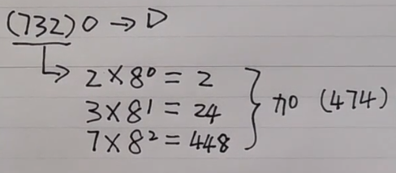
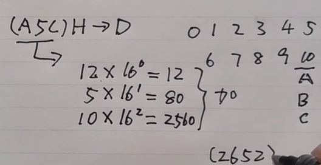
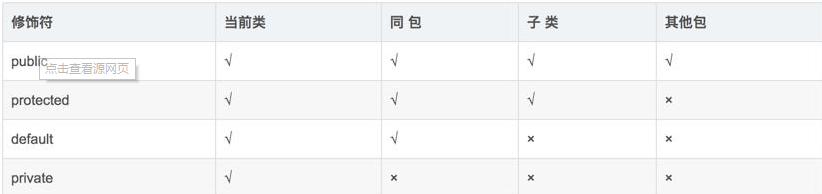

# 第一章 并发

## 1.线程安全

### 1.1 什么是线程安全

线程安全就是说多线程访问同一段代码，不会产生不确定的结果 。

多线程操作共享资源时无法保证原子性、有序性和可见性，所以可能出现线程安全性问题。

理解线程安全的两个方面：

- 执行控制：它的目的是控制代码执行（顺序）及是否可以并发执行。

- 内存可见控制：指的是线程执行结果在内存中对其它线程的可见性。

  根据Java内存模型的实现，线程在具体执行时，会先拷贝主存数据到线程本地（CPU缓存）。操作完成后再把结果从线程本地刷到主存。具体的就是去保证原子性、有序性和可见性。

### 1.2 线程安全的类

 LocalDateTime：比如SimpleDateFormat，它是一个线程不安全的时间类。

## 2.锁机制

### 2.1 CAS自旋锁

CAS是比较并交换，首先它会读取内存中当前值A，然后计算后的值为B，进行新值B把原值A覆盖之前比较现在内存中的值A，如果是就赋值，如果不是就重复刚才的操作。它是一条CPU并发原语，底层汇编指令是**cmpxchg**，因此它的执行过程不能被打断，所以它不会造成数据不一致问题。它的操作执行赖于Unsafe类，Unsafe位于rt.jar中，是CAS的核心类，由于java无法直接访问底层系统，需要通过本地native方法访问，Unsafe相当于一个后门，基于该类可以直接操作特定内存的数据。它内部有一个valueOffset变量，它表示根据内存偏移地址获取数据的。

自旋等待：线程自己通过不断循环尝试询问目标对象的锁是否被释放。这种操作区别于线程被操作系统挂起阻塞，因为如果对象的锁很快被释放，自旋就不需要进行系统中断和现场恢复，所以它的效率更高。但缺点是自旋相当于CPU空转，长时间就会浪费系统资源，默认是自旋15次。

**CAS优点：**

1. 自旋锁不会使线程状态发生切换，一直处于用户态，不会使线程进入阻塞状态，减少了不必要的上下文切换，执行速度快
2. 非自旋锁在获取不到锁的时候会进入阻塞状态，从而进入内核态，当获取到锁的时候需要从内核态恢复，需要线程上下文切换。 （线程被阻塞后便进入内核（Linux）调度状态，这个会导致系统在用户态与内核态之间来回切换，严重影响锁的性能）

**CAS缺点：**

- 它底层呢是一个do while的结构，可能循环时间长，给CPU带来很大的开销。

  解决办法：适应性自旋，自旋时间不再固定而是由**上一次在同一个锁上的自旋时间**以及**锁拥有者状态**这俩条件进行决定的。

- 它只能保证一个变量的原子性，多个变量得使用锁来保证。

- 可能引起ABA问题：原来的值虽然是A，当程序第二次读取原来的值虽然也是A，但是这是经过其他线程操作之后的结果。

  解决办法：加版本号（使用AtomicStampedReference类），但如果是基础类型简单值不需要版本号。

### 2.2 偏向锁/轻量锁/重量锁

JDK1.2之前，Java中一直是重量级锁，JDK1.6后，引入了偏向锁和轻量级锁。

- **偏向锁**：

  如果在程序运行中只有一个线程会获取这个对象锁，那么我们就可以设想对象最好能够认识这个线程，只要是这个线程过来就直接把锁给它，我们就可以认为这个对象偏爱这个线程，所以被称为偏向锁。

  一个对象被分为对象头、实例数据和填充字节，对象头可以分为指针域和mark word，可以通过读取mark word中的信息可以获取对象锁的这个线程的id，确认这个线程是不是老顾客。

  **如果对象发现目前不止一个线程在访问此资源，就会升级为轻量级锁。**

- **轻量级锁：**

  线程会在自己虚拟机栈中开辟一块被称为Lock Record的空间，其中存放对象头中MarkWord的副本以及owner指针，owner指针指向对象。另一方面，对象的markword的前30个bit会生成一个指针，指向线程虚拟机的Lock Record，这样就实现了线程和对象的绑定。

  这个时候这个对象已经被锁定，如果这时候其他线程也要获取这个对象的话，它就要进行自旋等待。

  **如果自旋等待的线程数超过一个，就会将轻量级锁升级为重量级锁。**

- **重量级锁**：

  需要通过moniter进行控制，会切换操作系统的用户态和内核态。

### 2.2 悲观锁/乐观锁

- **悲观锁**：操作系统会认为如果不严格同步线程调用，那么一定会产生线程异常。所以互斥锁会将资源锁定，只供一个线程调用。

  但悲观锁不是万能的，在一些情况下比如大部分调用都是读操作，就没有必要进行锁资源，或者线程切换的时间远远大于同步代码块执行的时间。就会产生资源浪费。

- **乐观锁**：就是CAS机制，其实没有用到锁。一些通过CAS来实现同步的工具，由于不会锁定资源，而且当线程需要修改共享资源的对象时，总是会乐观的认为对象状态值没有被其他线程修改过，而是每次自己都会尝试去compare状态值，这就是乐观锁。

### 2.3 公平锁/非公平锁

公平锁：按照请求锁的顺序分配，拥有稳定获得锁的机会，但是性能可能比非公平锁低。

非公平锁：就是锁的分配不用按照请求锁的顺序，简单来说就是可以哄抢。

非公平锁可能提高性能，因为它可能会在前面休眠线程恢复前拿到锁，这样就可能提高并发效率。通常情况下去唤醒一个挂起的线程，线程间会产生短暂的延时，非公平锁可以利用这段时间完成操作。

### 2.4 可中断锁/可重入锁

- **可中断锁：**字面意思是“可以响应中断的锁”。

  Java并没有提供任何直接中断某线程的方法，只提供了**中断机制**。

  线程A向线程B发出“请你停止运行”的请求（线程B也可以自己给自己发送此请求），但线程B并不会立刻停止运行，而是自行选择合适的时机以自己的方式响应中断，也可以直接忽略此中断。也就是说，Java的中断不能直接终止线程，而是需要被中断的线程自己决定怎么处理。这好比是父母叮嘱在外的子女要注意身体，但子女是否注意身体，怎么注意身体则完全取决于自己。

  Java中，synchronized就是**不可中断锁**，而Lock的实现类都是**可中断锁**。

- **可重入锁：**当A线程获取了某个锁，当A线程想要再次获得该锁的时候，不会因为锁已经被自己占有了而需要等待锁的释放。如果A线程既获取了锁又等待自己释放锁，就会造成死锁。比如一个递归函数里有加锁操作，递归过程中这个锁不会阻塞自己。线程A重复获取锁n次，释放的时候也需要相应的释放n次。

### 2.5  独占锁/共享锁

线程获取锁的两种模式。

独占模式：一旦被占用，其他线程不能占用

共享模式：一旦被占用，其他共享模式下的线程能占用

## 3.synchronized

### 3.1 synchronized底层过程


- **synchronized的同步机制：**

  当一个线程A正在执行的时候它处于Active状态，此时若需要让它暂时让出执行权，那么它的状态将会被标位为wait状态，此时EntrySet中的线程将有机会进入Monitor。另一个线程执行完毕之后，可以用notify唤醒A线程。如图：The Owner就是Monitor，管程。

- **synchronized底层原理：**

  可以用来同步线程，我们再Java中使用synchronize后，再使用javac编译java文件，生成class文件后，再对class文件使用javap反编译，就会看到Monitorenter和Monitorexit两个指令，它的作用是让线程同步。但是synchronize机制存在性能问题，因为它编译后的Monitorenter和Monitorexit指令是依赖操作系统的mutex lock实现的。所以**每当唤醒或者挂起一个线程就要切换操作系统的内核态到用户态，这种操作比较重量级**，有些时候切换所要的时间会超过线程执行的时间。所以Java6引入偏向锁、轻量级锁。

- **synchronized执行过程：**

  1. 线程获得锁
  2. 清空工作内存
  3. 从主内存拷贝共享变量的最新值到工作内存成为副本
  4. 执行代码
  5. 将修改后的副本值刷新到主内存中
  6. 线程释放锁

锁的从低到高分别是：无锁（自旋锁）、偏向锁、轻量级锁、重量级锁，锁只能升级不能降级。

### 3.2 synchronized加锁对象

synchronized**锁当前对象（this）**和**锁非静态方法**，是同一把锁

synchronized**锁静态方法**和**锁类**，是同一把锁

synchronized**锁对象**和**锁类**，他们是两个锁，互不影响

### 3.2  synchronize和volatile区别

- volatile只能修饰实例变量和静态变量（类变量），

  synchronized可以修饰方法、代码块。

- volatile保证数据的可见性， 但是不保证原子性， 

  synchronized可以保证线程安全。

- volatile用于禁止指令重排序：可以解决单例双重检查对象初始化代码执行乱序问题。

### 3.3 synchronize和Lock区别

1. 所处层面：

   - synchronized是Java中的一个关键字，当我们调用它时会从在虚拟机指令层面加锁，关键字为monitorenter和monitorexit
   - Lock是Java中的一个接口，它有许多的实现类来为它提供各种功能，加锁的关键代码为大体为Lock和unLock。

2. 解锁操作
   synchronized：不能指定解锁操作，执行完代码块的对象会自动释放锁。
   Lock：可调用ulock方法去释放锁比synchronized更灵活

3. 是否公平锁：

   对ReentrantLock类而言，通过构造函数传参**可以指定该锁是否是公平锁，默认是非公平锁**。

   对于synchronized而言，它也是一种**非公平锁**，但是并没有任何办法使其变成公平锁。

4. 获锁失败：

   - synchronized加锁的程序中，获锁失败的对象会被加入到一个虚拟的等待队列中被阻塞，直到锁被释放；1.6以后加入了自旋操作。

   - 用Lock加锁的程序中，获锁失败的线程会被自动加入到AQS的等待队列中。

5. 线程中断：

   - Lock可以让等待锁的线程响应中断。
   - 而synchronized却不行，使用synchronized时，等待的线程会一直等待下去，不能够响应中断；

## 4.volatile

### 4.1 不保证原子性

原子性是指在一次或多次操作中，要么所有的操作都执行，要么所有操作都不执行。**volatile不保证原子性**

解决方式：使用synchronize加锁、使用原子类AtomicInteger

### 4.2 禁止指令重排序

如果一个线程写入值到字段 a，然后写入值到字段 b ，而且b的值不依赖于 a 的值，那么，处理器就能够自由的调整它们的执行顺序，而且缓冲区能够在 a 之前刷新b的值到主内存。此时就可能会出现有序性问题。

什么是重排序：为了提高性能，编译器和处理器常常会对既定的代码顺序进行指令重排序。

1. 编译器优化的重排序，在不改变单线程语义的情况下重新安排语句的执行顺序。
2. 指指令级并行重排序，处理器的指令级并行技术将多条指令重叠执行，如果不存在数据的依赖性将会改变语句对应机器指令的执行顺序。
3. 内存系统的重排序，因为使用了读写缓存区，使得看起来并不是顺序执行的。


### 4.3 保证可见性

可见性问题：所有共享变量都在主内存中，每个线程有自己的工作内存，而线程的读写共享数据是通过本地内存交换的，所以导致了可见性问题。

解决方式1：通过加锁机制、通过volatile关键字

### 4.4 单例模式的应用

```java
class LazySingleton05 {
    private LazySingleton05() {}
    private static volatile LazySingleton05 lazySingleton05;
    public static LazySingleton05 getInstance(){
        if(lazySingleton05==null){
            synchronized (LazySingleton05.class){
                if(lazySingleton05==null){
                    lazySingleton05=new LazySingleton05();
                }
            }
        }
        return lazySingleton05;
    }
}
```

## 5.AQS

### 5.1 AQS内部概要

AQS：AbstractQuenedSynchronizer是JDK提供的一个能对竞争资源同步框架，其内部维护着一个用链表实现的的双向队列用来存储等待的线程，它存放着Node节点保存这线程的相关信息，int型的state表示一些状态。

**双向队列：**

一个线程当前没有获取到资源会被放入队列中排队，head和tail表示队列的头和尾。而头结点是一个虚节点，用来占位，第二个节点才是真正需要去拿锁的节点。

**内部类Node：**

里面存储了线程对象、等待状态、前后指针等信息。

**State：**

- 在 Semaphore信号量中，state 表示剩余许可证的数量。如果我们初始化将 state 设置为 10，就表示一共有 10 个许可证，然后当某一个线程取走一个许可证之后，这个 state 就会变成 9，所以 state 相当于一个内部的计数器。
- 在 CountDownLatch 中，state 表示的是需要“倒数”的数量。一开始我们假设把它设置为 5，当每次调用 CountDown 方法时，state 就会减 1，一直减到 0 的时候就代表这个门被放开。
- 在 ReentrantLock 重入锁中，state 初始状态为 0，表示无锁，如果有线程获取这把锁，state 状态变成 1，如果同一个线程多次获取这把锁，state 依次往上加 2，3，4，此时 state 表示重入次数。

**四个核心成员方法：**

- tryAcquire成员方法是要被重写的方法，否则就会抛出异常。

- Acquire成员方法被定义为final，表示不能被修改。它先调用tryAcquire()方法，尝试直接去获取资源，如果成功则直接返回，如果失败就返回就会把当前线程封装成Node对象放入等待队列中进行排队等待锁。

  > 调用addWaiter()方法将线程封装成Node后使用acquireQueue()方法加入等待队列进行排队等待锁。
  >
  > addWaiter方法是将线程封装成Node，方法中会先使用进行快速入队的这种方法，若不成功才执行完整入队的方法，这里有点不解的是完整方法比快速方法就多了一个判空条件，我想作者可能是经过大量测试发现判空会影响性能才这么设计的。而acquireQueue()方法配合release()方法可以对线程进行挂起和响应，以此来实现队列的先入先出。

- tryRelease()：需要被实现类重写，否则会抛出异常。

- release()：它会调用tryRelease()来释放资源，如果释放锁成功，就会唤醒等待队列其他节点，挂起的线程一旦被唤醒，那么它将会进行自旋尝试获取锁。


### 5.2 AQS内部方法

- **tryAcquire()**：tryAcquire()：尝试获取锁（修改标记位），无论是否成功都立即返回。

  从源码中可以看出，ASQ需要继承类必须override这个tryAcquire方法，否则就会抛出异常。

  > 如果当上层调用tryAcquire成功时则获得锁，此时可以对共享资源进行操作，使用完释放；如果获取锁失败，如果上层业务不想等待锁，可以直接进行相应的处理，如果选择等待锁那么就可以直接调用acquire方法，不用自己去进行复杂的排队处理。

- **acquire()**：尝试获取锁（修改标记位），若当前锁正在被占用则等待直到获取为止。

  从源码中可以看出，它被final修饰，意味着所有继承类必须直接调用这个方法，而不允许继承类擅自对它进行override。其中它先调用tryAcquire()方法，如果返回true就直接跳出判断条件；如果返回的是false，就会调用**addWaiter()方法将线程封装成Node后使用acquireQueue()方法加入等待队列进行排队等待锁**。

- **addWaiter()**：将线程封装成Node，方法中会先使用进行快速入队的这种方法，若不成功才执行完整入队的方法，这里有点不解的是完整方法比快速方法就多了一个判空条件，我想作者可能是经过大量测试发现判空会影响性能才这么设计的。

- **acquireQueue()**：acquireQueue()方法配合release()方法可以对线程进行挂起和响应，以此来实现队列的先入先出。

  > 我一开始先入为主的认为既然存在一个FIFO队列，应该遵循生产消费模型，应该有一个消费者不断从这个队列里获得头结点，然后让获取的节点中封装的线程再去拿锁。但是作者的设计更加巧妙，这也是我阅读源码最有收获的地方。

  首先acquireQueue()方法中定义了一个初始值为true的局部变量failed，这个变量是用来保障程序出错后的一系列清理工作。通过源码知道只有异常的时候程序才会进入finally中，failed才是true，此时才会进行cancelAcquire操作，它简单来说就是将Node的waitStatus置为CANCEL，以及其他的一些清理工作。

  方法主要还是一个自旋操作，如果当前节点的前置节点是头结点，且当前线程尝试获取锁成功了，那么直接返回就行。如果不是头结点，那么这时候就要进入下一个判断，判断当前线程是否需要进行挂起。判断方法为shouldParkAfterFailedAcquire()。

  > 这里为什么要挂起线程而不是进行自旋，是因为自旋是一个CPU的操作，如果大量的线程在自旋等待就会引起性能问题，所以理想情况下我们需要将那些还没有轮到它们出队的那些线程挂起，再在适合的时候把它们唤醒，这样就能避免大量自旋操作提升性能。

- shouldParkAfterFailedAcquire()方法：如果当前线程的前置节点的waitStatus为SIGNAL，那说明前置节点在拿锁，所以当前节点是需要挂起的，返回true；如果WaitStatus大于0，说明状态可能是CANCEL，所以可以将其从队列中删除，返回false；如果waitStatus是其他状态，既然当前节点已经加入，那么前直节点就应该做好准备等待锁，所以通过CAS将前置节点的waitStatus置为SIGNAL，返回false。这样就能保证head之后只有一个节点在通过CAS获取锁，队列里面其他线程都已经被挂起或者正在被挂起。tryRelease()方法：可以看出和tryAcquire方法已于，ASQ需要继承类必须override这个方法。

- **tryRelease()**：需要被实现类重写，否则会抛出异常。

- **release()**：如果释放锁成功，就要唤醒等待队列其他节点，挂起的线程一旦被唤醒，那么它将会继续执行acquireQueued方法，进行自选尝试获取锁。

- unparkSuccessor()：其中传参传进来的Head就是acquireQueue方法中的获取到锁的那个线程被置为head，这个时候head的使命已经完成了，它现在只是一个占位的虚节点，所以需要首先将他的waitStatus置为0，才不会影响其他函数的判断。然后程序会从FIFO队列的尾结点开始搜索，找到一个除了head之外的一个最靠前的并且waitStatus<=0的节点，对其进行LockSupport.unpark(s.thread)操作，即唤醒该线程。挂起的线程一旦被唤醒，那么它将会继续执行acquireQueued方法，进行自选尝试获取锁。

这样便会形成一个可以良好工作的闭环。

至于变量interrupt的作用是，当线程处于等待队列中时无法响应外部的中断请求，只有当这个线程拿到锁之后，然后再进行中断响应。

## 6.Lock

### 6.1 Lock原码

ReentrantLock实现Lock接口，首先看下Lock接口源码

```java
void lock();//获取锁，如果当前对象被其他线程占用，那么它将会等待，知道获取位置。
void lockInterruptibly() throws InterruptedException;//获取锁，假如当前线程等待锁的过程被中断，则会退出等待，并且抛出异常。
boolean tryLock();//无参方法，尝试获取锁并立即返回。
boolean tryLock(long time, TimeUnit unit) throws InterruptedException;//有参方法，在一段时间内获取锁，假如期间被中断会抛出异常。
void unlock();//释放锁
Condition newCondition();//新建一个当前绑定在Lock的Condition对象
```

lock方法就是获取锁，如果当前对象被其他线程占用，那么它将会等待，知道获取位置。

lockInterruptibly也是获取锁，假如当前线程等待锁的过程被中断，则会退出等待，并且抛出异常。

tryLock无参方法，尝试获取锁并立即返回。

tryLock有参方法，在一段时间内获取锁，假如期间被中断会抛出异常。

unlock方法，就是释放锁。

newCondition，新建一个当前绑定在Lock的Condition对象。

> Condition对象作用：简单来说，它表示一个等待状态。获得锁的线程可能在某一时刻需要等待一些条件的完成才能继续执行，那么它可以通过await方法注册在condition对象上进行等待，然后通过condition对象的signal方法将其唤醒，有的类似Object的wait和notify方法。不同的是，一个Lock对象可以关联多个Condition，多个线程可以绑定在不同的Condition对象上，这样就可以分组唤醒。此外，Condition还提供了和限时、中断相关的功能，丰富了线程的调动策略。

### 6.2 Lock优势

- 在使用synchronized关键字的情形下，假如占有锁的线程由于要等待IO或者调用sleep方法被阻塞了，但是又没有释放锁，那么其他线程就只能一直等待，这会极大影响程序执行效率。因此，就需

- 要有一种机制可以不让等待的线程一直无期限地等待下去，比如只等待一定的时间或者能够响应中断，这种情况可以通过 Lock 解决。

  指定等待时间：tryLock(long time, TimeUnit unit)

  响应中断：lockInterruptibly()

- 当多个线程读写文件时，读操作和写操作会发生冲突现象，但是读操作和读操作不会发生冲突现象。但是如果采用synchronized关键字实现同步的话，就会导致一个问题，就是当多个线程都只是进行读操作时，也只有一个线程在可以进行读操作，其他线程只能等待锁的释放而无法进行读操作。因此，需要一种机制来使得当多个线程都只是进行读操作时，线程之间不会发生冲突。Lock也可以解决这种情况。

  ReentrantReadWriteLock

- 我们有时候需要公平锁和非公平锁，而synchronized只要公平锁。

上面提到的三种情形，我们都可以通过Lock来解决，但 synchronized 关键字却无能为力。事实上，Lock 是 java.util.concurrent.locks包 下的接口，Lock 实现提供了比 synchronized 关键字 更广泛的锁操作，它能以更优雅的方式处理线程同步问题。也就是说，Lock提供了比synchronized更多的功能。

### 6.3 ReentrantLock

**原理如下：**

ReentrantLock可以通过参数true和false实现公平锁和非公平锁，ReentrantLock实现了Lock类和Serializable类，有三个内部类，Sync、NonfairSync、FairSync，Sync继承AQS，NonfairSync、FairSync继承Sync，而继承AQS的这个Sync类是ReentrantLock可以实现加锁和释放锁的关键核心类。

当一个线程调用ReentrantLock的lock方法尝试进行加锁时，首先会判断state是否是0，是的话说明之前没有线程加锁，就会进行一次CAS操作将state的值从0改为1，并将自己设置为当前加锁线程。如果state不是0的话，会判断加锁线程是不是自己，是自己的话可以可重入多次加锁，每次加锁就是把state的值给累加1。如果当前线程不是自己，就表示加锁失败，会将封装成Node节点放入等待队列中，等待队列是AQS用链表实现的双向队列，里面的Node节点存放了线程的相关信息。

而持有锁的线程每次释放锁都会让state-1，当state变为0的时候表示真正的释放锁。之后等待队列队头的线程就会重新尝试加锁。

> 非公平锁不先判断自己是否是队头节点而直接进行CAS进行加锁，但只有一次机会。

1.8底层加入了红黑树，类似hashmap。


ReentrantLock基于AQS，在并发编程中它可以**实现公平锁和非公平锁来对资源进行同步，同时和synchronize一样它支持可重入**，除此之外它在调度上更灵活，支持更多丰富的功能。

**其有两个构造函数，无参的是公平锁，有参的是非公平锁。**

此外，ReentrantLock内部最核心的是三个内部类，Sync、NonfairSync、FairSync以及对Lock接口的实现。

**Sync继承AQS，NonfairSync、FairSync继承Sync**

**Sync类内部核心方法：**

- **nonfairTryAcquire()**：非公平尝试获取锁，源码中也就是AQS的获取state部分，state需要去表示数量。当state为0时代表锁状态为空闲，可以进行一次CAS来更改state，如果state更改成功就代表获取了锁；当线程不为0的时候，首先判断当前线程是否是独占线程，如果当前线程不是独占线程，就表示获取锁失败，如果正是自己那么能够满足可重入性，只不过需要累加state来记录重入的次数，因为也要释放相应的次数。
- **tryRelease()**：代表的是是否完全被释放而不是代表是否成功被释放。

**NonfairSync类核心方法：**

- **lock()**：尝试获取锁，若当前锁正在被占用则等待直到获取为止。lock方法上来就是CAS操作获取锁，不管前面有没有其他的线程正在等待，这里可以看出它是非公平锁，但是它只有一次非公平的机会。如果这次CAS没有获得锁，它就调用AQS的acquire方法，就又变成了一个公平锁。

- **tryAcquire()**：尝试插队获取锁，只有一次机会，无论是否成功都立即返回。

> 因为一上来先尝试插队试一次抢锁，但是只有一次机会，没有抢到就会调用acquire，**acquire内部会调用了tryAcquire**，NofairSync对tryAcquire进行了重写，是一次nonfairTryAcquire非公平获得锁，所以就是上来就是两次抢锁。

**FairSync核心方法：**

- **lock()**：尝试公平地获取锁。
- **tryAcquire()**：只有在队列中当前线程之前没有其他线程的情况下可以直接拿去锁，否则就进行排队。如果当前线程已经获得锁，那么对state进行累加，可以继续使用锁。

### 6.4 ReentrantReadWriteLock


Lock readLock() ：读锁是共享锁

Lock writeLock() ：写锁是独占锁

## 7.ThreadLocal

### 7.1 内部结构


ThreadLocal一 个内部类就是ThreadLocalMap，这个内部类才是真正实现线程隔离的关键，它是由ThreadLocal维护，负责向其中设置值、添加值、删除值等操作。ThreadLocalMap是一个由键值对组成的Entry数组，它的key是ThreadLocal的一个引用，它的value是对应我们要操作的变量副本。所以别的线程不能获取其他线程的副本值，就形成了副本之间的隔离。

### 7.2 内存泄漏

每个thread中都存在一个map，map的类型是ThreadLocal.ThreadLocalMap。 Map中的key为一个threadlocal实例。这个Map的确使用了弱引用， 不过弱引用只是针对key， 每个key弱引用指向threadlocal。当把threadlocal实例置为null以后，没有任何强引用指向threadlocal实例，所以threadlocal将会被gc回收。但是，我们的value却不能回收，因为存在一条从当前线程连接过来的强引用，就会导致内存泄漏。

### 7.3 key弱引用原因

- 若key 使用强引用：这样会导致一个问题，就是当hreadLocalMap的key被回收时（也就是ThreadLoacl），因为ThreadLocalMap还持有ThreadLocal的强引用，如果没有手动删除，ThreadLocal不会被回收，会导致内存泄漏。 譬如 设置：ThreadLocal=null 以后，应该会被回收的，但实际情况是ThreadLocalMap还有一个强引用，导致无法回收。
- 若key使用弱引用：这样的话，引用的ThreadLocal的对象被回收了，由于ThreadLocalMap持有ThreadLocal的弱引用，即使没有手动删除，ThreadLocal也会被回收。value在下一次ThreadLocalMap调用set、get、remove的时候会被清除（清理key为null的记录），但是我们在使用完了ThreadLocal最好在手动的remove一下。

比较以上两种情况：由于ThreadLocalMap的生命周期跟Thread一样长，如果都没有手动删除对应key，都会导致内存泄漏，但是使用弱引用可以多一层保障，弱引用ThreadLocal不会内存泄漏，对应的value在下一次ThreadLocalMap调用 set、get、remove 的时候被清除，算是最优的解决方案。

### 7.4 应用场景user

​	比如有一个业务，其中有很多方法需要传user值，根据值判断user的权限。

​	第一想法是搞一个static user，全局变量，让方法都拿这个static变量。但是这种方法只是适用于单线程。若果另一个线程更改了这个值那么其他线程就拿到了更改后的值，比较混乱。

​	第二个想法是使用ThreadLoacl，根据它拿到了值是我们一开始为线程设定的值。

```java
public class TestThreadLocal {
    static ThreadLocal<Integer> threadLocal = new ThreadLocal<>();

    public static void main(String[] args) throws InterruptedException {
        Thread t1 = new Thread(()->{
            System.out.println(threadLocal.get());
            threadLocal.set(0);
            System.out.println(threadLocal.get());
        });
        Thread t2 = new Thread(()->{
            System.out.println(threadLocal.get());
            threadLocal.set(1);
            System.out.println(threadLocal.get());
        });
        t1.start();
        t1.join();
        t2.start();
    }
}
```

## 8.线程池

### 8.1 原理

**为什么要有线程池：**

比如，构建服务器应用程序是简单的模型，每当一个请求到达就创建一个新线程，然后在新线程中为请求服务。如果请求非常多，为每个请求创建一个新线程的开销很大，为每个请求创建新线程的服务器在创建和销毁线程上花费的时间和消耗的系统资源可能都要比花在处理实际的用户请求的时间和资源更多。所以就有了池化思想。

**池化思想：**

提高资源利用率，不用重复创建对象。在面向对象编程中，创建和销毁对象是消耗自愿的。在Java中更是如此，虚拟机会跟踪每一个对象，以便能够在对象销毁后进行垃圾回收。所以提高程序效率的一个手段就是减少对象的创建和销毁，这就是”池化资源”技术产生的原因。线程池顾名思义就是事先创建若干个可执行的线程放入一个池（容器）中，通常采用的是工厂模式，需要的时候从池中获取线程不用自行创建，使用完毕不需要销毁线程而是放回池中，从而减少创建和销毁线程对象的开销。

**线程池的优点：**

- 提高线程的利用率
- 提高程序的响应速度
- 便于统一管理线程对象
- 可以控制最大并发数

线程池有默认线程数量和最大线程数量，比如是默认线程数量3，最大线程数量是5，当这3个线程都被占用的时候，那么新来的获取线程的请求就会放入缓冲队列中，当缓冲队列满了的时候就会开启新的线程，当5个线程都被占用的时候就会采用拒绝策略。

线程池可以被模拟成银行柜台：


### 8.2 参数

```java
    public static void main(String[] args) {
        ExecutorService executorService = new ThreadPoolExecutor(
                3,
                5,
                1, 
                TimeUnit.SECONDS, 
                new ArrayBlockingQueue<>(3),
                Executors.defaultThreadFactory(),
                new ThreadPoolExecutor.AbortPolicy());
        for (int i = 0; i < 5; i++) {
            executorService.execute(() -> {
                System.out.println(Thread.currentThread().getName() + "===>办理业务");
            });        
```

- corePoolSize：默认线程数，相当于工作柜台数

- maximumPoolSize：最大线程数，相当于最大柜台数

- keepAliveTime：线程存活时间，相当于柜台工作人员多久时间可以下班回家

- unit：时间单位

- workQueue：等待队列

- threadFactory：线程创建工厂

- handler：拒绝策略

### 8.3 线程池种类

Java通过Executors提供四种线程池，分别为：

1. newFixedThreadPool：

   创建一个指定工作线程数量的线程池。

   每当提交一个任务就创建一个工作线程，如果工作线程数量达到线程池初始的最大数，则将提交的任务存入到池队列中。 

2. newCachedThreadPool：

   创建一个可缓存的线程池。

   这种类型的线程池特点是： ①工作线程的创建数量几乎没有限制。②如果长时间没有往线程池中提交任务，则该工作线程将自动终止。

3. newSingleThreadExecutor：

   只创建唯一的工作者线程来执行任务，如果这个线程异常结束，会有另一个取代它，保证顺序执行。

4. newScheduleThreadPool：

   创建一个定长的线程池，而且支持定时的以及周期性的任务执行。

### 8.4 线程池的拒绝策略

- **AbortPolicy：**丢弃任务并抛出RejectedExecutionException异常。

  这是线程池默认的拒绝策略，在任务不能再提交的时候抛出异常，及时反馈程序运行状态。

- **DiscardPolicy**：丢弃任务，但是不抛出异常。如果线程队列已满，则后续提交的任务都会被丢弃，且是静默丢弃。

- **DiscardOldestPolicy：**丢弃队列最前面的任务，然后重新提交被拒绝的任务。

- **CallerRunsPolicy：**由调用线程处理该任务。

### 8.5 应用场景

线程池适合单系统的大量的异步任务处理，比如发送短信、保存日志。

### 8.6 shutdown和shutdownNow

shutdown只是将线程池的状态设置为SHUTWDOWN状态，正在执行的任务会继续执行下去，没有被执行的则中断。

而shutdownNow则是将线程池的状态设置为STOP，正在执行的任务则被停止，没被执行任务的则返回。

## 9.多线程相关类、方法

### 9.1 四类

- CountDownLatch：

  是Java并发编程的常用类，是通过一个计数器来实现的，计数器的初始值是线程的数量。每当一个线程执行完毕后，计数器的值就-1，当计数器的值为0时，在闭锁上等待的线程就会被唤醒。latch.countDown()后面的代码不会被阻塞，latch.await(10000, TimeUnit.SECONDS)后面的代码会被阻塞。

- CyclicBarrier：

  它允许一组线程互相等待，直到到达某个公共屏障点 (common barrier point)。cyclicBarrier.await()后面的代码会被阻塞。

- Semaphore：

  是用来控制同时访问特定资源的线程数量，通过协调各个线程以保证合理地使用公共资源。

  Semaphore通过使用计数器来控制对共享资源的访问。 如果计数器大于0，则允许访问。 如果为0，则拒绝访问。 计数器所计数的是允许访问共享资源的许可。 因此，要访问资源，必须从信号量中授予线程许可。

- Phaser：

  Phaser又称“阶段器”，用来解决控制多个线程分阶段共同完成任务的情景问题。它与CountDownLatch和CyclicBarrier类似，都是等待一组线程完成工作后再执行下一步，协调线程的工作。但在CountDownLatch和CyclicBarrier中我们都不可以动态的配置parties，而Phaser可以动态注册需要协调的线程，相比CountDownLatch和CyclicBarrier就会变得更加灵活。

### 9.2 sleep、wait、yield

- **sleep：**使运行的线程进入阻塞状态，暂时让出CPU的使用权，从而CPU可以执行其他的线程，但它并不会释放锁。

  使用场合：
  线程的调度执行是按照其优先级的高低顺序进行的，当高级别的线程未死亡时，低级别的线程没有机会获得CPU资源。有时优先级高的线程需要优先级低的线程完成一些辅助工作或者优先级高的线程需要完成一些比较费时的工作，此时优先级高的线程应该让出CPU资源，使得优先级低的线程有机会执行。为了达到这个目的，优先级高的线程可以在自己的run()方法中调用sleep方法来使自己放弃CPU资源，休眠一段时间。

- **wait：**使运行的线程运行中断，暂时让出CPU的使用权，自己进入线程等待池，会释放锁。

  使用场合：

  当一个线程使用的同步方法中用到某个变量，而此变量又需要起它线程修改后才能符合本线程的需要，那么可以在同步方法中使用wait()方法。

- **yield：**使运行的线程进入就绪状态，暂时让出CPU的使用权，不会释放锁。

### 9.3 notify和notifyAll

- **notify：**随机唤醒等待队列里的一个线程
- **notifyAll：**唤起所有等待队列里面的线程  

并不是立马执行，只是告诉调用过wait方法的线程可以去参与获得锁的竞争了。如果notify方法后面的代码还有很多，需要这些代码执行完后才会释放锁。

### 9.4 join和priority

- **join：**将挂起**调用线程**的执行，直到**被调用的对象**完成它的执行。

  比如在线程B中调用了线程A的join()方法，直到线程A执行完毕后，才会继续执行线程B。

- **priority：**是一种优先级队列，不同于先进先出队列的另一种队列。每次从队列中取出的是具有最高优先权的元素。

### 9.5 stop和suspend

- **stop：**该方法不够安全，它会解除由线程获取的所有锁定，而且如果对象处于一种不连贯状态，那么其他线程能在那种状态下检查和修改它们。结果很难检查出真正的问题所在。
- **suspend：**容易发生死锁。调用suspend()的时候，目标线程会停下来，但却仍然持有在这之前获得的锁。此时，其他任何线程都不能访问锁定的资源。

### 9.6 start和run

- **start：**用来启动一个线程，这时此线程是处于就绪状态，并没有运行。然后通过此Thread类调用方法run()来完成其运行操作的，这里方法run()称为线程体，它包含了要执行的这个线程的内容，Run方法运行结束，此线程终止，而后CPU再运行其它线程。
- **run：**只是执行了重写的run方法。

### 9.7 Thread和Runnable

- **Runnable：**

  实现Runnable接口还可以继承其他类，因为java是单继承。

  实现Runnable接口的线程类的多个线程，可以访问同一变量，而Thread则不能（多窗口买票问题）

  > 原因：两种方式启动方式不同：
  >
  > Runnable线程类是实例化一个对象t之后，通过多次new Thread(t).start();启动多个线程，而这几个线程属于一个对象，对象的成员变量是同一个。
  >
  > Thread线程类启动多个线程需要 new MyThread().start();每个线程启动都对应多个对象，他们的成员变量是独立的。

- **Thread：**

  使用线程的方法方便一些，例如：获取线程的Id->Thread.currentThread().getId()

  ​														  线程名->Thread.currentThread().getName()

  ​														  线程状态->Thread.currentThread().getState()等

  操作同一变量，但是线程调用run方法内容不同时，使用Thread内部类的方式进行，例如生产者、消费者模式

### 9.8 i++的线程安全

i++：是先把i拿出来使用，然后再+1

++i ：是先把i+1，然后再拿出来使用，不安全

i++不是原子性操作，执行期中任何一步都是有可能被其他线程抢占的。后给每一段数据配一把锁，当一个线程占用锁访问其中一个段数据的时候，其他段的数据也能被其他线程访问。

**k++的执行过程：**

1. 首先返回k当前的值，这个值是个常量
2. 然后创建一个临时变量temp，将常量赋值给这个临时变量，返回临时变量的值
3. 最后k自加1

**++k的执行过程：**

1. 首先k自加
2. 返回自加后的k值。

所以++k的执行速度比k++快。

# 第二章 集合

## 1.常用集合和差别


Java常用主要是三个集合，主要是三个接口List、Set、Map，还有实现这些接口的诸多子类。List和Set实现了Collection接口，Map是其他接口，只不过我们经常把这三个放在一起谈。

基本差别是：

- List是有序的，即插入元素的顺序，其中可以存放重复的值和null值。

- Set是无序的并且其中的值都是各不相同的，所以里面只能存放一个null值。

- Map存放的是Entry键值对，键必须是唯一的。所以在Map中只能存放一个键为null（存不进去但是不会报错），但是可以存放多个值为null。

  但是ConcurrentHashMap、Hashtable中，不允许键值是null；TreeMap中，不允许键为null（TreeMap要使用Comparable或Comparator比较key）。

- Vector中的方法由于添加了synchronized修饰，因此Vector是线程安全的容器，但性能上较ArrayList差，因此已经是Java中的遗留容器。

## 2.HashMap

HashMap不是有序的，TreeMap是基于元素的固有顺序 (由 Comparator 或者 Comparable 确定，Key有序)， LinkedHashMap是根据元素增加或者访问的先后顺序进行排序。

hash就是把任意长度的输入通过hash算法映射成固定长度的输出。

### 2.1 HashMap1.8

- 初始化集合：

  在jdk8之前，是构造方法中创造一个长度是16的Entry[] table用来存储键值对数据的。

  在jdk8之后，是第一次调用put方法时创建数组Node[] table用来存储键值对。

- 插入方式：

  jdk8以前是头插法，jdk8后是尾插法

- 数据结构：

  jdk8之前用的是由数组 + 链表组成，数组是 HashMap 的主体，链表则是主要为了解决哈希冲突（“拉链法”解决冲突）。

  jdk1.8 以后 HashMap由数组 + 链表+红黑树。

### **2.2 HashMap插入过程**

1. 根据会计算hashCode，然后对其进行取模得到这个元素应该被放入哪个桶，这里的取模不是%而是通过位运算取模。

   将key的hashcode右移16位，将使用原来的hashcode进行异或运算，再将得到的结果与上（length-1），这里会得到一个0到length-1的数字。

   如果计算出来的桶的位置没有元素，那么就可以直接插入。

2. 如果这个桶的位置有元素，那么就比较当前要插入元素的hashcode和桶中元素的hashcode是否相同，如果不同就在划分出一个区域插入。

3. 如果一样的话再调用equals方法对其内容进行比较，如果不同就划分出一个区域插入。

4. 如果都相同的话，就覆盖。

> 常用解决哈希冲突的方法：开放地址法、链地址法（拉链法）、再哈希法、建立一个公共溢出区

### 2.3 HashMap扩容机制

从源码中可以看出，HashMap初始化长度是16，负载因子默认是0.75，扩容是一种比较耗资源的一种操作，它会为数组分配更多的空间，但是好处就是会使hash算法计算的结果更加均匀，hash碰撞也就会更少。

**扩容机制：**

- 扩容机制1：当hash表中容量被使用到75%就进行扩容。threshold就是一个临界值，threshold（临界值）= capacity（容量）* loadFactor（负载因子），每次扩容都是2的n次幂。

- 扩容机制2：hashmap中有一个最小化树容量，默认值是64，假如某个位置链表数量到达了8个，但是数组长度还没有到达64，hashmap不会树化这个链表，而是对它进行扩容，然后对数组中的元素重新计算位置并放入。

### 2.4 HashMap一些原因

**为什么引入红黑树**

jdk1.8 以前 HashMap 的实现是数组+链表，即使哈希函数取得再好，也很难达到元素百分百均匀分布。

如果hash算法比较优秀，每一个元素可以均匀分布在hash表中，那么它的查找时间复杂度就是O(1)，当 HashMap中有大量的元素都存放到同一个桶中时，这个桶下有一条长长的链表，这个时候 HashMap 就相当于一个单链表，遍历的时间复杂度就是O(n)，完全失去了它的优势。

针对这种情况，jdk1.8中引入了红黑树来优化这个问题。当链表长度很小的时候，即使遍历，速度也非常快，但是当链表长度不断变长，肯定会对查询性能有一定的影响，所以才需要转成树。当链表长度大于8**并且**当前数组的长度大于 64 时（不大于64红黑树需要旋转反而降低查询效率），就会将链表树化。

**为什么hashcode右移16位再异或上原来的hashcode**

目的是为了减少hash碰撞。

右移16位后的结果肯定是高16位都是0，后16位是原来高16位的值，如果拿这直接和length-1进行与运算，因为高16位都是0，这部分与操作后也都是0，所以结果就丢失了高16位的信息。右移16位再和原来的hashcode进行运算，这样就可以将高16位和低16位的信息进行混合，也就保留了高16位和低16位的信息。

**为什么用^而不是&或者|**

和位运算的规则有关，因为异或操作的规则是相同为0，不同为1，这样就可以更好的保留各部分的特征。如果用&运算出的结果更会向1靠拢，而用|运算出来的结果会更向0靠拢。

**为什么负载因子是0.75**

因为hash表元素个数与碰撞的概率是服从泊松分布的，发现在0.75处碰撞的概率最小的，所以使用0.75作为默认的负载因子，但是特殊的开发业务中程序员是可以手动控制负载因子的。

**为什么扩容规则是2的次幂**

如果数组长度都是2的n次方时候，2的整次幂数有统一的规律，可以通过位运算快速计算出元素的索引。

比如2<sup>4</sup>-1=16-1=15，在二进制下就是00000000 00000000 00000000 0001111

比如2<sup>5</sup>-1=32-1=31，在二进制下就是00000000 00000000 00000000 0011111

比如2<sup>6</sup>-1=64-1=63，在二进制下就是00000000 00000000 00000000 0111111

hash % length =  hash & (length - 1)。相较于取模，位与操作性能更好，因为取模需要hash值转换成十进制再进行计算而位与直接是二进制计算。

### 2.5 hash函数和冲突方法

**常见的几种哈希函数：**

1. 直接定制法：
   取关键字的某个线性函数为散列地址：Hash（Key）= A*Key + B
2. 除留余数法：
   设散列表中允许的地址数为m，取一个不大于m，但最接近或者等于m的质数p作为除数，按照哈希函数：Hash(key) = key% p(p<=m),将关键码转换成哈希地址。
3. 平方取中法：
   假设关键字为1234，对它平方就是1522756，抽取中间的3位227作为哈希地址； 再比如关键字为4321，对它平方就是18671041，抽取中间的3位671(或710)作为哈希地址。

**解决冲突方法：**

- 开放定址法：开放定址法也叫闭散列，当发生哈希冲突时，如果哈希表未被装满，说明在哈希表中必然还有空位置，那么可以把key存放到冲突位置中的“下一个” 空位置中去。
- 拉链法：hashMap中的方法
- 再哈希：发生冲突时计算另一个hash函数的地址，直到冲突不再发生。
- 建立公共溢出区

## 3.ConcurrentHashMap

hashTable就是put/get加上synchronized，成为了线程安全的集合。但是并发下会导致效率低，因为对其想要读写的线程都会被阻塞，所以HashTable都不怎么推荐使用，推荐使用ConcurrentHashMap。

它有很多构造函数，每一个构造都有一个很重要的值是sizeCtl

- sizeCtl=0：代表数组没有初始化，且数组默认的初始容量为16

- sizeCtl>0：如果数组没有初始化，那么它记录的就是初始容量；如果数组已经初始化，那么它记录的是数组的扩容临界值

  threshold（临界值）= capacity（容量）* loadFactor（负载因子）

- sizeCtl=-1：当调用put方法时候，表示数据正在进行初始化

- sizeCtl<-1：记录正在扩容的线程个数

**初始化：**

默认容量是16，一般开发会指定长度，不然用默认的长度的话插入数据就会涉及到扩容，扩容是比较消耗性能的，所以建议给一个初始容量。1.7之后如果给初始化长度是32，那么它会在32的基础上加上32右移1位也就是除以2再加1，就是32+16+1=49，为了保证长度是2的幂次方，所以实际上初始长度就是64。它调用的方法是：tableSizeFor(initalCapacity+(initalCapacity >>> 1)+1)

**插入Put：**

首先它会使用一个spread的扰动函数计算hash值，就是将hashcode，（h^(h >>>16 ) & 7FFF FFFF），7FFF FFFF在二进制下最高位是0，其余位都是1，所以跟它与出来的结果肯定都是正数，方便后面判断元素类型。

- 如果数组是null或者数组长度是空：

  然后会遍历table，这个table就是我们真正存储数据的那个数组，它首先会判断这个数组是否为空，为空的话就会进行初始化，其中会判断sizeCtl是否小于0，小于0的话就说明别的数组再对它进行初始化或者扩容，那么就要yield让出CPU的执行权。如果sizeCtl不小于0，那么它就会**利用CAS**把sizeCtl设置成-1，表明当前线程正在inti。之后它会判断初始值n是否是0，是的话就默认16当做初始值，不是的话就使用当前值n作为初始化容量，之后会根据n的大小去new一个Node数组。再执行n-(n>>>2)这个操作，n>>>2就是将n * 0.25，n-0.25 * n就是0.75 * n，这样就得到的值就是阈值，把它赋给sizeCtl，这时sizeCtl>0，表示它记录的是数组的扩容临界值。

- 如果数组不是null、数组长度不是是空：

  首先它会使用将数组长度-1和hash值进行与操作来计算脚标，hash % length =  hash & (length - 1)。相较于取模，位与操作性能更好，因为取模需要hash值转换成十进制再进行计算而位与直接是二进制计算。然后根据这个角标**CAS**地取出脚标对应的值，如果是空就会直接将元素插入，这个插入也是**CAS操作**。

- 如果角标对应的值不是空：

  它会判断这个节点的hash值是不是MOVED，是的话就证明是数组正在扩容，就不能往这里加元素，而是进行协助扩容。

- 如果这个节点的hash值不是MOVED：

  它会把这个位置锁起来，就可以保证这个位置的元素插入是线程安全的，而且不影响其他位置的元素插入。

  然后它会判断fh，fh是角标的hash，如果fh>0的话，就表示此时是链表结构，然后进行逐个比对，一样就覆盖然后break，不一样就在尾部插入。

  fh<0的话，表示此时是红黑树的结果，然后在红黑树上进行插入。

插入完了就会进行维护。

**扩容机制：**

- 扩容机制1：当hash表中容量被使用到75%就进行扩容。threshold就是一个临界值，threshold（临界值）= capacity（容量）* loadFactor（负载因子），每次扩容都是2的n次幂。

- 扩容机制2：hashmap中有一个最小化树容量，默认值是64，假如某个位置链表数量到达了8个，但是数组长度还没有到达64，hashmap不会树化这个链表，而是对它进行扩容，然后对数组中的元素重新计算位置并放入。

如果链表的长度>8 并且 数组长度>64的时候才会进行树化。

**其中CAS：**初始化改sizeCtl=-1、通过与操作取角标、插入元素。

**1.7和1.8区别：**

- JDK1.8的实现降低锁的粒度，JDK1.7版本锁的粒度是基于Segment的，包含多个HashEntry，而JDK1.8锁的粒度就数组上的一个桶。

- JDK1.8版本的数据结构变得更加简单，使得操作也更加清晰流畅，因为已经使用synchronized来进行同步，所以不需要分段锁的概念，也就不需要Segment这种数据结构了，由于粒度的降低，实现的复杂度也增加了

- JDK1.8使用数组+链表+红黑树，1.7是数组+链表。

  > 因为粒度降低了，在相对而言的低粒度加锁方式，synchronized并不比ReentrantLock差，在粗粒度加锁中ReentrantLock可能通过Condition来控制各个低粒度的边界，更加的灵活，而在低粒度中，Condition的优势就没有了

**jdk1.7的ConcurrentHashMap：**

ConcurrentHashMap用到了分段锁，就是使用多把锁，每个锁只锁住数组中的一段数据，这样就能大大减少锁的竞争。

它的两个核心内部类分别是Segment和hashEntry。

ConcurrentHashMap内部中维护了一个segmen的数组，该数组的每个元素是hashEntry数组，它和hashMap中的hash表结构几乎一样。Segment数组中，一个segment对象就是一把锁，一个segment对象对应了一个hashEntry数组，这个数组中的数据同步就依赖于同一把锁，不同hashEntry数组中的读写互不干扰，就形成了所谓的分段锁。假设segment数组的长度为n，那么相较于hashtable，理论上ConcurrentHashMap性能会提升n倍以上，因为ConcurrentHashMap本身对锁也进行了优化。


## 4.TreeMap

### 4.1 特点

TreeMap底层是红黑树，黑树结构天然支持排序，默认情况下通过Key值的自然顺序进行排序，并且元素中的键不能重复；


### 4.4.HashMap和TreeMap比较

- **HashMap：**

  HashMap根据键的HashCode值存储数据,，根据键可以直接获取它的值，具有很快的访问速度，插入、删除和定位元素，HashMap是最好的选择。

  HashMap的key可以为空。

- **TreeMap：**

  TreeMap使用了红黑树的二叉树结构存储的Entry，所以key值是有序的。插入、删除需要维护平衡会牺牲一些效率。但如果要按自然顺序或自定义顺序遍历，那么TreeMap会更好。

HashMap通过hashcode对其内容进行快速查找，而TreeMap中所有的元素都保持着某种固定的顺序，如果你要得到一个有序的结果你就应该使用TreeMap。而HashMap通常比TreeMap效率要高一些，一个是哈希表，一个是红黑树树，建议多使用HashMap，在需要排序的Map时候才用TreeMap。HashMap的查询速度比TreeMap要快。

## 5.TreeSet和hashSet

- TreeSet底层是TreeMap，红黑树，线程不安全，可排序。

- HashSet底层是hashMap，数组+链表+红黑树，线程不安全，无序。

对于基本的数据类型，在你把数据添加进去之后，TreeSet会按照这个类的compareTo方法进行排序。

自定义数据类型，让TreeSet的参数中传入Comarator接口的实现。

**区别：**

- TreeSet判断两个对象不相等的方式是两个对象通过equals方法返回false，或者通过CompareTo方法比较没有返回0

  HashSet是根据hashcode

- HashSet不能保证元素的排列顺序，顺序有可能发生变化

  TreeSet是SortedSet接口的唯一实现类，TreeSet可以确保集合元素处于排序状态。TreeSet支持两种排序方式，自然排序 和定制排序

- TreeSet是二叉树实现的,Treeset中的数据是自动排好序的，不允许放入null。

  HashSet 是哈希表实现的，HashSet中的数据是无序的，只能放入一个null。

## 6.Arraylist和LinkedList

- LinkedList是基于链表的，查询优势不大但是插入快，只需要断开两个结点的指针重新建立链路就可以了。它不需要有连续的内存空间，但是它内部维护了一个Node类，每插入一个数据就要新new一个Node类，所以插入大量数据的时候就会新建大量的对象。

- ArrayList扩容的时候可能存在空间碎片。因为需要的空间是连续的，将原来的数组赋值到新的空间里。需要申请空间的时间，需要拷贝数组的时间，所以可以的情况下最好指定数组长度。

  ArrayList是基于动态数组的，根据下标去访问就会很快速、方便。慢但是它对于内存的要求比较高，需要有一片连续的内存空间。而且它插入的时候涉及到扩容，如果初始化的数组长度为10，一旦数组长度超过10，它会new一个更大长度新的数组然后将老数组内容复制到新数组中，再把老数组进行回收，如果数据量大的话复制非常消耗性能。但是一开始设置大的数组长度有可能造成空间浪费。如果插入新的元素是在头部或者中间，那么还需要移动大量元素，如果尾插的话不会这么消耗性能。

## 7.线程安全集合方式

- new Vector()：Vector给add方法加了锁，降低的并发性。
- Collections.synchronizedList(new ArrayList<>());
- new CopyOnWriteArrayList()

## 8.集合相关类、方法

### 8.1  Collection和Collections

- Collection是集合类的上级接口，继承与他的接口主要有Set 和List。

- Collections是针对集合类的一个帮助类，他提供一系列静态方法实现对各种集合的搜索、排序、线程安全化等操作。

  排序Collections.sort(list)、随机排序 Collections.shuffle(list);、反转 Collections.reverse(list)、集合复制Collections.copy(list1,list2);

### 8.2 Iterator和ListIterator

Iterator提供了统一遍历操作集合元素的统一接口，Collection接口实现Iterable接口。

Iterator和ListIterator的区别是： 

- Iterator可用来遍历Set和List集合，但是ListIterator只能用来遍历List。 

  > forEachRemaining(Consumer<? super E> action)：为每个剩余元素执行给定的操作,直到所有的元素都已经被处理或行动将抛出一个异常
  >
  > hasNext()：如果迭代器中还有元素，则返回true。
  >
  > next()：返回迭代器中的下一个元素
  >
  > remove()：删除迭代器新返回的元素。

- ListIterator 接口则在继承 Iterator 接口的基础上定义了一些方法，使得 ListIterator 迭代能力增强，能够进行双向迭代、迭代过程中可以进行增删改操作。

  > add(E newElement)、set(E newElement)、hasPrevious()、previous()、nextIndex()、previousIndex() 等方法

### 8.3 快速失败和安全失败

- java.util下都是快速失败(fail-fast)：在使用迭代器对集合对象进行遍历的时候，如果A线程对集合进行遍历，正好B线程对集合进行修改（增加、删除、修改），则A线程会跑出ConcurrentModificationException异常。
- java.util.concurrent包下都是安全失败(fail-safe)：采用安全失败机制的集合容器，在遍历时不是直接在集合上访问的，而是先复制原有集合内容，在拷贝的集合上进行遍历。

# 第三章 内存

## 1.JMM内存模型

JMM（Java Memory Model）：Java内存模型是JVM虚拟机规范中定义的一种内存模型，描述了Java程序中各变量的访问规则以及JVM读取变量的细节，主要描述的是线程和内存的关系。

**JMM有以下规定：**

jvm内存划分为堆、栈、方法区、本地方法栈、程序计数器，而栈、本地方法栈、程序计数器是线程私有的工作空间。所有共享变量存储于主内存中，线程的工作内存保留了线程使用的变量的副本，线程对所有变量的操作都是在工作内存中完成的，不同线程之间也不能直接访问对方工作内存中的变量，线程间变量的值传递需要通过主内存的中转完成。所以这会引起可见性问题：所有共享变量都在主内存中，每个线程有自己的工作内存，而线程的读写共享数据是通过本地内存交换的，所以导致了可见性问题。可以使用volatile关键字开启可见。

## 2.JVM内存模型


**本地方法栈：**专门提供给Native方法用的空间，通常是C/C++编写的。

**程序计数器：**JVM是按行执行字节码的，所以需要一个计数器来记录当前执行的行数。尤其是当线程切换时候，需要对线程记录当前运行位置。

《计算机组成原理》书中，程序计数器+指令寄存器+控制单元=控制器，控制器+运算器=cpu。 

**栈：**8种基本类型的变量、对象的引用变量、实例方法，比如形参、局部变量、返回值等。

栈设定最大值可能会有StackOverflowException，没设置最大值可能会有out of memory也就是oom。

一个线程创建会创建一个虚拟机栈，一个线程结束虚拟机栈销毁。栈有一个基本单位的数据结构就是栈帧，一个线程执行一个方法的时候会伴随栈帧的入栈，方法返回结束或者出现异常这些栈帧会出栈。栈帧里面会存局部变量表这些东西。

- 栈帧：局部变量表、操作数栈、动态链接、返回地址

- 操作数栈：存储操作数，变量以及中间结果，方便指令顺序读取

- 动态链接：每个栈帧都包含一个指向运行时常量池中该栈帧所属方法的引用，持有这个引用是为了支持方法调用过程中的动态链接

- 返回地址：程序正常执行就返回结果，出现异常就要被异常处理器表进行处理

---

**方法区：**存放类的结构信息，比如静态变量、字符串常量。

**堆：**存放new出来的对象、成员变量、类元数据的地址，同时也是垃圾收集器管理的主要区域。

我们的对象都是保存在堆里，堆里维护了一个hash表，其key就是hashcode码，value就是我们的对象，可以通过hash码快速的找到对象在堆中对应的位置

根据系统的业务，调整各种内存区域大小的比例，让存活不久的对象在年轻代被干掉。


上图是运行时堆内存分配情况：几乎所有的对象在分配的时候都放入的是Eden区，还有一些比较大的对象（大小大于Survivor区域的50%）是直接放到老年代，老年代放的都是一些比较大或者存活年龄比较长的对象。存活时间是这样来的：如果Eden区存满的话，就会出发Minor GC，如果对象还被引用的话就会被转入Survivor区，对象每经历一次Minor GC它的年龄会+1，如果没有回收旧在From区和To区之间进行来回转移。如果一个对象在这两个区域转移超过15次（对象头中4bit的分代年龄，二进制表示最多15）或者CMS回收6次，就会被放到老年代。老年代发生的是MajorGC，会STW，只留下一个垃圾回收的进程，清完后再启动用户线程。而Major GC指的是清理老年代。

1. 指定分配内存：可以扩大年轻代内存，几乎就不会发生Full GC，因为对象在年轻代经历越久，就会在年轻代变成垃圾。
2. 指定垃圾回收器类型：如果高并发场景下使用内存比较大的机器指定新生代的内存也比较大，使用默认垃圾回收器去回收垃圾时间太久，以使用G1垃圾回收器进行部分分段回收。

**为什么要分代：** 

​	堆内存是虚拟机管理的内存中最大的一块，也是垃圾回收最频繁的一块区域，我们程序所有的对象实例都存放在堆内存中。给堆内存分代是为了提高对象内存分配和垃圾回收的效率。试想一下，如果堆内存没有区域划分，所有的新创建的对象和生命周期很长的对象放在一起，随着程序的执行，堆内存需要频繁进行垃圾收集，而每次回收都要遍历所有的对象，遍历这些对象所花费的时间代价是巨大的，会严重影响我们的GC效率，这简直太可怕了。

​    有了内存分代，情况就不同了，新创建的对象会在新生代中分配内存，经过多次回收仍然存活下来的对象存放在老年代中，静态属性、类信息等存放在永久代中，新生代中的对象存活时间短，只需要在新生代区域中频繁进行GC，老年代中对象生命周期长，内存回收的频率相对较低，不需要频繁进行回收，永久代中回收效果太差，一般不进行垃圾回收，还可以根据不同年代的特点采用合适的垃圾收集算法。分代收集大大提升了收集效率，这些都是内存分代带来的好处。

**Java8改进：**

【永久代】改叫【元空间】，将常量池存放在堆内存中，类信息存放在元空间。

## 3 JVM类的加载

### 3.1 字节码

**过程：**在机器和编译程序之间加入了一个抽象的虚拟机器，编译程序只需要面向虚拟机生成虚拟机能够理解的代码，然后由解释器将虚拟机代码转换为本操作系统的机器码执行，实现**跨平台**。这种供虚拟机理解的代码就是“字节码”。

**好处：**通过字节码的方式，在一定程度上解决了传统解释性语言执行效率低的问题，又保留的解释性语言跨平台的一个特点，可以实现一次编译多次运行的特点。


将类文件字节码加载到内存，生成一个模板(一次加载可以多次new)，转换成方法区的运行时数据结构。只有加载步骤中读取二进制流和初始化部分，能够被上层开发人员控制。而其他步骤都由JVM掌控，对于上层开发人员是一个黑盒，也就是**开闭原则**的一种体现。

### 3.2 类加载器


- BoostrapClassLoader（jre/lib/rt.jar）：负责加载Java自带的类，比如Object、String类
- ExtensionClassLoader（jre/lib/ext/*.jar）：负责加载Java的拓展类，拓展类很多在javax的包下，比如javax.swing

- ApplicationClassLoader：负责加载Java自定义的类，也就是我们手写的类

- 用户自定义加载器：Java.lang.ClassLoader

**双亲委派机制：**

- 避免类重复被加载
- 避免Java核心类被恶意修改：比如我们也定义了一个String，在其中写一个main方法，执行程序会抛出错误，因为的是Java自己的String类，Java自己的String类没有main方法

**打破双亲委派机制：**

重新实现ClassLoader的loadClass(...)

为什么要打破：如Tomcat

1. Tomcat破坏双亲委派机制因为要把各个web应用隔离开来，一个Tomcat服务器可能有两个web程序，A程序和B程序需要同一个jar包的不同版本，破坏双亲委派机制就可以抱有有两个这样的jar包被加载。
2. 与jvm一样，使用特定的类加载器去加载tomcat本身相关的jar包，避免恶意或者无意的破坏。

**什么时候需要自定义类加载器：**

- 加密：java代码很容易被反编译，如果你需要把自己的代码进行加密，可以先将编译后的代码用某种加密算法加密，然后实现自己的类加载器
- Java中的所有类，都需要由类加载器装载到JVM中才能运行。JVM就是负责类的装载，是由ClassLoader和它的子类来实现的，Java ClassLoader是负责在运行时查找和装入类文件的类，的工作就是把class文件以二进制流的形式从硬盘读取到内存中。

**类装载方式：**

- 隐式装载：程序在运行过程中当碰到通过new 等方式生成对象时，隐式调用类装载器加载对应的类到jvm中。
- 显式装载：通过class.forName()等方法，显式加载需要的类 ，隐式加载与显式加载的区别：两者本质是一样的。

Java类的加载是动态的，它并不会一次性将所有类全部加载后再运行，而是保证程序运行的基础类(像是基类)完全加载到jvm中，至于其他类，则在需要的时候才加载。这当然就是为了节省内存开销。

### 3.3 类加载过程

**加载，验证，准备，解析，初始化，使用，卸载**


- **加载：**类加载器通过类的全限定性类名读取类的二进制流到JVM内部，java堆中生成一个代表该类的java.lang.Class对象，作为方法区数据的访问入口。用到的是双亲委派机制。

- **验证：**验证加载的文件是否符合jvm规范，比如随便把一个文件修改成.class不能被加载进jvm，正确的class文件一定是以cafe babe开头的等等。验证final类不能被继承，final方法不能被重写

- **准备：**给static静态变量分配空间，赋默认值。

  给final static静态变量赋程序写的真实值。

- **解析：**将部分符号引用替换为直接引用，有些方法是多态存在的就不能直接替换

> **符号引用**：如果A类以及被加载，它对应的class文件通过字符串的形式找到她所引用的B类。
>
> 直接引用：B被加载之后，A中的符号引用编程B的地址，就是直接引用。
>
> **后期绑定：就是这里的动态解析**。如果A调用的B是一个具体的实现类，就称为静态解析，因为解析的目标类很明确。如果上层Java代码使用的多态，那么B类可能是一个接口或者抽象类，B类并不明确，当然就不知道使用哪个实现类。等到运行过程中发生了调用，这时候再进行解析就能用明确的直接引用替换符号应用。
>
> **这就是为什么有时候解析会发生在初始化之后，底层对应了invokedynamic字节指令**

- **初始化：**为静态变量赋值，为成员变量赋零值，执行静态代码块。

  如果初始化一个类的时候，其父类尚未初始化，则优先初始化其父类，如果同时包含多个静态变量和静态代码块，则按照自上而下的顺序依次执行。

1. 父类的静态变量
2. 父类的静态代码块
3. 子类的静态变量
4. 子类的静态代码块
5. 父类的非静态变量
6. 父类的非静态代码块
7. 父类的构造方法
8. 子类的非静态变量
9. 子类的非静态代码块
10. 子类的构造方法

JDK8之前HotSpot这种主流虚拟机使用了**永久代**这种具体实现方式来实现方法区这种抽象概念，在JDK8以后弃用了**永久代**这种实现方式，采用元空间这种**直接内存**来取代。**有人常说jdk8以后用元空间取代了方法去是驴头不对马嘴的错误说法**。因为方法区是抽象概念，而元空间是实现方式。

## 4.GC垃圾回收器

### 4.1 STW

**调优重点：**年轻代叫做minorGC，老年代叫做majorGC， 整个堆fullGC。主要是减少GC，特别是fullGC次数，因为fullGC会停止掉所有用户线程出发STW，并且时间比较久。

**Stop the World：**指的是GC事件发生过程中，会产生应用程序的停顿。停顿产生时整个应用程序线程都会被暂停，没有任何响应，有点像卡死的感觉，这个停顿称为STW。

**为什么要STW：**是因为标记过程中，若先遍历A对象的引用，此时A未引用B。而后遍历到C对象的引用，此时C也未引用B。而在此间C对象将B的引用转移到了A上，而此时GC会将B对象误标记进而清除。

### 4.2 GCRoot

1. 常量引用的对象
2. 静态变量引用的对象
3. java栈引用的对象
4. native方法引用的对象

### 4.3 垃圾搜索算法

1. **引用计数器**：记录当前有多少引用指向自身，当计数器为0的时候，说明没有引用指向自己，可以被回收。缺点是循环引用A->B，B->A，引用计数器不为0。
2. **可达性分析算法**：以GC root对象（线程私有的->>>栈、方法区的变量、本地方法栈的变量）作为起点，顺着该对象一直往下找其引用，找到的对象标记位非垃圾，其余未找到的标记为垃圾。

### 4.4 垃圾回收期算法

1. **标记清除算法**：标记垃圾，标记后就清除。

   缺点就是位置不连续，产生碎片，大对象可能无法存入。

2. **复制算法：**把内存一分为二，程序运行一段时间后，把有用的变量有序拷贝到另一块中。

   缺点就是浪费空间，一半用不上。

3. **标记整理算法：**标记有用的变量，往空间前面放，后面没用的统一清理。

   缺点就是算法时间长。

### 4.5 垃圾回收器类型


前面是分带模型，后面是分区模型，JDK8默认使用的是Parallel Scaveng和Parallel Old组合。

- **第一阶段：Serial（串行）收集器：**

  Serial收集器是一个单线程的收集器，采用复制算法，会Stop the World。

  > 开启Serial收集器的方式：-XX:+UseSerialGC

  SerialOld采用的是标记整理算法。

- **第二阶段：Parallel（并行）收集器**

  Parallel收集器也称吞吐量收集器，采用复制算法，Parallel是并行去完成垃圾清理工作。

  > 开启Parallel收集器的方式：-XX:+UseParallelGC -XX:+UseParallelOldGC

  ParallelOld采用的是标记整理算法。

- **第三阶段：CMS（并发）收集器**

  **ParNew**：是Serial多线程版本，专门和CMS配合使用。

  是一款并发的收集器，使用标记-清除算法，该回收器是针对老年代垃圾回收的，在初始化阶段会导致stw。

  > 开启CMS收集器的方式：-XX:+UseParNewGC -XX:+UseConcMarkSweepGC

  **CMS使用的算法是三色清除标记：**

  - 对象自身被扫过并且扫过其引用，标记为黑色。

  - 对象自身被扫过但是没扫过其引用，标记为灰色。

  - 还没有扫过的，标记为白色。

    如果在标记过程中，应用程序也在运行，那么对象的指针就有可能改变。这样的话，我们就会遇到一个问题：对象丢失问题。如图：


- **第四阶段：G1（并发）收集器**

  G1收集器相对于CMS的优势而言是内存碎片的产生率大大降低。

  > 开启G1收集器的方式：-XX:+UseG1GC

  G1算法将堆划分为若干个不连续的Region，也就是区域，不过这些Region一部分包含新生代，一部分包含老年代。它会估计每个区域的垃圾比例，优先回收垃圾多的Region，每个Region它有两个重要的数据结构：

  - **Remember Set（RSet）**：

  - **Card Table：**

    在每一个区域中，每512个字节分为一块，叫做card。如果RegionA中的对象引用了RegionB，就把RegionA的对应的card记录在RegionB的Rset中。当发生更新操作的时候，把要更新的对象所在的Card Table卡表中对应的Card标记成dirty并放入到一个队列里面，队列有白、绿、黄、红四个颜色。

    - 如果在白：表示状态更新慢，不做什么操作
    - 如果在绿：优化线程被激活，把队列中脏的卡更新到对应的Rset中
    - 如果是黄：所以优化线程被激活，全力以赴排空队列
    - 如果在红：应用线程也参与排空队列操作

  YoungGC：STW后，开始扫描Eden+survior区的GCRoot，为了更新所有的Rset排空白绿黄红队列，然后扫描所有的Rest，再进行from-to区拷贝转换。

  MixGC：首先会进行并发初始标记，然后STW，

  GC Old区的时候也会GC Youny区，因为Rset和Card Table的存在，所以在回收一个Region的时候不需要执行全堆扫描，只需要检查它的RS就可以找到外部引用。这样相比CMS遍历范围就缩小了。为了再次确认断开的引用关系是否真的是断开了使用STAB进行重新标记，最后进行清理。

  **G1解决三色标记问题：**

  G1中使用的是STAB方式，删除的时候记录所有的对象，它有3个步骤：

  1. 在开始标记的时候生成一个快照图标记存活对象；
  2. 在并发标记的时候所有被改变的对象入队；
  3. 可能存在游离的垃圾，将在下次被收集；

**调优命令：**java -Xms200M最小堆、-Xmx200M最大堆200M、jps查看jvm进程、jmap -histo 进程id查看对象占用内存情况

使用jmap -dump:format=b,file=test.prof 进程id，可以将jvm进程运行内存情况复制到test.prof文件中，再使用Java安装bin目录下使用jvisualvm工具，装入test.prof文件查看信息。

## 5.JVM调优

### 5.1 调优命令-jdk自带

Jps：会显示虚拟机进程情况

Jstack：线程一些信息

Jstat：可以监视内存中堆和非堆以及内存使用情况，gc次数。

Jinfo：虚拟机配置信息 

### 5.2  调优工具-jconsole

Java自带的监控JVM情况的一个可视化工具

### 5.3 调优工具-Alibaba Arthas

使用java -jar arthas-boot.jar，它就会识别本机所有jvm进程。

输入进程序号，使用dashiboard命令，就会看到很多信息比如内存CPU等等、使用thread 线程id就会定位到有问题的地方、thread -b找死锁、

**命令watch：**如果一个接口除了问题，可以查看方法的入参和出参，看他的入参是不是不符合预期，如果入参符合预期出参不符合预期那就可能是函数内部有问题，如果这个函数调用了某些子函数，那可以继续去watch这些子函数，看子函数的入参出参是否符合预期，这样步步排查就可以看出问题。

**命令trace：**可以显示方法调用链路，并输出每个链路上的耗时

**火焰图：**可以显示各个函数占用CPU的情况。

### 5.4 各种问题调优步骤

**ClassNotFoundExpcetion：**

- 你类中的类名写的有错误

- Maven导入了冲突的依赖，导致低版本的类被优先使用
- Maven设置某些要使用的类的作用域是非运行期间
- 集成MyBatis查询数据库，可能没有添加mysql驱动

**NoSuchMethodError：**

- 应用程序直接或间接依赖了同一个类的多个版本，并且在运行时执行了缺少方法的版本

**CPU占用过高：**

1. 我们可以用top命令查看哪个进程占用高，得到了进程的pid
2. 然后使用jstack+进程号 >a.txt，把它输出到一个文件里面。
3. 再用户top hp pid命令罗列出这个进程的所有线程，我们可以看出哪个线程占用cpu最高，把占用cpu最高的线程的pid转为16进制
4. 在刚才jstack生成的文件里面搜索这个值，我们就可以定位到出现问题的代码，然后再进行排查。

如果是代码可能是哪里代码出问题，比如死循环一直创建对象，或者对象使用完没有销毁，引起内存泄露。另一种原因可能因为业务需要程序一次性读取几个G的文本文件，或者tomcat中引用了非常多的jar包，而堆内存又设置太小引起了oom，这时候可以通过使用命令-Xms以及-Xmx等命令设置堆大小

**定位死锁：**

jdk中提供了jps和jstack两个工具，先jps查看进程ID，然后jstack查看异常未结束的进程信息；

Arthas，thread -b命令

### 5.5 JVM参数

堆设置：

- -Xms:初始堆大小
- -Xmx:最大堆大小
- -Xmn:新生代大小
- -XX:NewRatio:设置新生代和老年代的比值。如：为3，表示年轻代与老年代比值为1：3
- -XX:SurvivorRatio:新生代中Eden区与两个Survivor区的比值。如：-XX:SurvivorRatio=4,Eden:S0:S1=4:1:1，表示SurvivorRatio值就是设置Eden区的比例占多少，S0/S1相同
- -XX:MaxTenuringThreshold:设置转入老年代的存活次数。如果是0，则直接跳过新生代进入老年代
- -XX:PermSize、-XX:MaxPermSize:分别设置永久代最小大小与最大大小（Java8以前）
- -XX:MetaspaceSize、-XX:MaxMetaspaceSize:分别设置元空间最小大小与最大大小（Java8以后）

收集器设置

- -XX:+UseSerialGC:设置串行收集器
- -XX:+UseParallelGC:设置并行收集器
- -XX:+UseParalledlOldGC:设置并行老年代收集器
- -XX:+UseConcMarkSweepGC:设置并发收集器

垃圾回收统计信息

- -XX:+PrintGC
- -XX:+PrintGCDetails
- -XX:+PrintGCTimeStamps
- -Xloggc:filename

并行收集器设置

- -XX:ParallelGCThreads=n:设置并行收集器收集时使用的CPU数。并行收集线程数。
- -XX:MaxGCPauseMillis=n:设置并行收集最大暂停时间
- -XX:GCTimeRatio=n:设置垃圾回收时间占程序运行时间的百分比。公式为1/(1+n)

并发收集器设置

- -XX:+CMSIncrementalMode:设置为增量模式。适用于单CPU情况。
- -XX:ParallelGCThreads=n:设置并发收集器新生代收集方式为并行收集时，使用的CPU数。并行收集线程数

## 6.四种引用

**引用类型：**

- **强引用**：通常我们使用new出来的对象都是强引用，就算内存不够用了报出OOM异常垃圾回收器都不会回收这个引用对象

  使用场景：我们平常大部分使用的场景都是使用了强引用，比如new创建对象，反射获得一个对象等。

- **软引用**：使用SoftReference包裹起来的引用，当内存不够的时候垃圾回收器会回收

  使用场景：可用于高速缓存。软引用可以和一个引用队列进行关联，如果这个软引用的对象被垃圾回收，就会将这个软引用加入到关联的队列中去。 

- **弱引用**：使用WeakReference包裹起来的引用，不管内存空间是否够用，只要发生了GC都会被垃圾回收器回收，ThreadLocal里的key就是一个弱引用

  使用场景： 如ThreadLocal里的ThreadLocalMap类中的key。弱引用用于生命周期更短的，对内存更敏感的场景中，比如占用内存很大的Map，java api中就提供了WeakHashMap使用，就会是的大Map被及时清理掉。如

- **虚引用**：使用PhantomReference包裹起来的引用，必须配合队列使用。无论什么时候去get都不会拿到值。

  主要做堆外内存回收，堆外内存GC回收不了。首先虚引用会指向堆外内存的一个空间，在虚引用被GC掉之前会放入队列里，我们一旦从队列拿出虚引用就说明这个虚引用被回收掉了。然后可以从队列中拿出虚引用指向的堆外内存，把它回收掉。

## 7.内存泄漏

**内存泄漏：**

内存泄漏是指用户向系统申请分配内存进行使用，可是使用完了以后却没有释放，结果那块内存用户不能访问，而系统也不能再把它分配给需要的程序。

**什么情况发生：**

主要原因是长生命周期的对象持有短生命周期对象的引用，这样就很可能发生内存泄露，尽管短生命周期对象已经不再需要，但是因为长生命周期对象持有它的引用而导致不能被回收。

**例子：**

- 各种连接：如数据库连接、IO连接、socket连接中忘记调用close()方法

- 或者使用hashset的时候修改了某个对象的值，会导致hashcode改变从而不能被删除引起内存泄漏

- ThreadLocal

  > 每个thread中都存在一个map，map的类型是ThreadLocal.ThreadLocalMap。 Map中的key为一个threadlocal实例。这个Map的确使用了弱引用，不过弱引用只是针对key， 每个key弱引用指向threadlocal。当把threadlocal实例置为null以后，没有任何强引用指向threadlocal实例，所以threadlocal将会被gc回收。但是，我们的value却不能回收，因为存在一条从当前thread连接过来的强引用。

**避免：**

- 使用List、Map等集合时，在使用完成后赋值为null
- 少用静态集合等
- 连接操作完成业务逻辑时记得close
- 养成手动调用remove的习惯

## 8.数据类型和符号

### 8.1 基本数据类型

**2种基本数据类型：**byte 、short 、int 、long 、float 、double 、boolean 、char 

byte  short int long都表示有符号数，即最高位是用来表示正负的，0表示正，1表示负；

- byte占一个字节，表示范围：-~2^7-1 即-128~127

- short 占两个字节，表示范围：--~2^15-1

- int 占四个字节 ，表示范围：-~2^31-1

- long 占八个字节，表示范围：-~2^63-1

- float 占四个字节， double占八个字节

- char 占两个字节，一个char代表一个unicode码,范围：0~2^16

- boolean 占一个字节，只有true和false两个值


**使用注意事项：**

- 在程序中使用整数常量，默认该常量为int型
- 如果一个整数的值大于int类型的范围，则需要将其赋值给一个long类型的变量，并且必须在该数的后面加上l或者L
- 程序中小数是默认为double类型的，若要将其赋值给float类型的数据则需要在数据后面加上f或者F,或者直接强制转换
- 可以直接将byte、short、int、long类型的数值赋值给float和double

**boolean占的字节：**

boolean值只有true和false两种，这个数据类型只代表1bit的信息，但是它到底占了多少空间，却没有严格的说法，也就是说，不论它的所占空间是多少，只有1bit的信息是有意义的。

Java语言表达式所操作的boolean值，在编译之后都使用Java虚拟机中的int数据类型来代替，而boolean数组将会被编码成Java虚拟机的byte数组，每个元素boolean元素占8位。这样我们可以得出boolean类型占了单独使用是4个字节，在数组中又是1个字节。

### 8.2 包装数据类型

​	为了编程的方便引入了基本数据类型，但是为了能够将这些基本数据类型当成对象操作，Java为每 一个基本数据类型都引入了对应的包装类型，int的包装类就是Integer，从Java 5开始引入了自动装箱/拆箱机制，使得二者可以相互转换。箱就是自动将基本数据类型转换为包装器类型；拆箱就是自动将包装器类型转换为基本数据类型。

```java
基本数据类型: boolean 1，char 2，byte 1，short 2，int 4，long 8，float 4，double 8
封装类类型：Boolean，Character，Byte，Short，Integer，Long，Float，Double
```

1. 基本数据类型是值传递，封装类是引用传递

2. 基本数据类型是存放在栈中的，而封装类是存放于堆中的
3. 基本数据类型初始值如:int=0,而封装类Integer=null

4. 集合中添加的元素一定是封装类引用数据类型

5. 声明基 本数据类型不需要实例化可直接赋值，而封装类必须申请一个存储空间实例化才可赋值


### 8.3 数据类型转换

类型转换包括强制类型转换和自动类型转换，转换的原则为：

| 操作数1                        | 操作数2           | 转换后的类型 |
| ------------------------------ | ----------------- | ------------ |
| byte 、short、int              | byte 、short、int | int          |
| byte 、short、int              | long              | long         |
| byte 、short、int、long        | float             | folat        |
| byte 、short、int、long、float | double            | double       |
| char                           | int               | int          |

**隐式类型转换**：隐式类型是这样一种现象，前面我们说到整数是默认为int型的，如果没有做其他优化的话 byte a=3;是有错误的，但是实际上这句话是可以正常编译的，这是因为虚拟机做了隐式类型转换，当我们将一个整数赋值给byte、short、char类型的变量时，**如果该整数不超过对应变量的取值范围时就会进行隐式类型转换**，隐式类型转换的前提是赋值的数是整数常量。

- 例如：

  ```java
  byte a=9;//正确；
  int b=9; byte c=b;//错误，因为b是一个int类型的变量
  ```

- 例如：

  ```java
  byte a=1;
  a=a+1;//错误，因为等号右边已经转换为了int类型，而左边为byte类型
  a+=1;//正确，这句话等效于a=(byte)(a+1);
  ```

- 例如：

  ```java
  byte a=3+4;//正确,编译时先算出3+4等于10，再进行隐式类型转换
  byte b=3; byte c=4;
  byte d=b+c;//错误，因为在计算是就会发生自动类型转换将等式右边转换为int，见上面表格第一行；
  ```

### 8.4 原码、反码、补码和位运算

1. 原码：用第一位表示符号，其余位表示值。因为第一位是符号位，所以8位二进制数的取值范围就是：[1111 1111 , 0111 1111]  即 [-127 , 127] 

2. 反码：正数的补码反码是其本身，负数的反码是符号位保持不变，其余位取反。

   例如正数1的原码是[0000 0001]，它的反码是是其本身[0000 0001]，-1的原码是[1000 0001],其反码是[1111 1110]

3. 补码：正数的补码是其本身，负数的补码是在其反码的基础上+1，例如正数1的原码是[0000 0001],他的补码是其本身[0000 0001]，-1的补码是[1111 1111]

**程序中的所有数在计算机内存中都是以二进制的形式储存的。位运算就是直接对整数在内存中的二进制位进行操作。**

- 按位与&：有0为0，否则为1

- 按位或|：有1是1，否则为0

- 异或^：    不同为1，否则为0

- 取反~：    1变0 ，	0变1

- 左移<<（操作数<<位数）：将符号左边的操作数左移指定位数，左边高位丢弃，右边补0

- 右移>>（操作数>>位数）：将符号左边的操作数右移指定位数，右边低位丢弃，左边补高位原数字


### 8.5 进制转换

- 2转10：

- 8转10：

- 16转10：
- 10转2：

- 10转8：

- 10转16：

- 2转8和8转2：

- 2转16和16转2：

### 8.6 值传递和引用传递

- 值传递是对基本型变量而言的，传递的是该变量的一个副本，改变副本不影响原变量。
- 引用传递一般是对于对象型变量而言的，传递的是该对象地址的一个副本，并不是原对象本身 。 所以对引用对象进行操作会同时改变原对象。
  一般认为，java内的传递都是值传递。

### 8.7 深拷贝和浅拷贝

- **浅拷贝：**

  对于数据类型是基本数据类型的成员变量，浅拷贝会直接进行值传递，也就是将该属性值复制一份给新的对象。

  对于数据类型是引用数据类型的成员变量，比如说成员变量是某个数组、某个类的对象等，那么浅拷贝会进行引用传递，也就是只是将该成员变量的引用值（内存地址）复制一份给新的对象。因为实际上两个对象的该成员变量都指向同一个实例。在这种情况下，在一个对象中修改该成员变量会影响到另一个对象的该成员变量值。

- **深拷贝：**

  复制对象的所有基本数据类型的成员变量值。

  为所有引用数据类型的成员变量申请存储空间，并复制每个引用数据类型成员变量所引用的对象，直到该对象可达的所有对象。也就是说，对象进行深拷贝要对整个对象(包括对象的引用类型)进行拷贝。

  **深拷贝实现方式：**

  - 深拷贝实现方式 1：重写 **clone** 方法来实现深拷贝
  - 深拷贝实现方式 2：通过对象序列化实现深拷贝(推荐)

### 8.8 ==、equals、hashcode

- **==**

  比较的是地址，其实是值因为引用类型存的是对象的地址

  如果作用于基本数据类型的变量，则直接比较其存储的值是否相等，

  如果作用于引用类型的变量，则比较的是所指向的对象的地址是否相等。

  其实==比较的不管是基本数据类型，还是引用数据类型的变量，比较的都是值，只是引用类型变量存的值是对象的地址

- **equals：**

  比较的是是否是同一个对象，重写后比较的是值。

  首先，equals()方法不能作用于基本数据类型的变量，

  另外，equals()方法存在于Object类中，而Object类是所有类的直接或间接父类，所以说所有类中的equals()方法都继承自Object类，在没有重写equals()方法的类中，调用equals()方法其实和使用==的效果一样，也是比较的是引用类型的变量所指向的对象的地址。不过，Java提供的类中，有些类都重写了equals()方法，重写后的equals()方法一般都是比较两个对象的值，比如String类。

- **hashcode：**

  我们的对象都是保存在堆里，堆里维护了一个hash表，其key就是hashcode码，value就是我们的对象，可以通过hash码快速的找到对象在堆中对应的位置。

  为什么重写equals一定也要重写HashCode方法？

  如果给一个HashMap中添加两个Person对象，这两个Person对象的姓名、年龄是相同的，如果没有重写hashcode方法，那么它调用的就是Object类中被native修饰的hashcode方法，因为这两个是不同的对象，所以返回的hashcode肯定是不同的；重写了hashcode方法就会让程序认为他们姓名和年龄都相同的时候，这两个是同一个人。

  Java对于eqauls方法和hashCode方法是这样规定的：

  1. 如果两个对象相equals为true，那么它们的hashCode值一定要相同；

  2. 如果两个对象的hashCode相同，它们并不一定相同。

     当然，你未必要按照要求去做，但是如果你违背了上述原则就会发现在使用容器时，相同的对象可以出现在Set集合中，同时增加新元素的效率会大大下降

### 8.9 &和&&的区别

- &运算符有两种用法：(1)按位与；(2)逻辑与。&&运算符是短路与运算。逻辑与跟短路与的差别是非常巨大的，虽然二者都要求运算符左右两端的布尔值都是true整个表达式的值才是true。

- &&之所以称为短路运算是因为，如果&&左边的表达式的值是false，右边的表达式会被直接短路掉，不会进行运算。


很多时候我们可能都需要用&&而不是&，例如在验证用户登录时判定用户名不是null而且不是空字符串，应当写为：username != null &&!username.equals("")，二者的顺序不能交换，更不能用&运算符，因为第一个条件如果不成立，根本不能进行字符串的equals比较，否则会产生NullPointerException异常。

### 8.10 引用和指针

指针和引用都是地址的概念

- 指针指向一块内存，它的内容是所指内存的地址；引用是某块内存的别名。
- 程序为指针变量分配内存区域，而不为引用分配内存区域。
- 指针使用时要在前加 * ，引用可以直接使用。
- 引用在定义时就被初始化，之后无法改变；指针可以发生改变。 即引用的对象不能改变，指针的对象可以改变。
- 没有空引用，但有空指针。这使得使用引用的代码效率比使用指针的更高。因为在使用引用之前不需要测试它的合法性。相反，指针则应该总是被测试，防止其为空。

### 8.11 正则表达式

在编写处理字符串的程序时，经常会有查找符合某些复杂规则的字符串的需要。正则表达式就是用于描述这些规则的工具。换句话说，正则表达式就是记录文本规则的代码。计算机处理的信息更多的时候不是数值而是字符串，正则表达式就是在进行字符串匹配和处理的时候最为强大的工具，绝大多数语言都提供了对正则表达式的支持。

Java中的String类提供了支持正则表达式操作的方法，包括：matches()、replaceAll()、replaceFirst()。此外，Java中可以用Pattern类表示正则表达式对象，它提供了丰富的API进行各种正则表达式操作，如：

- replace() 和 replaceAll() 都是常用的替换字符串的方法，两者都是全部替换

  > replace的参数是char和CharSequence，即可以支持字符的替换，也支持字符串的替换(CharSequence即字符串序列的意思，说白了也是字符串);
  >
  > replaceAll的参数是regex，即基于规则表达式的替换，比如，可以通过replaceAll("\d"， "*")把一个字符串所有的数字字符都换成星号;

- replaceFirst()替换第一次出现的字符

- matches() 方法用于检测字符串是否匹配给定的正则表达式

  ```java
    Pattern p = Pattern.compile("[a-z]{3}");
    Matcher m = p.matcher("fgh");
    system.out.println(m.matches());
  ```

### 8.12 transient作用

一个类实现了Serilzable接口，就可以实现序列化。序列化是java进程之间进行对象传输或者对对象进行持久化操作的时候需要对对象序列化成二进制流，便于进行传输或者存储，如Session等。transient修饰一个属性后此属性就不会被序列化。

### 8.13 assert断言

1. assert [boolean 表达式]

   如果true，则程序继续执行。

   如果为false，则程序抛出AssertionError，并终止执行。

2. assert [boolean 表达式 : 错误表达式 （日志）]

   如果[boolean表达式]为true，则程序继续执行。

   如果为false，则程序抛出java.lang.AssertionError，输出[错误信息]。

## 9.面向对象

### 9.1 权限修饰符



### 9.2 String类

**String和StringBuffer/StringBulider：**

- String不可变型字符串

  每次拼接都会生成新的对象，就会造成内存的浪费。

- StringBuffer和StringBuilder是可变型字符串，其中有append、insert、reverse、setCharAt方法。

StringBuffer线程安全，StringBuilder线程不安全，底层实现上的话，StringBuffer其实就是比StringBuilder多了Synchronized修饰符。

**String是否能能继承**

不能，char数组用final修饰的。

**String不可变原因：**

不可改变的意思就是说：不可变对象是指一个对象的状态在对象被创建之后就不再变化。不能改变对象内的成员变量，包括基本数据类型的值不能改变，引用类型的变量不能指向其他的对象，引用类型指向的对象的状态也不能改变。

String 不可变是因为在 JDK 中 String 类被声明为一个 final 类，且类内部的 value 字节数组也是 final 的，只有当字符串是不可变时字符串池才有可能实现，字符串池的实现可以在运行时节约很多 heap 空间，因为不同的字符串变量都指向池中的同一个字符串；

- 如果字符串是可变的则会引起很严重的安全问题，譬如数据库的用户名密码都是以字符串的形式传入来获得数据库的连接，或者在 socket 编程中主机名和端口都是以字符串的形式传入，因为字符串是不可变的，所以它的值是不可改变的，否则黑客们可以钻到空子改变字符串指向的对象的值造成安全漏洞；
- 字符串是不可变的，同一个字符串实例可以被多个线程共享，这样便不用因为线程安全问题而使用同步，字符串自己便是线程安全的；
- 字符串是不可变的所以在它创建的时候 hashcode 就被缓存了，不变性也保证了 hash 码的唯一性，不需要重新计算，这就使得字符串很适合作为 Map 的键，字符串的处理速度要快过其它的键对象，这就是 HashMap 中的键往往都使用字符串的原因。

**String创建对象问题：**

```java
String s1 = "Hello";//创建一个
String s2 = "Hello";//不创建
String s3 = new String("Hello");//创建一个
String s4 = new String("Java");//创建两个
```

Java为了避免产生大量的String对象，设计了一个字符串常量池。工作原理是这样的，创建一个字符串时，JVM首先为检查字符串常量池中是否有值相等的字符串，如果有，则不再创建，直接返回该字符串的引用地址，若没有，则创建，然后放到字符串常量池中，并返回新创建的字符串的引用地址。而new语句会在堆内存中创建一个新的String对象，再在字符串常量池中找有没有对应的字符串常量。

```java
String s1 = "a" + "b" + "c" + "d";//创建一个
String s2 = "a";//创建一个
String s3 = "b";//创建一个
String s4 = "a" + "b";//创建一个，等于String s4 = "ab";
String s5 = s2 + "b";//创建一个
String s6 = s2 + s3;//创建一个
```

javac编译可以对字符串常量直接相加的表达式进行优化，不必要等到运行期去进行加法运算处理，而是在编译时去掉其中的加号，直接将其编译成一个这些常量相连的结果。第一行代码被编译器在编译时优化后，相当于直接定义了一个”abcd”的字符串，所以，上面的代码应该只创建了一个String对象

### 9.3 内部类

非静态内部类

静态内部类：静态内部类的构造和类中所有静态组件都不需要依赖外部对象，可以直接通过类名本身进行构造。

匿名内部类：简化代码

```java
public class AnonymousInnerClass {
    //内部类实现也可以
    public class InnerClassImplementIt implements MyInterface{
        @Override
        public void test() {}
    }
    public static void main(String[] args) {
        //正常实现类
        MyInterface myInterface = new MyImplement();
        myInterface.test();
        //匿名内部类
        MyInterface myInterface2 = new MyInterface() {
            @Override
            public void test() {
                System.out.println("test");
            }
        };
    }
}
```

**内部类规则：**

- 一个内部类对象可以访问创建它的外部类对象的内容。

- 内部类如果不是static的，那么它可以访问创建它的外部类对象的所有属性。

- 内部类如果是sattic的，那么它只可以访问创建它的外部类对象的所有static属性。

- 一般普通类只有public或package的访问修饰，而内部类可以实现static，protected，private等访问修饰。

### 9.4 抽象类和接口

**语法区别**：

1. 抽象类可以有构造方法，接口中不能有构造方法。
2. 抽象类中可以有普通成员变量，接口中不能有成员变量。
3. 抽象类中可以有各种类型的变量，接口中只能有被public static final修饰的变量（默认）
4. 抽象类中可以包含非抽象的普通方法，接口中的所有方法必须都是抽象的。

**设计目的：**

- 接口：
  - 接口是一种**自上而下**的设计，先规定行为方法，只要可以实现这些行为，就可以成为接口的实现类。
  - 是对行为的一种抽象，它表达的是是like a的关系，比如鸟可以像飞行器一样飞，这个鸟的飞就是一种行为，而接口就是去定义这种行为，至于实现接口的主体是谁、怎么实现的，接口不关心。
  - 就可以成为接口的实现类。它提供了一种机制去强迫不同的类有相同的行为，而这个行为的具体实习是不做限制的。体现在类实现了接口就要实现接口中的所有抽象方法。
- 抽象类：
  - 抽象类是一种**自下而上**的设计，先有子类才能提取公同的属性与行为，抽象出父类。
  - 抽象类是对类的本质的一种抽象，表达的是一种is a的关系。比如宝马是一辆车，那么宝马是子类车是父类，父类其实已经实现了子类一些固有的特性，那么对于子类差异化的特性，就交给子类自己去实现。
  - 达到代码的复用，如果多个类具有相同的一些行为，或者一部分行为的一个实现方式也是一致的时候，我们就可以把这些类派生出一个抽象的父类出来，就是将子类的一些共性问题抽象出来放到父类去。抽象类不能被实例化。

**JDK8：**

1. 接口中的方法可以是default的，其中可以写代码
2. 接口中可以有static方法

### 9.5 final、finally、finalize

- 当用final修饰一个类时，表明这个类不能被继承。
- 当用final修饰一个方法时，表明这个方法不能被重写。
- 当用final修饰一个变量时，表明这个变量不能被修改。

final类中的成员变量可以根据需要设为final，但是要注意final类中的所有成员方法都会被隐式地指定为final方法。

finally是异常处理语句结构的一部分，表示总是执行。
finalize是Object里面的一个方法，当一个堆空间中的对象没有被栈空间变量指向的时候，这个对象会等待被java回收：

```java
protected void finalize() throws Throwable {}
```

### 9.3 this和super

this指针指向的是本对象，this(a,b) 相当于 对象(a,b)，所以就会进入下一个构造函数内。

### 9.4  泛型限定符

1. 泛型中上界和下界的定义

   上界<? extend Fruit>

   下界<? super Apple>

2. 上界和下界的特点

   上界的list只能get，不能add

   下界的list只能add，不能get

3. 解释

   上界<? extend Fruit> ，表示所有继承Fruit的子类，但是具体是哪个子类，无法确定，所以调用add的时候，要add什么类型，谁也不知道。但是get的时候，不管是什么子类，不管追溯多少辈，肯定有个父类是Fruit，所以，我都可以用最大的父类Fruit接着，也就是把所有的子类向上转型为Fruit。

   下界<? super Apple>，表示Apple的所有父类，包括Fruit，一直可以追溯到老祖宗Object 。那么当我add的时候，我不能add Apple的父类，因为不能确定List里面存放的到底是哪个父类。但是我可以add Apple及其子类。因为不管我的子类是什么类型，它都可以向上转型为Apple及其所有的父类甚至转型为Object 。但是当我get的时候，Apple的父类这么多，我用什么接着呢，除了Object，其他的都接不住。

> 所以，归根结底可以用一句话表示，那就是编译器可以支持向上转型，但不支持向下转型。具体来讲，我可以把Apple对象赋值给Fruit的引用，但是如果把Fruit对象赋值给Apple的引用就必须得用cast。

### 9.5 异常处理机制

Java使用面向对象的方式来处理异常，它把程序中发生的每个异常分别封装到一个对象中，该对象包含有异常的信息。

所有异常的根类是Throwable，Throwable又派生了两个子类，Error和Exception。

- Error类以及它的子类的实例，代表了JVM本身的错误。错误不能被程序员通过代码处理，很少出现。

- Exception包括运行时期异常和编译期异常。

  - 运行时期异常：

    - 方法定义中无需throws声明，调用者也无需try-catch处理此异常
    - 运行时期异常一旦发生，需要程序人员修改源代码(这些异常通常是由于逻辑错误引起的)
    - 常见的运行时异常有:NullPointerException、ClassNotFindException、ArrayIndexOutOfBoundsException、NoSuchMethodException、IllegalArgumentException、StackOverFlowException、OutOfMemoryError、ConcurrentModfiicationException

  - 编译时异常：

    必须进行处理的异常，如果不处理，程序就不能编译通过，可以通过try..catch处理或用throws声明继续抛给上层调用方法处理

**常见异常：**

- ConcurrentModificationException
- ClassNotFoundException
- NullPointerException
- StackFlowOverException
- NoSuchMethodException
- Out Of Memery
- RejectedExecutionException

### 9.6 两个排序接口

- Comparable：

  comparable是内部排序接口，实现compareTo方法，编写排序逻辑。

- Comparator：

  是外部排序器

  定义额外一个类实现Comparator接口，将要排序的类以泛型的方式传入，类里面实现compare接口，实现排序逻辑。

  ```java
  class ComparableClass implements Comparable<ComparableClass>{    
      int age;    
      String name;        
      @Override    
      public int compareTo(ComparableClass o) {        
          if(this.age-o.age>0){            
              return 1;        
          }else if(this.age-o.age<0){
              return -1;        
          }else{
              return this.name.compareTo(o.name);        
          }    
      }
  }
  public interface Comparable<T> {public int compareTo(T o);}
  ```

  ```java
  class ComparatorClassComparator implements Comparator<ComparatorClass>{
      @Override
      public int compare(ComparatorClass o1, ComparatorClass o2) {
          if(o1.age-o2.age>0){
              return 1;
          }else if(o1.age-o2.age<0){
              return -1;
          }else{
              return o1.name.compareTo(o2.name);
          }
      }
  }
  ```

int compare(T o1, T o2) 是“比较o1和o2的大小”。返回“负数”，意味着“o1比o2小”；返回“零”，意味着“o1等于o2”；返回“正数”，意味着“o1大于o2”。

### 9.7 构造函数和方法重载

- 每一个类都有构造函数，当新对象被创建时，构造函数会被调用。在未给类提供构造函数的情况下，Java编译器会为这个类创建一个默认的构造函数。 
- 可以为一个类创建多个构造函数。每一个构造函数必须有它自己唯一的参数列表。 
- 方法重载指的是方法名相同，方法参数不同。

### 9.8 方法覆盖和方法重载

- 重写发生在子类与父类之间，重写要求子被重写方法与父类被重写方法有相同的返回类型，比父类被重写方法更好访问，不能比父类被重写方法声明更多的异常（里氏代换原则）。
- 重载发生在一个类中，同名的方法如果有不同的参数列表（参数类型不同、参数个数不同或者二者都不同）则视为重载。

### 9.9 面向对象的特征

面向过程C语言表示：

```c
struct fridge{
	int volume;//容积
	int power;//功率
	....
}
struct elephant{
	int weight;//容积
	int size;//功率
	....
}
//将大象装进冰箱
void put_elephant_info_fridge(struct elephant *e,struct fridge *f){
    //判断大象体积
    //打包大象
    //打开冰箱门
    //装大象
    //关闭冰箱门
}
```

而java是面向对象的语言，**简单来说大千世界的各种事物都可以看做对象，将对象作为基本的结构单元进行设计，面向对象中并不是没有一点面向过程的代码，而是面向对象把重点放在了对象的抽象和拓展**。同样是将大象装进冰箱，使用Java编写如下。**无论是面向对象还是面向过程，我们都要实现打包大象、打开冰箱、关闭冰箱这些核心算法，这样看来面向过程和面向对象的区别不是很大**。但是随着软件的升级和拓展，需要开发的内容越来越多，比如要把老虎放进冰箱、狮子放进冰箱，就是把别的动物放进冰箱，那么面向过程就是开发很多冗余重复的代码，而面向对象可以将动物抽象成一个父类，把要装进冰箱的动物继承这个父类，使得子类可以继承父类的特征和行为，从而子类对象直接获得了父类的属性和方法。从而避免了很多重复代码，就可以降低开发成本、减少开发周期。

```java
class Fridge{
	int volume;
	int power;
	public void open(){}
	public void putElephant(Elephant e){}
	public void close(){}
}
class Elephant{
    int weight;
    int size;
    public getWeight(){}
    public getSize(){}
    void pickUp(){}
}
```

1. **抽象**：抽取关键相关特性（属性和方法）构成对象，用程序的方法逻辑和数据结构 属性模拟现实的世界对象
2. **封装**：封装就是把同一类事物的共性（包括属性和方法）归到同一类中，方便使用。它还会给类的属性或者方法通过访问修饰符进行信息隐藏，只保留一些必要的内容使其与外界发生联系，也就是说用户无需知道内部的数据和方法的具体实现细节，只需根据留提高给外部可访问的方法进行操作就行。
3. **继承**：新类继承了原始类的特性，新类称为原始类的派生类（子类），而原始类称为新类的基类（父类）。子类可以从它的基类那里继承非私有的方法和实例变量，可以对继承的方法进行重写使之更适合特殊的需要，也减少了开发重复代码。
4. **多态性**：父类的引用指向子类对象，但是存在一些缺憾，那就是它必定会导致一些方法和属性的丢失，而导致我们不能够获取它们。父类类型的引用可以调用父类中定义的所有属性和方法，对于只存在与子类中的方法和属性它就望尘莫及了。

### 9.10 六原则一法则

单、开、依、里、接、合，迪

- **单一职责原则：一个类只做它该做的事情。**（单一职责原则想表达的就是"高内聚"，写代码最终极的原则只有六个字"高内聚、低耦合"，所谓的高内聚就是一个代码模块只完成一项功能，在面向对象中，如果只让一个类完成它该做的事，而不涉及与它无关的领域就是践行了高内聚的原则，这个类就只有单一职责。另一个是模块化，好的自行车是组装车，从减震叉、刹车到变速器，所有的部件都是可以拆卸和重新组装的，好的乒乓球拍也不是成品拍，一定是底板和胶皮可以拆分和自行组装的，一个好的软件系统，它里面的每个功能模块也应该是可以轻易的拿到其他系统中使用的，这样才能实现软件复用的目标。）
- **开闭原则：软件实体应当对扩展开放，对修改关闭。**（在理想的状态下，当我们需要为一个软件系统增加新功能时，只需要从原来的系统派生出一些新类就可以，不需要修改原来的任何一行代码。要做到开闭有两个要点：①抽象是关键，一个系统中如果没有抽象类或接口系统就没有扩展点；②封装可变性，将系统中的各种可变因素封装到一个继承结构中，如果多个可变因素混杂在一起，系统将变得复杂而换乱。）
- **依赖倒转原则：面向接口编程。**（声明方法的参数类型、方法的返回类型、变量的引用类型时，尽可能使用抽象类型而不用具体类型，因为抽象类型可以被它的任何一个子类型所替代，请参考下面的里氏替换原则。）
- **里氏替换原则：任何时候都可以用子类型替换掉父类型。**（简单的说就是能用父类型的地方就一定能使用子类型。里氏替换原则可以检查继承关系是否合理，如果一个继承关系违背了里氏替换原则，那么这个继承关系一定是错误的，需要对代码进行重构。例如让猫继承狗，或者狗继承猫，又或者让正方形继承长方形都是错误的继承关系，因为你很容易找到违反里氏替换原则的场景。需要注意的是：子类一定是增加父类的能力而不是减少父类的能力，因为子类比父类的能力更多，把能力多的对象当成能力少的对象来用当然没有任何问题。）
- **接口隔离原则：接口要小而专，绝不能大而全。**（臃肿的接口是对接口的污染，既然接口表示能力，那么一个接口只应该描述一种能力，接口也应该是高度内聚的。例如，琴棋书画就应该分别设计为四个接口，而不应设计成一个接口中的四个方法，因为如果设计成一个接口中的四个方法，那么这个接口很难用，毕竟琴棋书画四样都精通的人还是少数，而如果设计成四个接口，会几项就实现几个接口，这样的话每个接口被复用的可能性是很高的。Java中的接口代表能力、代表约定、代表角色，能否正确的使用接口一定是编程水平高低的重要标识。）
- **合成聚合复用原则：优先使用聚合或合成关系复用代码。**（通过继承来复用代码是面向对象程序设计中被滥用得最多的东西，因为所有的教科书都无一例外的对继承进行鼓吹从而误导了初学者。类与类之间简单的说有三种关系，Is-A关系、Has-A关系、Use-A关系，分别代表继承、关联和依赖。其中，关联关系根据其关联的强度又可以进一步划分为关联、聚合和合成，但都是Has-A关系，合成聚合复用原则想表达的是优先考虑Has-A关系而不是Is-A关系复用代码。原因嘛可以自己从百度上找到一万个理由，需要说明的是，即使在Java的API中也有不少滥用继承的例子，例如Properties类继承了Hashtable类，Stack类继承了Vector类，这些继承明显就是错误的，更好的做法是在Properties类中放置一个Hashtable类型的成员并且将其键和值都设置为字符串来存储数据，而Stack类的设计也应该是在Stack类中放一个Vector对象来存储数据。记住：任何时候都不要继承工具类，工具是可以拥有并可以使用的，而不是拿来继承的。）
- **迪米特法则：迪米特法则又叫最少知识原则，一个对象应当对其他对象有尽可能少的了解。**再复杂的系统都可以为用户提供一个简单的门面，Java Web开发中作为前端控制器的Servlet或Filter不就是一个门面吗，浏览器对服务器的运作方式一无所知，但是通过前端控制器就能够根据你的请求得到相应的服务。调停者模式也可以举一个简单的例子来说明，例如一台计算机，CPU、内存、硬盘、显卡、声卡各种设备需要相互配合才能很好的工作，但是如果这些东西都直接连接到一起，计算机的布线将异常复杂，在这种情况下，主板作为一个调停者的身份出现，它将各个设备连接在一起而不需要每个设备之间直接交换数据，这样就减小了系统的耦合度和复杂度。

---

**耦合：**

模块与模块之间有写操作是有关联的， 如果改动一个模块其他的模块都有可能受到影响，那么说明模块与模块之间的关系越是紧密，独立性就越不好！

例如：如果模块1直接操作了模块2的数据，这种操作模块与模块之间就为强耦合，甚至可以认为这种情况之下基本算没有分模块！如果1只是通过数据与2模块交互，这种我们称之为弱耦合！微服务独立的模块，方便去维护，或者写单元测试等等...如果模块之间的依赖非常严重，将会非常不易于维护。

**内聚**：

模块内部的代码， 相互之间的联系越强，内聚就越高， 模块的独立性就越好。 一个模块应该尽量的独立，去完成独立的功能！如果有代码非得引入到独立的模块，建议拆分成多模块！低内聚的代码，不好维护，代码也不够健壮

## 10.反射和IO

### 10.1 反射

动态与静态：常见的静态语言有：C#、c++、Java等，常见的动态语言有：JavaScript、Python、Ruby、PHP等。 
主要的区别： 

- 静态语言通常需要编译才能运行，比如java文件需要编译成字节码文件、C++也需要编译成汇编代码才能执行。
- 动态语言通常不需要编译只需要相应的解析器去解析即可，比如js代码需要浏览器的脚本解析引擎去解析执行。 

优缺点： 

- 动态语言更灵活、但速度相对来说要慢。
- 静态语言相对来说不灵活，因外需要编译，所以在编译时期变量类型和值就已经确定了。但是速度相对更快。 

java的反射其实就是为了解决java自身作为静态语言的不足之处，它允许用户在**运行时期动态的生成对象并且访问对象的成员**。因为作为java语言本身而言通常情况下是在代码进行编译的时候生成相应的class文件，class文件反应的就是java类内部执行的流程和包涵的成员。java虚拟机加载的就是class文件，new一个对象也就是指的加载一份相应的class文件到内存中。所以通常情况下要使用的对象在编译的时候已经确定了。反射的诞生以为着用户可以绕过编译，直接在运行时期按需执行。 

### 10.2 反射创建对象

```java
public class GetMemberMethod {
    public static void main(String[] args) throws Exception {
        Class cls6 = Person.class;
        //1.获取无参成员方法
        Method eat_method = cls6.getMethod("eat");
        Person p =new Person();
        eat_method.invoke(p);//执行方法
        //获取有参成员方法
        Method eat_method2 = cls6.getMethod("eat", String.class);
        eat_method2.invoke(p,"西红柿");

        System.out.println("--------------------------------");
        //2.获取所有public修饰的方法
        Method[] methods = cls6.getMethods();
        for(Method method:methods){
            System.out.println(method);
            String name = method.getName();//获取方法名称
            System.out.println(name);
            //method.setAccessible(true);
        }
        System.out.println("--------------------------------");
        //3.获取类名
        String className = cls6.getName();
        System.out.println(className);
        //4.获取所有public修饰的方法
        Method[] methods2 = cls6.getDeclaredMethods();
    }
}
```

### 10.3 反射中的常用方法

```java
Class cls4 = Person.class;
```

- getFields()：获取所有public修饰的成员变量
- getField(“a”)：获得到person中的public String a变量
- getDeclaredFields()：获取所有的成员变量 不考虑修饰符
- getDeclaredField("d")：可以获取非public修饰符的变量
- getMethod()：获取无参成员方法
- getConstructor()：获取构造方法

### 10.4 序列化

- 把对象转换为字节序列的过程称为对象的序列化。
- 把字节序列恢复为对象的过程称为对象的反序列化。

对象的序列化主要有两种用途：

1. 把对象的字节序列永久地保存到硬盘上，通常存放在一个文件中；
2. 在网络上传送对象的字节序列

　　在很多应用中，需要对某些对象进行序列化，让它们离开内存空间，入住物理硬盘，以便长期保存。比如最常见的是Web服务器中的Session对象，当有 10万用户并发访问，就有可能出现10万个Session对象，内存可能吃不消，于是Web容器就会把一些session先序列化到硬盘中，等要用了，再把保存在硬盘中的对象还原到内存中。

### 10.5 流

适配器模式


- FileInputStream、FileOutputStream：读取的是字节

- FileRead、FileWrite：读取的是字符

- BufferInputStream、BufferOutStream：自带缓冲区（不带缓冲区增加了io操作，心想性能）

- InputStreamReader、OutputStreamWriter：指定字符集

- PrintWriter：往文件里面放数据

## 11.堆外内存（直接内存）

直接内存（Direct Memory）并不是虚拟机运行时数据区的一部分，也不是Java虚拟机规范中定义的内存区域，这些内存直接受操作系统管理（而不是虚拟机），这样做的结果就是能够在一定程度上减少垃圾回收对应用程序造成的影响。使用未公开的Unsafe和NIO包下ByteBuffer来创建堆外内存。

优点：

1. 减少了垃圾回收的工作，因为垃圾回收会暂停其他的工作（可能使用多线程或者时间片的方式，根本感觉不到） 
2. 加快了复制的速度。因为堆内在flush到远程时，会先复制到直接内存（非堆内存），然后在发送；而堆外内存相当于省略掉了这个工作。 

缺点：

1. 堆外内存难以控制，如果内存泄漏，那么很难排查 
2. 堆外内存相对来说，不适合存储很复杂的对象。一般简单的对象或者扁平化的比较适合。

# 第四章 新特性

## 1.永久代与元空间

JDK8之后HotSpot这种主流虚拟机对方法区使用了**元空间**这种直接内存代替了**永久代**这种实现方式。

## 2.接口中默认方法和静态方法	

在jdk8之前，interface之中变量必须是public、static、final的，方法必须是public、abstract的且不能有方法体，由于这些修饰符都是默认的。

在JDK 1.8开始，普通方法可以有方法体，支持使用static和default修饰方法体，不需要子类重写。


```java
public interface JDK8Interface {
    /**
     * 抽象方法 需要子类实现
     * 默认类型：public、abstract
     */
    void add();
    default void defaultGet() {
        System.out.println("我是default方法");
    }

    static void staticGet() {
        System.out.println("我是default方法");
    }
}
public class JDK8InterfaceImpl implements JDK8Interface {
    /**
     * 默认的情况下必须重写接口中抽象方法 默认和静态方法是不需要必须重写
     */
    @Override
    public void add() {
        System.out.println("add");
    }
}
public class Test01 {
    public static void main(String[] args) {
        JDK8InterfaceImpl jdk8Interface = new JDK8InterfaceImpl();
        jdk8Interface.add();
        jdk8Interface.defaultGet();

        JDK8Interface.staticGet();
    }
}
```

> 输出：
> add
> 我是default方法
> 我是default方法

**@FunctionalInterface**

修饰函数式接口的，接口中的抽象方法只能有一个。

## 3.Lamdba表达式

Lamdba要求接口中定义的必须实现的抽象方法只能有一个。

示例：

```java
public interface OrderService {
    void get();
}
public class Test {
    public static void main(String[] args) {
        //1.使用匿名内部类的形式调用OrderService 中get方法
        OrderService orderService = new OrderService() {
            @Override
            public void get() {
                System.out.println("get");
            }
        };
        orderService.get();
        //2.直接new
        new OrderService(){
            @Override
            public void get() {
                System.out.println("get");
            }
        }.get();
        //3.Lamda表达式
        ((OrderService) () -> System.out.println("get")).get();
        //4.
        new Thread(new Runnable() {
            @Override
            public void run() {
                System.out.println(Thread.currentThread().getName());
            }
        }).start();
        new Thread(() -> System.out.println(Thread.currentThread().getName())).start();
    }
}
```

> 输出：
>
> get
> get
> get
> Thread-0
> Thread-1

### 3.1 基础语法

```java
// 1.Lambda表达式的基础语法
// Lambda是一个匿名函数 一般关注的是以下两个重点
// 参数列表 方法体

/**
* （）：用来描述参数列表
*  {}：用来描述方法体 有时可以省略
*  ->: Lambda运算符 读作goes to
*  例 Test t=()->{System.out.println("hello word")}; 大括号可省略
*/
```

```java
@FunctionalInterface
public interface LambdaNoneReturnNoneParmeter {
    void test();
}

@FunctionalInterface
public interface LambdaNoneReturnSingleParmeter {
    void test(int n);
}

@FunctionalInterface
public interface LambdaNoneReturnMutipleParmeter {
    void test(int a,int b);
}

@FunctionalInterface
public interface LambdaSingleReturnNoneParmeter {
    int test();
}

@FunctionalInterface
public interface LambdaSingleReturnSingleParmeter {
    int test(int n);
}

@FunctionalInterface
public interface LambdaSingleReturnMutipleParmeter {
    int test(int a,int b);
}
public class Syntax1 {
    public static void main(String[] args) {
        // 1.Lambda表达式的基础语法
        // Lambda是一个匿名函数 一般关注的是以下两个重点
        // 参数列表 方法体

        /**
         * （）：用来描述参数列表
         *  {}：用来描述方法体
         *  ->: Lambda运算符 读作goes to
         */

        // 无参无返回  
        LambdaNoneReturnNoneParmeter lambda1=()->{
            System.out.println("hello word");
        };
        lambda1.test();

        // 无返回值 单个参数 
        LambdaNoneReturnSingleParmeter lambda2=(int n)->{
            System.out.println("参数是："+n);
        };
        lambda2.test(10);

        // 无返回值 多个参数
        LambdaNoneReturnMutipleParmeter lambda3=(int a,int b)->{
            System.out.println("参数和是："+(a+b));
        };
        lambda3.test(10,12);

        // 有返回值 无参数
        LambdaSingleReturnNoneParmeter lambda4=()->{
            System.out.println("lambda4：");
            return 100;
        };
        int ret=lambda4.test();
        System.out.println("返回值是："+ret);

        // 有返回值 单个参数
        LambdaSingleReturnSingleParmeter lambda5=(int a)->{
            return a*2;
        };
        int ret2= lambda5.test(3);
        System.out.println("单个参数，lambda5返回值是:"+ret2);

        //有返回值 多个参数
        LambdaSingleReturnMutipleParmeter lambda6=(int a,int b)->{
            return a+b;
        };
        int ret3=lambda6.test(12,14);
        System.out.println("多个参数，lambda6返回值是："+ret3);
    }
}
```

### 3.2 语法精简

```java
LambdaNoneReturnMutipleParmeter lambda1=(int a,int b)-> {
    System.out.println("hello world"); 
};    
可以精简为:
LambdaNoneReturnMutipleParmeter lambda1=(a,b)-> {
    System.out.println("hello world");
};

LambdaNoneReturnSingleParmeter lambda2=(a)->{
    System.out.println("hello world");
};
可以精简为:
LambdaNoneReturnSingleParmeter lambda2= a->{
    System.out.println("hello world");
};

LambdaNoneReturnSingleParmeter lambda3=a->{
    System.out.println("hello world");
};
可以精简为:
LambdaNoneReturnSingleParmeter lambda3=a->System.out.println("hello world");

LambdaSingleReturnNoneParmeter lambda4=()->{
    return 10;
};
可以精简为:
LambdaSingleReturnNoneParmeter lambda4=()->10;

LambdaSingleReturnNoneParmeter lambda4=(a,b)->{
    return a+b;
};
可以精简为:
LambdaSingleReturnMutipleParmeter lambda5=(a,b)->a+b;
```

## 4.stream流

Stream 流处理，首先要澄清的是 java8 中的 Stream 与 I/O 流 InputStream 和 OutputStream 是完全不同的概念。
Stream 机制是针对集合迭代器的增强。

### 4.1 流的创建方式

1.由集合对象创建流。对支持流处理的对象调用 stream()。支持流处理的对象包括 Collection 集合及其子类

2.通过静态方法 Stream.of() ，但是底层其实还是调用 Arrays.stream()

3.由数组创建流

```java
 //1.由集合对象创建流。对支持流处理的对象调用 stream()。支持流处理的对象包括 Collection 集合及其子类
        //集合转换成流
        List<String> list = new ArrayList<>();
        Stream<String> stream = list.stream();

        HashSet<String> set = new HashSet<>();
        Stream<String> stream1 = set.stream();

        //获取键
        HashMap<String, String> map = new HashMap<>();
        Set<String> keySet = map.keySet();
        Stream<String> stream2 = keySet.stream();
        //获取值
        Collection<String> values = map.values();
        Stream<String> stream3 = values.stream();

        //获取键值对
        Set<Map.Entry<String, String>> entries = map.entrySet();
        Stream<Map.Entry<String, String>> stream4 = entries.stream();

        //2.通过静态方法 Stream.of() ，但是底层其实还是调用 Arrays.stream()
        Stream<Integer> integerStream = Stream.of(1, 2, 3, 4, 5);

        Integer[] arr = {1,2,4,5,3};
        Stream<Integer> stream5 = Stream.of(arr);
        //3.由数组创建流
        IntStream stream6 = Arrays.stream(new int[]{3, 2, 1});
```


**还有两种比较特殊的流：**

- 空流：Stream.empty()
- 无限流：Stream.generate()和 Stream.iterate()。可以配合 limit() 使用可以限制一下数量

```java
// 接受一个 Supplier 作为参数
Stream.generate(Math::random).limit(10).forEach(System.out::println);
// 初始值是 0，新值是前一个元素值 + 2
Stream.iterate(0, n -> n + 2).limit(10).forEach(System.out::println);
```

 **流处理的特性：**

1. 不存储数据
2. 不会改变数据源
3. 不可以重复使用

Stream 的所有操作连起来组合成了管道，管道有两种操作：
第一种，中间操作（intermediate）。调用中间操作方法返回的是一个新的流对象。
第二种，终值操作（terminal）。在调用该方法后，将执行之前所有的中间操作，并返回结果。比如forEach、count。

### 4.2 各种流的介绍

- forEach用来遍历流中的数据的
- count方法用来统计其中的元素个数的
- filter方法的作用是用来过滤数据的。返回符合条件的数据
- limit方法可以对流进行截取处理，支取前n个数据
- skip方法获取一个截取之后
- map方法们可将流中的元素映射到另一个流中
- sorted方法将数据排序
- distinct方法进行去重
- max和min获取最大值和最小值
- reduce方法将所有数据归纳得到一个数据
- mapToInt将Stream中的Integer类型转换成int类型
- concat可以把两个流，希望合并成为一个流
- match相关的方法判断数据是否匹配指定的条件
- find相关方法我们需要找到某些数据

### 4.3 各种流的使用

forEach遍历

```java
	@Test
    public void test1(){
        List<Integer> integerList = Arrays.asList(1,2,3,4,5);
        Stream<Integer> integerStream = Stream.of(1, 2, 3, 4, 5, 6, 7);
        integerList.forEach(System.out::print);
        integerList.forEach(t->{
            System.out.print(t);
        });
        integerStream.forEach(num-> System.out.println(num));
    }
    /**
     * 统计字符串出现频率
     */
    @Test
    public void test2(){
        Map<String,Integer> map = new HashMap<>();
        String str = "2021-08-06-2021-09-06";
        String[] words = str.split("-");
        for(String word : words){
            if(map.containsKey(word)){
                Integer count = map.get(word);
                map.put(word,++count);
            }else {
                map.put(word,1);
            }
        }
        map.forEach((k,v)-> {
            System.out.println(k+">>>>>>>>>>>>>>>"+v);
        });
        map.forEach((k,v)-> System.out.println(k+"------------------>"+v));
    }
```

distinct去重

```java
    public void test(){
        List<Integer> integerList = Arrays.asList(0,1,2,2,3,4,5,6,7,8,9);
        Stream<Integer> distinct = integerList.stream().distinct();
        distinct.forEach(System.out::println);
    }
```

sort排序

```java
    public void test2(){
        HashMap<String, Integer> map = new HashMap<>();
        map.put("周杰伦",5);map.put("胡歌",3);map.put("刘亦菲",4);map.put("呆呆",100);
        List<Map.Entry<String,Integer>> list = new ArrayList<>();

        Set<Map.Entry<String, Integer>> set = map.entrySet();
        Iterator<Map.Entry<String, Integer>> iterator = set.iterator();
        while(iterator.hasNext()){
            Map.Entry<String, Integer> entry = iterator.next();
            list.add(entry);
        }

        list.sort((entry1,entry2)->entry2.getValue()-entry1.getValue());
        list.forEach(entry-> System.out.println(entry.getKey()+">>使用lambda>>"+entry.getValue()));
```

mapToInt把Integer转成int

```java
  @Test
    public void test(){
        List<Integer> integerList = Arrays.asList(0,1,2,2,3,4,5,6,7,8,9);
        IntStream intStream = integerList.stream().mapToInt(Integer::intValue);
        intStream.forEach(System.out::println);
    }
```

Filter过滤

```java
        List<Integer> integerList = Arrays.asList(0,1,2,3,4,5,6,7,8,9);
        Stream<Integer> integerStream = integerList.stream().filter(num -> num % 2 == 0);
        integerStream.forEach(num-> System.out.println(num));
        
        List<Integer> collect = integerList.stream().filter(num -> num % 2 == 0).collect(Collectors.toList());
        collect.forEach(System.out::println);
```

map把xx设置成yy

```java
        List<Integer> integerList = Arrays.asList(0,1,2,3,4,5,6,7,8,9);
        integerList = integerList.stream().map(num->num*10).collect(Collectors.toList());
        System.out.println(integerList);

        Stream<String> stringStream = integerList.stream().map((Integer i) -> {
            return String.valueOf(i);
        });
        stringStream.forEach(System.out::println);
```

count统计多少个

```java
       List<Integer> integerList = Arrays.asList(0,1,2,3,4,5,6,7,8,9);
        long count = integerList.stream().count();
        System.out.println(count);
```

limit限制取出多少个

```java
        List<Integer> integerList = Arrays.asList(0,1,2,3,4,5,6,7,8,9);
        Stream<Integer> limit = integerList.stream().limit(5);
        limit.forEach(System.out::println);
```

skip跳过多少个

```java
        List<Integer> integerList = Arrays.asList(0,1,2,3,4,5,6,7,8,9);
        Stream<Integer> limit = integerList.stream().skip(5);
        limit.forEach(System.out::println);
```

find找到某些数据

```java
        List<Integer> integerList = Arrays.asList(0,1,2,2,3,4,5,6,7,8,9);
        Optional<Integer> first = integerList.stream().findFirst();
        Optional<Integer> any = integerList.stream().findAny();
        System.out.println(first.get());
        System.out.println(any.get());
```

match判断元素是否满足指定条件

```java
boolean anyMatch(Predicate<? super T> predicate); // 元素是否有任意一个满足条件
boolean allMatch(Predicate<? super T> predicate); // 元素是否都满足条件
boolean noneMatch(Predicate<? super T> predicate); // 元素是否都不满足条件
  public void test(){
        List<Integer> integerList = Arrays.asList(0,1,2,2,3,4,5,6,7,8,9);
        boolean b = integerList.stream().allMatch(s -> s < 50);
        System.out.println(b);
    }
```

max和min找出最大最小

```java
Optional<T> min(Comparator<? super T> comparator);
Optional<T> max(Comparator<? super T> comparator);
    @Test
    public void test(){
        List< > integerList = Arrays.asList(0,1,2,2,3,4,5,6,7,8,9);
        Optional<Integer> max = integerList.stream().max((a, b) -> a - b);
        System.out.println(max);
        System.out.println(max.get());
    }
```

concat结合两个流

```java
        Stream<String> stringStream = Stream.of("111", "222", "333", "444");
        Stream<Integer> integerStream = Stream.of(1, 2, 3, 4);
        Stream<? extends Serializable> concat = Stream.concat(stringStream, integerStream);
        concat.forEach(System.out::println);
```

### 4.4 并行流的获取

串行流：

```java
public class Test01 {
    @Test
    public void test1(){
        List<Integer> integerList = Arrays.asList(0,1,2,3,4,9);
        integerList.stream().filter(s->{
            System.out.println(Thread.currentThread()+"***"+s);
            return s>3;
        }).count();
    }
}
```

> Thread[main,5,main]*0
> Thread[main,5,main]*1
> Thread[main,5,main]2
> Thread[main,5,main]3
> Thread[main,5,main]4
> Thread[main,5,main]9

而，parallelStream其实就是一个并行执行的流，它通过默认的ForkJoinPool，可以提高多线程任务的速度。

我们可以通过两种方式来获取并行流。

1. 通过List接口中的parallelStream方法来获取
2. 通过已有的串行流转换为并行流(parallel) 

```java
public class Test2Get {
    /**
     * 获取并行流的两种方式
     */
    @Test
    public void test02() {
        List<Integer> list = new ArrayList<>();
        // 通过List 接口 直接获取并行流
        Stream<Integer> integerStream = list.parallelStream();
        // 将已有的串行流转换为并行流
        Stream<Integer> parallel = Stream.of(1, 2, 3).parallel();
    }
    /**
     * 并行流操作
     */
    @Test
    public void test03(){
        Stream.of(1,4,2,6,1,5,9)
                .parallel() // 将流转换为并发流，Stream处理的时候就会通过多线程处理
                .filter(s->{
                    System.out.println(Thread.currentThread() + " s=" +s);
                    return s > 2;
                }).count();
    }
}
```

> Thread[ForkJoinPool.commonPool-worker-2,5,main] s=4
> Thread[main,5,main] s=1
> Thread[ForkJoinPool.commonPool-worker-2,5,main] s=9
> Thread[ForkJoinPool.commonPool-worker-1,5,main] s=1
> Thread[ForkJoinPool.commonPool-worker-3,5,main] s=2
> Thread[ForkJoinPool.commonPool-worker-2,5,main] s=5
> Thread[main,5,main] s=6

多线程，这样会提高效率。

### 4.5 并行流线程安全问题

```java
public class Test3Safe {
    @Test
    public void test01(){
        List<Integer> list = new ArrayList<>();
        for (int i = 0; i < 1000; i++) {
            list.add(i);
        }
        System.out.println(list.size());
        List<Integer> listNew = new ArrayList<>();
        // 使用并行流来向集合中添加数据
        list.parallelStream()
        //.forEach(s->listNew.add(s));
                .forEach(listNew::add);
        System.out.println(listNew.size());
    }
}
```

针对这个问题，我们的解决方案有哪些呢？

1. 加同步锁
2. 使用线程安全的容器
3. 通过Stream中的toArray/collect操作

如下：

```java
package Java8新特性.Stream流.并行流;

import org.junit.Test;

import java.util.ArrayList;
import java.util.Collections;
import java.util.List;
import java.util.Vector;
import java.util.stream.Collectors;
import java.util.stream.IntStream;

public class Test3Safe {
    @Test
    public void test(){
        List<Integer> list = new ArrayList<>();
        for (int i = 0; i < 1000; i++) {
            list.add(i);
        }
        System.out.println(list.size());

        List<Integer> listNew = new ArrayList<>();
        // 使用并行流来向集合中添加数据
        list.parallelStream()
        //.forEach(s->listNew.add(s));
                .forEach(listNew::add);
        System.out.println(listNew.size());
    }

    /**
     * 加同步锁
     */
    @Test
    public void test01(){
        List<Integer> list = new ArrayList<>();
        for(int i=0;i<100;i++){
            list.add(i);
        }
        System.out.println(list.size());

        List<Integer> listNew = new ArrayList<>();
        Object o = new Object();
        list.parallelStream().forEach(s->{
            synchronized (o){
                listNew.add(s);
            }
        });
        System.out.println(listNew.size());
    }
    @Test
    public void test02(){
        List<Integer> listNew = new ArrayList<>();
        Object obj = new Object();
        IntStream.rangeClosed(1,1000)
                .parallel()
                .forEach(i->{
                    synchronized (obj){
                        listNew.add(i);
                    }
                });
        System.out.println(listNew.size());
    }

    /**
     * 使用线程安全的容器
     */
    @Test
    public void test03(){
        Vector v = new Vector();
        Object obj = new Object();
        IntStream.rangeClosed(1,1000)
                .parallel()
                .forEach(i->{
                    synchronized (obj){
                        v.add(i);
                    }
                });
        System.out.println(v.size());
    }
/**
 * 将线程不安全的容器转换为线程安全的容器
 */
    @Test
    public void test04(){
        List<Integer> listNew = new ArrayList<>();
    // 将线程不安全的容器包装为线程安全的容器
        List<Integer> synchronizedList = Collections.synchronizedList(listNew);
        Object obj = new Object();
        IntStream.rangeClosed(1,1000)
                .parallel()
                .forEach(i->{
                    synchronizedList.add(i);
                });
        System.out.println(synchronizedList.size());
    }
    /**
     * 我们还可以通过Stream中的 toArray方法或者 collect方法来操作
     * 就是满足线程安全的要求
     */
    @Test
    public void test05(){
        List<Integer> listNew = new ArrayList<>();
        Object obj = new Object();
        List<Integer> list = IntStream.rangeClosed(1, 1000)
                .parallel()
                .boxed()
                .collect(Collectors.toList());
        System.out.println(list.size());
    }
}

```


## 5.方法引用

我们用Lambda表达式来实现匿名方法。但有些情况下，我们用Lambda表达式仅仅是调用一些已经存在的方法，除了调用动作外，没有其他任何多余的动作，在这种情况下，我们倾向于通过方法名来调用它，而Lambda表达式可以帮助我们实现这一要求，它使得Lambda在调用那些已经拥有方法名的方法的代码更简洁、更容易理解。方法引用可以理解为Lambda表达式的另外一种表现形式。

如果Lambda中所指定的操作在别的地方都已经存在，是否还有必要重写相同逻辑？

注意：Lambda中传递的参数一定是方法引用中那个方法可以接收的类型，否则会抛出异常。

| 类型         | 语法               | 对应的Lambda表达式                   |
| ------------ | ------------------ | ------------------------------------ |
| 静态方法引用 | 类名::staticMethod | (args) -> 类名.staticMethod(args)    |
| 实例方法引用 | inst::instMethod   | (args) -> inst.instMethod(args)      |
| 对象方法引用 | 类名::instMethod   | (inst,args) -> 类名.instMethod(args) |
| 构建方法引用 | 类名::new          | (args) -> new 类名(args)             |

### 5.1为什么要用方法引用

lambda表达式冗余
在使用Lambda表达式的时候，也会出现代码冗余的情况，比如：用Lambda表达式求一个数组的和。

```java
public class FunctionRefTest01 {
    public static void main(String[] args) {
        printMax(a -> {
	// Lambda表达式中的代码和 getTotal中的代码冗余了
            int sum = 0;
            for (int i : a) {
                sum += i;
            }
            System.out.println("数组之和：" + sum);
        });
    }
    public void getTotal(int a[]) {
        int sum = 0;
        for (int i : a) {
            sum += i;
        }
        System.out.println("数组之和：" + sum);
    }

    private static void printMax(Consumer<int[]> consumer) {
        int[] a = {10, 20, 30, 40, 50, 60};
        consumer.accept(a);
    }
}
```

解决方案，方法引用

```java
public class FunctionRefTest02 {
    public static void main(String[] args) {
// :: 方法引用 也是JDK8中的新的语法
        printMax(FunctionRefTest02::getTotal);
    }
    public static void getTotal(int a[]) {
        int sum = 0;
        for (int i : a) {
            sum += i;
        }
        System.out.println("数组之和：" + sum);
    }
    private static void printMax(Consumer<int[]> consumer) {
        int[] a = {10, 20, 30, 40, 50, 60};
        consumer.accept(a);
    }
}
```

### 5.2 方法引用格式

符号表示： ::
符号说明：双冒号为方法引用运算符，而它所在的表达式被称为方法引用
应用场景：如果Lambda表达式所要实现的方案，已经有其他方法存在相同的方案，那么则可以使用方
法引用。
常见的引用方式：
方法引用在JDK8中使用是相当灵活的，有以下几种形式：

1. instanceName::methodName 对象::方法名
2. ClassName::staticMethodName 类名::静态方法
3. ClassName::methodName 类名::普通方法
4. ClassName::new 类名::new 调用的构造器
5. TypeName[]::new String[]::new 调用数组的构造器

### 5.3 对象名::方法名

这是最常见的一种用法。如果一个类中的已经存在了一个成员方法，则可以通过对象名引用成员方法

```java
public class FunctionRefTest03 {
    public static void main(String[] args) {
        Date now = new Date();
        Supplier<Long> supplier = ()->{return now.getTime();};
        System.out.println(supplier.get());
// 然后我们通过 方法引用 的方式来处理
        Supplier<Long> supplier1 = now::getTime;
        System.out.println(supplier1.get());
    }
}
```

方法引用的注意事项：

1. 被引用的方法，参数要和接口中的抽象方法的参数一样
2. 当接口抽象方法有返回值时，被引用的方法也必须有返回值

### 5.4 类名::静态方法名

```java
public class FunctionRefTest04 {
    public static void main(String[] args) {
        Supplier<Long> supplier1 = () -> {
            return System.currentTimeMillis();
        };
        System.out.println(supplier1.get());
// 通过 方法引用 来实现
        Supplier<Long> supplier2 = System::currentTimeMillis;
        System.out.println(supplier2.get());
    }
}
```

### 5.5 类名::引用实例方法

Java面向对象中，类名只能调用静态方法，类名引用实例方法有前提，实际上是拿第一个参数作为方法的调用者。

```java
public class FunctionRefTest05 {
    public static void main(String[] args) {
        Function<String, Integer> function = (s) -> {
            return s.length();
        };
        System.out.println(function.apply("hello"));
// 通过方法引用来实现
        Function<String, Integer> function1 = String::length;
        System.out.println(function1.apply("hahahaha"));
        BiFunction<String, Integer, String> function2 = String::substring;
        String msg = function2.apply("HelloWorld", 3);
        System.out.println(msg);
    }
}
```

### 5.6 类名::构造器

由于构造器的名称和类名完全一致，所以构造器引用使用::new 的格式使用。

```java
public class FunctionRefTest06 {
    public static void main(String[] args) {
        Supplier<Person> sup = () -> {
            return new Person();
        };
        System.out.println(sup.get());
// 然后通过 方法引用来实现
        Supplier<Person> sup1 = Person::new;
        System.out.println(sup1.get());
        BiFunction<String, Integer, Person> function = Person::new;
        System.out.println(function.apply("张三", 22));
    }
}
```

### 5.7 数组::构造器

```java
public class FunctionRefTest07 {
    public static void main(String[] args) {
        Function<Integer,String[]> fun1 = (len)->{
            return new String[len];
        };
        String[] a1 = fun1.apply(3);
        System.out.println("数组的长度是：" + a1.length);
// 方法引用 的方式来调用数组的构造器
        Function<Integer,String[]> fun2 = String[]::new;
        String[] a2 = fun2.apply(5);
        System.out.println("数组的长度是：" + a2.length);
    }
}
```

小结：方法引用是对Lambda表达式符合特定情况下的一种缩写方式，它使得我们的Lambda表达式更加
的精简，也可以理解为lambda表达式的缩写形式，不过要注意的是方法引用只能引用已经存在的方法。

## 6.Optional容器类

避免空指针

### 6.1 以前对null处理

```java
    @Test
    public void test01(){
//String userName = "张三";
        String userName = null;
        if(userName != null){
            System.out.println("字符串的长度：" + userName.length());
        }else{
            System.out.println("字符串为空");
        }
    }
```

### 6.2 Optional类

Optional是一个没有子类的工具类，Optional是一个可以为null的容器对象，它的主要作用就是为了避
免Null检查，防止NullpointerException

### 6.3 Optional基本使用

```java
    @Test
    public void test02(){
        // 第一种方式 通过of方法 of方法是不支持null的
        Optional<String> op1 = Optional.of("zhangsan");
        //Optional<Object> op2 = Optional.of(null);
        // 第二种方式通过 ofNullable方法 支持null
        Optional<String> op3 = Optional.ofNullable("lisi");
        Optional<Object> op4 = Optional.ofNullable(null);
        // 第三种方式 通过empty方法直接创建一个空的Optional对象
        Optional<Object> op5 = Optional.empty();
    }
```

### 6.4 Optional常用方法

```java
public class B_someMethod {
    /**
     * Optional中的常用方法介绍
     * get(): 如果Optional有值则返回，否则抛出NoSuchElementException异常
     * get()通常和isPresent方法一块使用
     * isPresent():判断是否包含值，包含值返回true，不包含值返回false
     * orElse(T t):如果调用对象包含值，就返回该值，否则返回t
     * orElseGet(Supplier s):如果调用对象包含值，就返回该值，否则返回 Lambda表达式的返
     回值
     */
    @Test
    public void test03(){
        Optional<String> op1 = Optional.of("zhangsan");
        Optional<String> op2 = Optional.empty();
        // 获取Optional中的值
        if(op1.isPresent()){
            String s1 = op1.get();
            System.out.println("用户名称:" +s1);
        }
        if(op2.isPresent()){
            System.out.println(op2.get());
        }else{
            System.out.println("op2是一个空Optional对象");
        }
        String s3 = op1.orElse("李四");
        System.out.println(s3);
        String s4 = op2.orElse("王五");
        System.out.println(s4);
        String s5 = op2.orElseGet(()->{
            return "Hello";
        });
        System.out.println(s5);
    }
    
    @Test
    public void test04(){
        Optional<String> op1 = Optional.of("zhangsan");
        Optional<String> op2 = Optional.empty();
// 如果存在值 就做什么
        op1.ifPresent(s-> System.out.println("有值:" +s));
        op1.ifPresent(System.out::println);
    }
}
```

### 6.5 Optional避免空指针案例

Boy类中持有一个Girl类的引用。

```java
public String getGirlNameByBoyByOptional(Boy boy){
        Optional<Boy> optionalBoy = Optional.ofNullable(boy);
        //确保Boy不可能是null
        Boy boy1 = optionalBoy.orElse(new Boy(new Girl("刘亦菲")));
        Girl girl = boy1.getGirl();

        //确保Girl不可能是null
        Optional<Girl> optionalGirl = Optional.ofNullable(girl);
        Girl girl1 = optionalGirl.orElse(new Girl("赵露思"));
        return girl1.getName();
    }

    //使用Optional类避免空指针
    @Test
    public void test(){
        System.out.println(getGirlNameByBoyByOptional(null));
    }
}
```


## 7.时间类型

### 7.1 旧版问题

```java
public class A_oldProblm {
    @Test
    public void test() throws ParseException {
        //1.设计不合理
        Date date = new Date(2021,05,05);
        System.out.println(date);//Sun Jun 05 00:00:00 CST 3921
        //2.时间格式转换,线程不安全
        SimpleDateFormat sdf = new SimpleDateFormat("yyyy-MM-dd");
        for(int i=0;i<310;i++){
            new Thread(()-> {
                try {
                    System.out.println(sdf.parse("2021-09-06"));
                } catch (ParseException e) {
                    e.printStackTrace();
                }
            }).start();
        }
    }
}
```

1. 设计不合理，java.util和java.sql中都有日期类，java.util.Date同时包含日期和时间，而java.sql.Date只包含日期，此外用于格式化和解析的类又在java.text包中。
2. 线程不安全，java.util.Date是线程不安全的，所有日期类都是可变的，这是java日期类最大问题。
3. 时区处理麻烦，日期类并不提供国际化。

### 7.2 新版时间

JDK 8中增加了一套全新的日期时间API，是线程安全的。新的日期及时间API位于java.time 包
中，下面是一些关键类。
LocalDate ：表示日期，包含年月日，格式为 2019-10-16
LocalTime ：表示时间，包含时分秒，格式为 16:38:54.158549300
LocalDateTime ：表示日期时间，包含年月日，时分秒，格式为 2018-09-06T15:33:56.750
DateTimeFormatter ：日期时间格式化类。
Instant：时间戳，表示一个特定的时间瞬间。
Duration：用于计算2个时间(LocalTime，时分秒)的距离
Period：用于计算2个日期(LocalDate，年月日)的距离
ZonedDateTime ：包含时区的时间
Java中使用的历法是ISO 8601日历系统，它是世界民用历法，也就是我们所说的公历。平年有365天，闰年是366天。

此外Java 8还提供了4套其他历法，分别是：
ThaiBuddhistDate：泰国佛教历
MinguoDate：中华民国历
JapaneseDate：日本历
HijrahDate：伊斯兰历

### 7.3 新版时间基本使用

```java
public class B_newDate {
    @Test
    public void test(){
        //1.创建指定日期
        LocalDate date = LocalDate.of(2021,05,06);
        System.out.println(date);
        //2.得到当前日期
        LocalDate now = LocalDate.now();
        System.out.println(now);
        //3.根据对象获取日期信息
        System.out.println("年："+now.getYear()+"月："+now.getMonth()+"日："+now.getDayOfMonth()+"星期："+now.getDayOfWeek());
    }
    @Test
    public void test2(){
        //1.创建指定日期
        LocalTime time = LocalTime.of(5,2,6,990);
        System.out.println(time);
        //2.得到当前日期
        LocalTime now = LocalTime.now();
        System.out.println(now);
        //3.获取时间信息
        System.out.println(now.getHour());
        System.out.println(now.getMinute());
        System.out.println(now.getSecond());
        System.out.println(now.getNano());
    }
    @Test
    public void test3(){
        //1.创建指定日期
        LocalDateTime localDateTime = LocalDateTime.of(2021, 8, 20, 12, 33, 59, 990);
        System.out.println(localDateTime);
        //2.得到当前日期
        LocalDateTime now = LocalDateTime.now();
        System.out.println(now);
        //3.获取时间信息
        System.out.println(now.getYear());//2021
        System.out.println(now.getMonth());//AUGUST
        System.out.println(now.getMonth().getValue());//8
        System.out.println(now.getDayOfMonth());//3
        System.out.println(now.getDayOfWeek());//TUESDAY
        System.out.println(now.getDayOfWeek().getValue());//2
        System.out.println(now.getHour());
        //....
    }
}
```

### 7.4 日期修改和比较

```java
@Test
    public void test(){
        LocalDateTime now = LocalDateTime.now();
        System.out.println(now+"---------------------");
        //1.修改日期不会修改原来的值
        System.out.println(now.withYear(1996));
        System.out.println(now.withMonth(9));
        System.out.println(now.withDayOfMonth(6));
        System.out.println(now.withHour(8));
        System.out.println(now.withMinute(59));
        System.out.println(now+"---------------------");
        //2.当前日期基础上，加上或者减去指定的时间
        System.out.println("两天后:" + now.plusDays(2));
        System.out.println("10年后:"+now.plusYears(10));
        System.out.println("6个月后 = " + now.plusMonths(6));
        System.out.println("10年前 = " + now.minusYears(10));
        System.out.println("半年前 = " + now.minusMonths(6));
        System.out.println("一周前 = " + now.minusDays(7));
    }
    @Test
    public void test02(){
        LocalDate now = LocalDate.now();
        LocalDate date = LocalDate.of(2020, 1, 3);
        // 在JDK8中要实现 日期的比较 isAfter isBefore isEqual 通过这几个方法来直接比较
        System.out.println(now.isAfter(date)); // true
        System.out.println(now.isBefore(date)); // false
        System.out.println(now.isEqual(date)); // false
    }
```

注意：在进行日期时间修改的时候，原来的LocalDate对象是不会被修改，每次操作都是返回了一个新的
LocalDate对象，所以在多线程场景下是数据安全的。

### 7.5 格式化和解析操作

在JDK8中我们可以通过java.time.format.DateTimeFormatter 类可以进行日期的解析和格式化操作

```java
  public void test01(){
        LocalDateTime now = LocalDateTime.now();
        // 指定格式 使用系统默认的格式 2021-05-27T16:16:38.139
        DateTimeFormatter formatter = DateTimeFormatter.ISO_LOCAL_DATE_TIME;
        // 1.将日期时间转换为字符串
        String format = now.format(formatter);
        System.out.println("formatter = " + format);


        // 2.通过 ofPattern 方法来指定特定的格式
        DateTimeFormatter formatter2 = DateTimeFormatter.ofPattern("yyyy-MM-dd HH:mm:ss");
        String format1 = now.format(formatter2);
        // 2021-05-27 16:16:38
        System.out.println("formatter2 = " + format1);

        // 3.将字符串解析为一个 日期时间类型
        LocalDateTime parse = LocalDateTime.parse("1997-05-06 22:45:16", formatter2);
        // parse = 1997-05-06T22:45:16
        System.out.println("parse = " + parse);
```

### 7.6 时间线程安全

SimpleDateFormat并不是线程安全的，因为在SimpleDateFormat中持有一个Calendar类对象。在Parse 和Format方法时会调用calendar.setTime(date)方法。

- 使用ThreadLocal：　 
- 使用JDK8新的DateTimeFormatter这个类

## 8.函数式接口

### 8.1 函数式接口

​	我们知道使用Lambda表达式的前提是需要有函数式接口，而Lambda表达式使用时不关心接口名，抽象方法名。只关心抽象方法的参数列表和返回值类型。因此为了让我们使用Lambda表达式更加的方法，在JDK中提供了大量常用的函数式接口。

```java
public class Demo01Fun {
    public static void main(String[] args) {
        fun1((arr)->{
            int sum = 0 ;
            for (int i : arr) {
                sum += i;
            }
            return sum;
        });
    }
    public static void fun1(Operator operator){
        int[] arr = {1,2,3,4};
        int sum = operator.getSum(arr);
        System.out.println("sum = " + sum);
    }
}
@FunctionalInterface
interface Operator{
    int getSum(int[] arr);
}
```

在JDK中帮我们提供的有函数式接口，主要是在 java.util.function 包中。

4种函数式接口使用场景个人总结：

- Supplier(生产者) ：他的泛型一定和方法的返回值类型是一种类型。如果需要获得一个数据，并且不需要传入参数,可以使用Supplier接口。
- Consumer(消费者)：如果想要处理一个数据，但是不需要返回值,可以使用Consumer接口。

- predicate(判断)：如果想要判断一个数据，并且需要一个布尔类型的返回值，可以使用predicate接口。

- Function(函数)：如果想要进行属性之间的转换,如String->Integer，则需要使用Function接口。Function的泛型一般有两种类型,前面的类型表示传入的参数类型,后面的类型表示返回值类型。

### 8.2 Supplier

无参有返回值的接口，对于的Lambda表达式需要提供一个返回数据的类型。

```java
@FunctionalInterface
public interface Supplier<T> {
    T get();
}
```

```java
public class TestSupplier {
    public static void main(String[] args) {
        fun1(()->{
            int arr[] = {22,33,55,99,77,44,66,999};
            Arrays.sort(arr);
            return arr[arr.length-1];
        });
    }

    private static void fun1(Supplier<Integer> supplier){
        Integer max = supplier.get();
        System.out.println("max="+max);
    }
}
```

### 8.3 Consumer

​		有参无返回值的接口,前面介绍的Supplier接口是用来生产数据的，而Consumer接口是用来消费数据的，使用的时候需要指定一个泛型来定义参数类型。

```java
ublic interface Consumer<T> {
    void accept(T t);
}
```

```java
public class TestConsumer {
    public static void main(String[] args) {
        test(msg -> {
            System.out.println(msg + "-> 转换为小写：" + msg.toLowerCase());
        });
    }

    public static void test(Consumer<String> consumer){
        consumer.accept("Hello World");
    }
}
```

### 8.4 Function

有参有返回值的接口，Function接口是根据一个类型的数据得到另一个类型的数据，前者称为前置条
件，后者称为后置条件。有参数有返回值。

```java
public interface Function<T, R> {
    R apply(T t);
}
```

```java
public class TestFunction {
    public static void main(String[] args) {
        test(msg -> {
            return Integer.parseInt(msg);
        });
    }

    public static void test(Function<String, Integer> function) {
        Integer apply = function.apply("666");
        System.out.println("apply = " + apply);
    }
}
```

### 8.5 Predicate

有参且返回值为Boolean的接口

```java
public interface Predicate<T> {
    boolean test(T t);
}
```

```java
public class TestPredicate {
    public static void main(String[] args) {
        test(msg -> {
            return msg.length() > 3;
        }, "HelloWorld");
    }

    private static void test(Predicate<String> predicate, String msg) {
        boolean b = predicate.test(msg);
        System.out.println("b:" + b);
    }
}
```

## 9.重复注解和类型注解

### **9.1 元注解**

 * @Target 表示该注解用于什么地方，可能的值在枚举类 ElemenetType 中，包括：

   ElemenetType.CONSTRUCTOR：构造器声明

   ElemenetType.FIELD ：成员变量上，域声明（包括 enum 实例）

   ElemenetType.LOCAL_VARIABLE：局部变量声明

   ElemenetType.METHOD ：方法声明

   ElemenetType.PACKAGE：包声明

   ElemenetType.PARAMETER：参数声明

   ElemenetType.TYPE：类，接口（包括注解类型）或enum声明

 * @Retention 表示在什么级别保存该注解信息。可选的参数值在枚举类型 RetentionPolicy 中，包括：

   RetentionPolicy.SOURCE：注解将被编译器丢弃

 * RetentionPolicy.CLASS：注解在class文件中可用，但会被VM丢弃

   RetentionPolicy.RUNTIME：VM将在运行期也保留注释，因此可以通过反射机制读取注解的信息。

 * @Documented 将此注解包含在 javadoc 中 ，它代表着此注解会被javadoc工具提取成文档。在doc文档中的内容会因为此注解的信息内容不同而不同。相当与@see,@param 等。

 * @Inherited 允许子类继承父类中的注解。

### 9.2 重复注解

自从Java 5中引入 注解 以来，注解开始变得非常流行，并在各个框架和项目中被广泛使用。不过注解有一个很大的限制是：在同一个地方不能多次使用同一个注解。

JDK 8引入了重复注解的概念，允许在同一个地方多次使用同一个注解。在JDK 8中使用@Repeatable注解定义重复注解。

### 9.3 类型注解

JDK 8为@Target元注解新增了两种类型： TYPE_PARAMETER ， TYPE_USE 。
TYPE_PARAMETER ：表示该注解能写在类型参数的声明语句中。 类型参数声明如： TYPE_USE ：表示注解可以再任何用到类型的地方使用。

# 第五章 项目相关

## 1.项目简介

两个项目，主要是解析数据和编写接口，还有编写过工具类。

**解析数据：**就是气象局会给我们传来很多文本文件，每个文本文件对应着不同的站点，比如气象站、机场站、海洋站、高空站、预报数据等，然后会给我们发来数据的说明文档，根据说明文档对应的字段和字符在文本文件中的位置，来进行解析。比如1101000210一串数字，以1开头的代表哪个地区，以a开头的代表温度还是风速之类的，因为有时候站点数据不规范，所以要进行字符串拼接、分割，书写很多判断逻辑。因为数据量特别大，数据类型又特别多，解析数据的代码加起来我可能写了有5、6000行。然后把解析好的数据存入数据库，为了后面接口服务。

**编写接口：**就是根据需求文档，实现后端接口用于前端调用，其中因为一些数据量特别大，所以把个别表进行了水平拆表，另外还使用了redis做缓存。

**编写工具类：**读取Execl里的数据自动给类赋值，用到反射、泛型、自定义注解。工具类，Excel有些字段不合规矩，读到程序筛选入库。

在Maven的pom文件中加入XSSFWorkbook依赖，使用XSSFWorkbook读取Execl中的内容，自定义了一个类，只写好其属性名。然后使用反射读取到类的信息，把类的属性放到集合里，因为通过反射读取到的属性顺序和Java文件中定义的属性顺序是不一样的，所以需要给他们加上自定义注解，通过自定义注解进行排序，这样使用反射得到的类的属性就和Java类中定义的属性顺序一样了。然后读取到Execl里的数据，通过遍历类的属性给类赋值。

自定义注解就让注解类就是@interface只有一个值value就好，然后再定义一个帮助类，这个类有一个方法，这个方法是可以拿到使用自定义注解的属性的注解的值，比如name上的自定义注解的值是1，age上自定义注解的值是2，那么就可以拿到1,2，拿到这个1,2后就可以对属性进行排序。排序的方式是，通过反射拿到所有属性，是一个数组，拿到了属性可以通过刚才那个帮助类拿到注解上的值，使用Arrays.asList将数组转为list，再使用Collections.sort中写排序逻辑，排序逻辑就是m1的value和m2的value求差。

**流程：**完成的代码会通过git上传到公司仓库，配置了jenkins自动拉取仓库代码并且部署项目。

## 2.遇到问题

### 2.1 跨域问题

**引起原因：**

简单来说，当一台机器资源从另一台机器（不同的域名或者端口）请求一个资源或者接口，就会发起一个跨域 HTTP 请求。举个简单的例子，从http://aaa.com/index.html，请求地址为 http://bbb.com/下面的一个接口，这就是发起了一个跨域请求。在不做任何处理的情况下，这个跨域请求是无法被成功请求的，因为浏览器基于同源策略会对跨域请求做一定的限制。那什么又是同源策略呢？

**同源策略：**

一个域名请求地址的组成是：协议+域名+端口号+请求资源地址 , 当其中任意一个不相同时 , 都算作不同源（必须是域名完全相同，比如说 a.example.com 和 b.example.com 这两个域名。虽然它们的顶级域名和二级域名（均为 example.com）都相同，但是三级域名（a 和 b）不相同，所以也不能算作域名相同）。如果不同时满足这上面三个条件，那就不符合浏览器的同源策略，没有同源策略的话机器可能遭受CSRF攻击（Cross-site request forgery，跨站请求伪造）。

**CSRF攻击：**

1. 比如我们打开了一个www.taobao.com，然后登录我们的账号
2. 此时不小心打开了一个不安全的www.xxx.com网站，谁知道这个网站不安全。没有同源策略的限制，它可能就会向www.taobao.com发起请求，而服务端验证通过后会在响应头加入Set-Cookie字段，然后下次再发请求的时候，浏览器会自动将cookie附加在HTTP请求的头字段Cookie中，这样一来，这个不法网站就相当于登录了你的账号，可以为所欲为了。

**解决方案1：**

@CrossOrigin注解

这个方法仅对Java有用。springboot中，在Controller类上添加一个 @CrossOrigin(origins ="*") 注解就可以实现对当前controller 的跨域访问了，当然这个标签也可以加到方法上，或者直接加到入口类上对所有接口进行跨域处理，注意这个注解只在JDK1.8版本以上才起作用。

**解决方案2：**

编写一个CorsConfig，实现基本的跨域请求，其中配置允许访问的客户端域名、客户端请求头、允许访问的方法名（Get、Post等）

```java
import org.springframework.context.annotation.Bean;
import org.springframework.context.annotation.Configuration;
import org.springframework.web.cors.CorsConfiguration;
import org.springframework.web.cors.UrlBasedCorsConfigurationSource;
import org.springframework.web.filter.CorsFilter;
/**
 * 实现基本的跨域请求
 * @author linhongcun
 *
 */
@Configuration
public class CorsConfig {
    @Bean
    public CorsFilter corsFilter() {
        final UrlBasedCorsConfigurationSource urlBasedCorsConfigurationSource = new UrlBasedCorsConfigurationSource();
        final CorsConfiguration corsConfiguration = new CorsConfiguration();
        /*是否允许请求带有验证信息*/
        corsConfiguration.setAllowCredentials(true);
        /*允许访问的客户端域名*/
        corsConfiguration.addAllowedOrigin("*");
        /*允许服务端访问的客户端请求头*/
        corsConfiguration.addAllowedHeader("*");
        /*允许访问的方法名,GET POST等*/
        corsConfiguration.addAllowedMethod("*");
        urlBasedCorsConfigurationSource.registerCorsConfiguration("/**", corsConfiguration);
        return new CorsFilter(urlBasedCorsConfigurationSource);
    }
}

```

### 2.2 比空问题

!object.equals("") && object==null

应该写成

object==null &&  !object.equals("") 

### 2.3 CPU过高问题

### 2.4 工具类问题

### 2.4 Redis

解决接口请求数据慢

## 3.自我介绍

面试官您好，很荣幸可以获得本次面试机会。我的名字叫王晨阳，就读于西安科技大学计算机学院软件工程专业，本科的专业也是软件工程。研一的时候，我担任过大学生考研的数据结构课的辅导讲师，研二时候我主动去了一家公司实习，期间参与了两个项目的开发，我的主要工作是数据解析、工具类编写以及接口编写，这半年的实习经历让我熟悉了公司开发项目流程，让我收获很多。实习中我也发现我很适合开发这份工作，感觉工作的时候时间过得很快，因为对我来说它不枯燥，所有我会很专注。我对计算机专业很感兴趣，也对互联网的行业抱有很大的热情。

# 第六章 Maven

## 1.关键字

GroupID：是项目组织唯一的标识符，实际对应JAVA的包的结构，是main目录里java的目录结构

ArtifactID：就是项目的唯一的标识符，实际对应项目的名称，就是项目根目录的名称。

- 编译项目：mvn compile
- 打包发布：mvn package
- 打包时跳过测试：mvn package -Dmaven.test.skip=ture

- 清空：mvn clean
- 运行测试：mvn test

## 2.scope

**compile** ：为默认的依赖有效范围。在编译、运行、测试时均有效。

**runtime** ：在运行、测试时有效，但是在编译代码时无效。例如：JDBC驱动实现，项目代码编译只需要JDK提供的JDBC接口，只有在测试或运行项目时才需要实现上述接口的具体JDBC驱动。

**test** ：只在测试时有效，例如：JUnit。

**provided** ：在编译、测试时有效，但是在运行时无效。例如：servlet-api，运行项目时，容器已经提供，就不需要Maven重复地引入一遍了。

**system** ：在编译、测试时有效，但是在运行时无效。和provided的区别是，使用system范围的依赖时必须通过systemPath显式地指定依赖文件的路径。

## 3.解决冲突

1. 查看依赖冲突
   - 通过dependency:tree命令来检查版本冲突
   - 如果是idea，可以安装maven helper插件来检查依赖冲突
2. 解决冲突
   - 使用第一声明者优先原则：谁先定义的就用谁的传递依赖，即在pom.xml文件自上而下，先声明的jar坐标，就先引用该jar的传递依赖。
   - 使用路径近者优先原则：直接依赖级别高于传递依赖。因此我们可以在最先的pom.xml添加如下内容
   - 排除依赖如果是idea，可以使用maven helper插件进行排除，右键单机依赖会出现Execlude选项
   - 版本锁定：使用dependencyManagement 进行版本锁定

# 第七章 Spring

## 1.Spring的属性注入

### 1.1 set方法注入

```java
public class Book {
    String bookName;
    //set注入
    public void setBname(String bookName) {
        this.bookName = bookName;
    }
}
```

```xml
   <bean id="book" class="com.atguigu.spring5.Book">
        <!--使用property完成属性注入
            name：类里面属性名称
            value：向属性注入的值
        -->
        <property name="bookName" value="《朝花夕拾》"></property>
    </bean>
```

```java
    @Test
    public void testBook1(){
        ApplicationContext context = new ClassPathXmlApplicationContext("bean1.xml");
        Book book = context.getBean("book", Book.class);
        System.out.println(book);
    }
```

### 1.2 构造参数注入

```java
public class Book {
    private String Book;
    public Book(String name){
        this.name=name;
    }
}
```

```xml
    <bean id="book" class="com.atguigu.spring5.Book">
        <constructor-arg name="bookName" value="《狂人日记》"></constructor-arg>
    </bean>
```

### 1.3 引用属性注入

```xml
    <!--1 service和dao对象创建-->
    <bean id="userService" class="com.atguigu.spring5.service.UserService">
        <!--注入userDao对象
            name属性：类里面属性名称
            ref属性：创建userDao对象bean标签id值
        -->
        <property name="userDao" ref="userDaoImpl"></property>
    </bean>
    <bean id="userDaoImpl" class="com.atguigu.spring5.dao.UserDaoImpl"></bean>
```

### 1.4 数组注入

### 1.5 List集合

## 2.Spring中Bean的种类

在 Spring 中，由Spring IOC容器管理的对象称为bean，是由Spring IOC容器实例化、组装和管理的对象。

BeanFactory和ApplicationContext负责生产和管理Bean。

- 普通bean：**在配置文件中定义的bean类型就是返回类型**

- 工厂bean：**在配置文件中定义的bean类型可以和返回类型不一样**

  第一步：创建类，让类作为工厂bean，实现FactoryBean

  第二步：实现接口里面的方法，在其中定义bean的返回值类型

## 3.bean作用域和生命周期

设置多实例方法：在spring配置文件bean标签的属性scope用于设置。

- **singleton**（默认值）：是单实例，加载配置文件就会创建实例
- prototype：是多实例，使用的时候才会创建实例，每次调用 getBean() 时，相当于执行new操作
- request：该属性仅对HTTP请求产生作用，使用该属性定义Bean时，每次HTTP请求都会创建一个新的Bean
- session：该属性仅用于HTTP Session，同一个Session共享一个Bean实例，不同Session使用不同的实例
- global-session：同session作用域不同的是，所有的Session共享一个Bean实例。

生命周期：

- 实例化 Instantiation
- 属性赋值 Populate
- 初始化 Initialization
- 销毁 Destruction

**对象创建**

1、从xml配置的Bean,@Bean注解，或者Java代码BeanDefinitionBuilder中读取Bean的定义，实例化Bean对象；

2、设置Bean的属性；

3、注入Aware的依赖（BeanNameAware,BeanFactoryAware,ApplicationContextAware）;

4、执行通用的方法前置处理，方法： BeanPostProcessor.postProcessorBeforeInitialization()

5、执行 InitalizingBean.afterPropertiesSet() 方法

6、执行Bean自定义的初始化方法init,或者 @PostConstruct 标注的方法；

7、执行方法BeanPostProcessor.postProcessorAfterInitialization()

8、创建对象完毕；

**对象销毁**

9、执行 DisposableBean.destory() 方法；

10、执行自定义的destory方法或者 @PreDestory 标注的方法

11、销毁对象完毕

## 4.对象注入和属性注入

**对象注入：**

Spring四大注解：都可以被spring框架所扫描并注入到spring容器来进行管理

- @Componet
- @Controller
- @Service
- @Repository

@Componet和@service区别：可以点进@service注解看一下，@service引用了@component注解，也就是@component注解实现的功能@service都能实现，而@service是对@component进一步拓展，被@service注解标注的类会被spring认定是业务逻辑层，里面有spring对业务逻辑层管理的一对逻辑。

**属性注入：**

常见注解：

- @Autowired：根据属性类型进行自动装配
- @Qualifier：根据属性名称进行注入
- @Resource：可以根据类型注入，可以根据名称注入
- @Value：注入普通类型属性

一个接口有多个实现类时，注入时需要用指定是哪个实现类：使用@Qualifier或者@Resource

## 5.IOC控制反转

​		如果一个A类需要使用另外一个B类的对象的时候，A自己均要使用像new object() 这样的语法来将B类的对象创建出来，这个B类对象是由A类主动创建出来的，创建B类对象的主动权和创建时机是由A类自己把控的，这样就会使得对象间的耦合度高，也就是A和B之间存在一种耦合关系，并且是紧密耦合在一起。而使用了Spring之后就不一样了，创建B类对象的工作是由Spring来做的，Spring创建好B类对象，然后存储到一个容器里面，当A类需要使用B类对象时，Spring就从存放对象的那个容器里面取出A要使用的那个B类对象，然后交给A类对象使用，至于Spring是如何创建那个对象，以及什么时候创建好对象的，A类不需要关心这些细节问题。所有的类的创建、销毁都由spring来控制，也就是说控制对象生存周期的不再是引用它的对象，而是spring，所以这叫控制反转。

　　所以控制反转IoC是说创建对象的控制权进行转移，以前创建对象的主动权和创建时机是由自己把控的，而现在这种权力转移到第三方，比如转移交给了IoC容器，它就是一个专门用来创建对象的工厂，你要什么对象，它就给你什么对象，通过IoC容器来建立它们之间的关系。

​		另外，IOC的一个重点是在系统运行中，动态的向某个对象提供它所需要的其他对象。这一点是通过DI（Dependency Injection，依赖注入）来实现的。

​		DI（Dependency Injection，依赖注入）的思想是：依赖不由程序员控制，而是通过Spring容器帮我们new指定实例并且将实例注入到需要该对象的类中。

**IOC底层原理：**

​	xml解析、工厂模式、反射

## 6.AOP面向切面

**面向切面：**

举一个例子，就是我们在获取数据的时候，一般对获取数据的接口都会做活动的有效性校验、以及这个接口是不是需要用户登录。

按照正常的逻辑，我们就是：开始->检测有效性->检测是否需要登录->获取的数据->结束

这有个问题就是，有多少接口，就要多少次代码copy多少次检测是否需要登录的代码，那么可以把检测是否需要登录的代码封装成一个方法，每个请求接口来调用这个方法。

同样有个问题，我虽然不用每次都copy检测是否需要登录的代码了，但是每个接口总得要调用这个方法吧。于是就有了切面的概念，我们获取数据的时候，把这个方法注入到接口调用的某个地方（切点）。

这样接口只需要关心具体的业务，而不需要关注其他非该接口关注的逻辑或处理。

**优点：**利用AOP可以对业务逻辑的各个部分进行隔离，从而使得业务逻辑各部分之间的耦合度降低，提高程序的可重用性，同时提高了开发的效率。

通俗解释：不通过修改源代码的方式，在主干功能里添加新功能

Spring中通过@Before、@After、@AfterReturning、@AfterThrowing、@Around

**AOP底层原理：**

有两种情况动态代理

1. 有接口情况，使用JDK动态代理

   创建接口实现类代理对象，增强类的方法newProxyInstance(ClassLoader loader, 类<?>[] interfaces, InvocationHandler h)

   第一个参数：类加载器

   第二个参数：增强方法所在的类实现的接口，支持多个接口

   第三个参数：实现里面的接口InvocationHandle，创建代理对象，在invoke方法中写增强的方法

2. 没有接口情况，使用CGLIB动态代理

   创建子类的代理对象，增强类的方法

**AOP术语：**

- 连接点：类里面哪些方法可以被增强，这些方法称为连接点
- 切入点：实际真正被增强的方法，称为切入点
- 通知（增强）：
  1. 实际增强的逻辑部分称为通知（增强）
  2. 通知有多种类型
     - 前置通知：@Before
     - 后置通知：@AfterReturning
     - 环绕通知：@Around
     - 异常通知： @AfterThrowing
     - 最终通知： @After
- 切面：是一个动作，把通知引用到切入点的过程。

**应用：**

权限 缓存 事务 日志

## 7.代理模式的理解

比如我们现在有一个老师Dao接口，接口中定义了一个方法是讲课。然后我们写一个老师实现类去实现这个Dao接口，重写讲课方法。然后我们再去定义一个老师代理类，这个代理类持有老师实现类的引用并且也实现老师Dao这个接口，然后重写讲课的这个方法，在重写的讲课方法中调用老师实现类中的讲课方法，在老师实现讲课方法之前或者可以进行擦黑板之类的操作。这些擦黑板的操作就是对原有方法的增强，在AOP术语中称为通知。

而在动态代理中，我们可以让程序在运行的时候自动在内存中创建一个实现老师Dao接口的代理，而不需要去定义老师代理类。这就是它被称为动态的原因。

实现Proxy.newProxyInstance方法，在invoke方法中实现通知。

**JDK动态代理和CGLib动态代理的区别：**

- **实现方式：**

  - JDK动态代理具体实现原理：

    通过实现InvocationHandler接口创建自己的调用处理器；

    通过为Proxy类指定ClassLoader对象和一组interface来创建动态代理；

    通过反射机制获取动态代理类的构造函数，其唯一参数类型就是调用处理器接口类型；

    通过构造函数创建动态代理类实例，构造时调用处理器对象作为参数参入；

    Spring通过Java的反射机制生产被代理接口的新的匿名实现类，重写了其中AOP的增强方法。

  - CGLib动态代理：

    利用ASM开源包，对代理对象类的class文件加载进来，通过修改其字节码生成子类来处理。

- **两者面向：**

  JDK动态代理是面向接口的。

  CGLib动态代理是通过字节码底层继承要代理类来实现，因此如果被代理类被final关键字所修饰，会失败。

- **性能：**

  在1.6和1.7的时候，JDK动态代理的速度要比CGLib动态代理的速度要慢，但是并没有教科书上的10倍差距，在JDK1.8的时候，JDK动态代理的速度已经比CGLib动态代理的速度快很多了，但是JDK动态代理和CGLIB动态代理的适用场景还是不一样的哈！

- **使用注意：**

  如果要被代理的对象是个实现类，那么Spring会使用JDK动态代理来完成操作（Spirng默认采用JDK动态代理实现机制）；

  如果要被代理的对象不是个实现类那么，Spring会强制使用CGLib来实现动态代理。

## 13.@Transactional注解

1. 在需要事务管理的地方加@Transactional 注解。@Transactional 注解可以被应用于接口定义和接口方法、类定义和类的 public 方法上。
2. 注意仅仅 @Transactional 注解的出现不足于开启事务行为，它仅仅 是一种元数据。必须在配置文件中使用配置元素，才真正开启了事务行为。
3. @Transactional 注解只能应用到 public 可见度的方法上。 如果你在 protected、private 或者 package-visible 的方法上使用 @Transactional 注解，它也不会报错， 但是这个被注解的方法将不会展示已配置的事务设置。

### 什么时候失效？

- @Transactional 应用在非 public 修饰的方法上
- @Transactional 注解属性 propagation 设置错误
- @Transactional 注解属性 rollbackFor 设置错误

## 14.@RequestBody与@RequestParam

@RequestParam(指定的参数可以是普通元素、数组、集合、对象等等，它接收的是key-value里面的参数

@RequestBody接受的是请求体里面的数据(get是默认的请求体，post是提交表单需要的请求体)

## 15.@Controller和@RestController

@Controller类中的方法可以直接通过返回String跳转到jsp、ftl、html等模版页面。在方法上加@ResponseBody注解，也可以返回实体对象。

@RestController注解相当于@ResponseBody ＋ @Controller合在一起的作用。

## 16.Spring和SpringMVC

Spring和SpringMVC是父子容器关系。

首先 springmvc和spring它俩都是容器，容器就是管理对象的地方，例如Tomcat，就是管理servlet对象的，而springMVC容器和spring容器，就是管理bean对象的地方，再说的直白点，springmvc就是管理controller对象的容器，spring就是管理service和dao的容器。所以我们在springmvc的配置文件里配置的扫描路径就是controller的路径，而spring的配置文件里自然配的就是service和dao的路径。

# 第八章 SpringBoot

## 1.SpringBoot对比Spring

**Spring 缺点：**

1. 配置繁琐
   虽然Spring的组件代码是轻量级的，但它的配置却是重量级的。所有这些配置都代表了开发时的损耗，因为在思考Spring特性配置和解决业务问题之间需要进行思维切换，所以编写配置挤占了编写应用程序逻辑的时间。
2. 依赖繁琐
   项目的依赖管理也是一件耗时耗力的事情。在环境搭建时，需要分析要导入哪些库的坐标，而且还需要分析是否依赖冲突。

**SpringBoot 功能：**

1. 自动配置
   Spring Boot的自动配置是一个运行时（更准确地说，是应用程序启动时）的过程，考虑了众多因素，才决定Spring配置应该用哪个，该过程是SpringBoot自动完成的。
2. 起步依赖
   起步依赖本质上是一个Maven项目对象模型，定义了对其他库的传递依赖，这些东西加在一起即支持某项功能。
3. 辅助功能
   提供了一些大型项目中常见的非功能性特性，如嵌入式服务器、安全、指标，健康检测、外部配置等。

**Spring Boot 并不是对 Spring 功能上的增强，而是提供了一种快速使用 Spring 的方式 。**

## 2.SpringBoot自动配置原理

SpringBoot的入口类要使用@SpringBootApplication注解声明，这个注解里面最主要的就是@EnableAutoConfiguration。

在@EnableAutoConfiguration注解内使用到了@import注解来引入EnableAutoConfigurationImportSelector完成导入配置的功能，而EnableAutoConfigurationImportSelector会给容器中导入非常多的自动配置类，就是给容器中导入这个场景需要的所有组件，并配置好这些组件，有了自动配置类，免去了我们手动编写配置注入功能组件的工作。

## 3.SpringBoot的启动方式

1. 在Idea中搭建好SpringBoot的项目，执行带有main方法的类
2. 将SpringBoot项目打成jar包后，使用java -jar的方式启动
3. 使用Maven插件，mvn springboot：run

## 4.SpringBoot的jar包和普通jar包

普通的jar包可以被依赖，解压后直接就是包名，包里就是我们的代码。

Spring Boot 中默认打包成的 jar 叫做可执行 jar，这种jar包可以通过可以通过命令（java -jar xxx.jar）来运行的，但这种jar包不能被其他项目所依赖，因为它和普通 jar 的结构不同，即使被依赖了也不能直接使用其中的类。Spring Boot 打包成的可执行 jar 解压后，在 \BOOT-INF\classes 目录下才是我们的代码，因此无法被直接引用。如果非要引用，可以在 pom.xml 文件中增加配置，将Spring Boot 项目打包成两个 jar ，一个可执行，一个可引用。

# 第九章 Mybatis

## 1.mybatis的配置

主mybatis.xml中要配置使用到的StudentDao.xml，StudentDao.xml中的namespace要配置对应的接口全限定性类名，标签的id要对应StudentDao的方法名

```xml
<?xml version="1.0" encoding="UTF-8" ?>
<!DOCTYPE configuration
        PUBLIC "-//mybatis.org//DTD Config 3.0//EN"
        "http://mybatis.org/dtd/mybatis-3-config.dtd">
<configuration>
    <!--settings：控制mybatis全局行为-->
    <settings>
        <!--设置mybatis输出日志-->
        <setting name="logImpl" value="STDOUT_LOGGING" />
    </settings>
    <!--环境配置： 数据库的连接信息
        default:必须和某个environment的id值一样。
        告诉mybatis使用哪个数据库的连接信息。也就是访问哪个数据库
    -->
    <environments default="mydev">
        <!-- environment : 一个数据库信息的配置， 环境
             id:一个唯一值，自定义，表示环境的名称。
        -->
        <environment id="mydev">
            <!--
               transactionManager ：mybatis的事务类型
                   type: JDBC(表示使用jdbc中的Connection对象的commit，rollback做事务处理)
            -->
            <transactionManager type="JDBC"/>
            <!--
               dataSource:表示数据源，连接数据库的
                  type：表示数据源的类型， POOLED表示使用连接池
            -->
            <dataSource type="POOLED">
                <property name="driver" value="com.mysql.jdbc.Driver"/>
                <property name="url" value="jdbc:mysql://localhost:3306/studyMybatis?useUnicode=true&amp;characterEncoding=utf8&amp;useSSL=false&amp;serverTimezone=UTC"/>
                <property name="username" value="root"/>
                <property name="password" value="123456"/>
            </dataSource>
        </environment>

        <!--表示线上的数据库，是项目真实使用的库-->
        <environment id="online">
            <transactionManager type="JDBC"/>
            <dataSource type="POOLED">
                <property name="driver" value="com.mysql.jdbc.Driver"/>
                <property name="url" value="jdbc:mysql://localhost:3306/onlinedb"/>
                <property name="username" value="root"/>
                <property name="password" value="fhwertwr"/>
            </dataSource>
        </environment>
    </environments>

    <!-- sql mapper(sql映射文件)的位置-->
    <mappers>
        <!--一个mapper标签指定一个文件的位置。
           从类路径开始的路径信息。  target/clasess(类路径)
        -->
        <mapper resource="mybatis/dao/StudentDao.xml"/>
        <!--<mapper resource="com/bjpowernode/dao/SchoolDao.xml" />-->
    </mappers>
</configuration>
        <!--
           mybatis的主配置文件： 主要定义了数据库的配置信息， sql映射文件的位置

           1. 约束文件
           <!DOCTYPE configuration
                PUBLIC "-//mybatis.org//DTD Config 3.0//EN"
                "http://mybatis.org/dtd/mybatis-3-config.dtd">

            mybatis-3-config.dtd：约束文件的名称

          2. configuration 根标签。
        -->
```

**主mybatis.xml：**

- 配置数据库信息

  ```xml
              <dataSource type="POOLED">
                  <property name="driver" value="com.mysql.jdbc.Driver"/>
                  <property name="url" value="jdbc:mysql://localhost:3306/studyMybatis?useUnicode=true&amp;characterEncoding=utf8&amp;useSSL=false&amp;serverTimezone=UTC"/>
                  <property name="username" value="root"/>
                  <property name="password" value="123456"/>
              </dataSource>
  ```

- 显示执行sql详细内容

  ```xml
     <settings>
          <!--设置mybatis输出日志-->
          <setting name="logImpl" value="STDOUT_LOGGING" />
      </settings>
  ```

- mapper：增加一个dao就要新增这个mapper resource

  ```xml
  <mappers>
          <!--一个mapper标签指定一个文件的位置。
             从类路径开始的路径信息。  target/clasess(类路径)
          -->
          <mapper resource="mybatis/dao/StudentDao.xml"/>
          <!--<mapper resource="com/bjpowernode/dao/SchoolDao.xml" />-->
      
      	<!--        简单方式-->
          <package name="mybatis.dao"/>
      </mappers
  ```

- typeAliases：起别名

  ```xml
      <typeAliases>
  <!--        第一种方式-->
  <!--        <typeAlias type="mybatis.domain.Student" alias="stu"/>-->
  <!--        <typeAlias type="mybatis.vo.ViewStudent" alias="vstu"/>-->
  
  <!--        第二种方式   这个包中的所有类，类名就是别名-->
          <package name="mybatis.domain"/>
          <package name="mybatis.vo"/>
      </typeAliases>
  ```

  

**StudentDao.xml：**

```xml
<?xml version="1.0" encoding="UTF-8" ?>
<!DOCTYPE mapper
        PUBLIC "-//mybatis.org//DTD Mapper 3.0//EN"
        "http://mybatis.org/dtd/mybatis-3-mapper.dtd">
<mapper namespace="com.dao.StudentDao">
    <select id="selectStudents" resultType="mybatis.domain.Student">
        select * from student order by id;
    </select>
    <insert id="insertStudent">
        insert into student values(#{id},#{name},#{email},#{age},#{time})
    </insert>
</mapper>

```

id是这个查询语句的唯一标识，一个namespace的id不能重复。

**自定义模板：**

setting-Editor-File and Code Templates

**调用过程：**

```java
StudentDao dao = new StudentDaoImpl();
List<Student> students = dao.selectStudents();
```

调用了

```java
    public List<Student> selectStudents() {
        SqlSession sqlSession = MyBatisUtils.getSqlSession();
        String sqlId = "dao.StudentDao.selectStudents";
        List<Student> studentList = sqlSession.selectList(sqlId);

        sqlSession.commit();
        sqlSession.close();
        return studentList;
    }
```

其中的dao.StudentDao.selectStudents是		“命名空间.id"

```xml
<mapper namespace="dao.StudentDao">
    <select id="selectStudents" resultType="mybatis.domain.Student">
        select * from student order by id;
    </select>
</mapper>
```

## 2.xml中的标签含义

有select、insert、update、delete标签，标签中写sql语句。

**id：**为此namespace中对应其Dao接口中的某一个方法的唯一标识，id要和接口中的方法名称一致

**resultType：**为此标签的返回值类型，mybatis会把resultType指定列值付给同名的属性。它的返回类型可以是：类型的全限定性名称、类型的别名，**建议使用全限定性类名，因为准确。**

```xml
<!--    根据id查找-->
    <select id="selectStudentById"  parameterType="java.lang.Integer" resultType="mybatis.domain.Student">
        select * from student where id=#{id};
    </select>
<!--    sql执行返回一行一列-->
    <select id="countStudent" resultType="java.lang.Integer">
    <select id="countStudent" resultType="int">
        select count(*) from student
    </select>
```

**typeAliases：**定义类的全限定性名称的别名，在mybaits.xml中定义。

```xml
<!--    定义别名 -->
	<typeAliases>
        <!--        第一种方式-->
        <typeAlias type="mybatis.domain.Student" alias="stu"/>
        <typeAlias type="mybatis.vo.ViewStudent" alias="vstu"/>
        <!--        第二种方式   这个包中的所有类，类名就是别名-->
        <package name="mybatis.domain"/>
        <package name="mybatis.vo"/>
    </typeAliases>

```

**parameterType：**为此标签的参数类型（可省略，Mybatis通过反射机制能发消息接口参数的类型），是全限定性名称或者别名(Mybatis文档中有说明)

```java
例如全限定性名称：parameterType="java.lang.Integer" 
例如别名：parameterType="int"
```

**resultMap：**结果映射，指定列名和java对象的属性的对应关系，当列名和属性名不一样就可以使用这个。(推荐使用)

```xml
<!--    列名和属性名不一样，第一种方式，使用resultMap，resultMap和resultType不要一起用-->
    <resultMap id="studentMap" type="mybatis.domain.Student">
        <id column="id" property="id"/>
        <result column="name" property="name" />
        <result column="email" property="email"/>
        <result column="age" property="age"/>
    </resultMap>
    <select id="selectAllStudents" resultMap="studentMap">
        select * from student
    </select>

<!--    列名和属性名不一样，第二种方式，sql中使用as-->
    <select id="selectAllStudents" resultMap="studentMap">
        select id as stuid,name as stuname,email as stuemail,age as stuage,time as stutime from student
    </select>
```

**sql：**自定义代码片段

```xml
   <sql id="studentSql">
        select * from student
    </sql>
```

**properties：**指定配置文件位置

```xml
<!--    指定properties的文件位置，从根路径开始寻找-->
    <properties resource="jdbc.properties"/>
```


## 3. ${ } 和 #{ }的区别

mybatis 在对 sql 语句进行预编译之前，会对 sql 进行动态解析，在动态 SQL 解析阶段， #{ } 和 ${ } 会有不同的表现

```mysql
select * from user where name = #{name}; 
select * from user where name = '${name}'; 
```

---

\#{} 在动态解析的时候， 会解析成一个参数标记符。就是解析之后的语句是：

```mysql
select * from user where name = ？; 
```

${}在动态解析的时候，会将我们传入的参数当做String字符串填充到我们的语句中，就会变成下面的语句：

```mysql
select * from user where name = "王晨阳"; 
```

---

预编译之前的 SQL 语句已经不包含变量了，完全已经是常量数据了。相当于我们普通没有变量的sql了

 \#{}: 解析为一个 JDBC 预编译语句（prepared statement）的参数标记符，一个 #{ } 被解析为一个参数占位符 。

  ${}: 仅仅为一个纯碎的 string 替换，在动态 SQL 解析阶段将会进行变量替换。

**一般能用#的就别用$**

## 4.传入多个参数

- 使用@Param
- 使用对象传
- 使用位置传：name=#{arg0} or age=#{arg1}
- 使用map

## 5.属性名和字段名不一致

在Mapper映射文件中使用resultMap来自定义映射规则

```xml
<!--    列名和属性名不一样，第一种方式，使用resultMap，resultMap和resultType不要一起用-->
    <resultMap id="studentMap" type="mybatis.domain.Student">
        <id column="id" property="id"/>
        <result column="name" property="name" />
        <result column="email" property="email"/>
        <result column="age" property="age"/>
    </resultMap>
    <select id="selectAllStudents" resultMap="studentMap">
        select * from student
    </select>

<!--    列名和属性名不一样，第二种方式，sql中使用as-->
    <select id="selectAllStudents" resultMap="studentMap">
        select id as stuid,name as stuname,email as stuemail,age as stuage,time as stutime from student
    </select>
```

## 6.获得自动生成主键值

- useGeneratedKeys 设置为 true
- 把 keyProperty 设置为java类接收自增长主键的属性名

可以通过 Mybatis元素useGeneratedKeys返回当前插入数据主键值到输入类中。

```xml
    <insert id="getIdByAtom" useGeneratedKeys="true" keyProperty="id" parameterType="mybatis.domain.Student">
        insert into student values(#{id},#{name},#{email},#{age},#{time})
    </insert>
```

## 7.一级缓存、二级缓存

查询缓存，就是为了提高数据库性能。

mybatis的缓存采用了装饰器模式。委托模式在CachingExecutor类中能看出来，底层数据结构是hashMap。

---

**一级缓存：**

本地缓存，也是sqlSession级别的缓存，一级缓存是一直开启的。

**工作机制：**

与数据库同一次会话期间查询到的数据会被放入本地缓存中，以后需要获取相同的缓存直接去缓存里拿，没必要去数据库。

**失效情况：**

- sqlSession不同
- sqlSession相同，查询条件不一样（究其原因，就是一级缓存中没有这个数据）
- sqlSession相同，两次查询之间发生了增删改操作（这次增删改，可能对当前数据有影响）
- 调用了clearCache方法，清空了缓存

---

**二级缓存：**

全局缓存，也是namespace级别的缓存，每一个namespace对应一个xml文件

**工作机制：**

1. 一个会话，查询一条数据，这个数据就会被放入当前会话的一级缓存中
2. 如果会话关闭，一级缓存的数据就会被保存到二级缓存中，新的会话查询信息就可以参照二级缓存中的内容
3. 不同的namespace查出的数据会放在自己对应的缓存中（map）中

```xml
<mapper namespace="com.java.dao.UserMapper">
	<cache eviction="LRU" flushInterval="6000" readOnly="false" size></cache>
```

eviction（缓存回收策略）、flushInterval：缓存多久清空、readOnly（是否可读）、size（缓存放多少元素）、type（自定义缓存全类名）

1. LRU：最近最少使用
2. FIFO：先进先出
3. 软引用
4. 弱引用

## 8.动态SQL

如果有比较复杂的业务，我们需要写复杂的 SQL 语句，往往需要拼接，而拼接 SQL ，稍微不注意，由于引号，空格等缺失可能都会导致错误，mybatis 动态SQL，通过 if, choose, when, otherwise, trim, where, set, foreach等标签，可组合成非常灵活的SQL语句，从而在提高 SQL 语句的准确性的同时，也大大提高了开发人员的效率。

```xml
 <select id="selectStudentIf" resultType="mybatis.domain.Student">
        select * from student
        where 1=1
        <if test="name !=null and name!='' ">
            name = #{name}
        </if>
        <if test="age > 0">
            or age > #{age}
        </if>
    </select>
    
    <select id="selectStudentWhere" resultType="mybatis.domain.Student">
        select * from student
        <where>
            <if test="name !=null and name!='' ">
                name = #{name}
            </if>
            <if test="age > 0">
                or age > #{age}
            </if>
        </where>
    </select>

    <select id="selectForEachOne" resultType="mybatis.domain.Student">
        select * from student where id in
        <foreach collection="list" item="myid" open="(" close=")" separator=",">
            #{myid}
        </foreach>
    </select>
```

## 9.Dao接口的工作原理

Mapper 接口的工作原理是JDK动态代理，Mybatis运行时会使用JDK动态代理为Mapper接口生成代理对象proxy，代理对象会拦截接口方法，根据类的全限定名+方法名，如：mybatis/dao/StudentDao.selectStudentIf(），唯一定位到一个MapperStatement并调用执行器执行所代表的sql，然后将sql执行结果返回。

Mapper接口里的方法，是不能重载的，因为是使用全限名+方法名的寻找策略。

Dao接口即Mapper接口。接口的全限名，就是映射文件中的namespace的值；接口的方法名，就是映射文件中Mapper的Statement的id值；接口方法内的参数，就是传递给sql的参数。

## 10.id是否能重复

不同的Xml映射文件，如果配置了namespace，那么id可以重复；如果没有配置namespace，那么id不能重复；

但是一个namespace下的id是不能重复的。

原因就是namespace+id是作为Map的key使用的。


## 11.一对一

- 方式一增加一个类，要查询的两张表的字段名作为其属性名，用这个类做关联查询后的返回值。

  ```java
  @Data
  public class UserAndCard {
      int uid;
      String uname;
      int ucardid;
      int cid;
      String uinfo;
  }
  
  @Data
  public class User {
      int uid;
      String uname;
      int ucardid;
  }
  
  @Data
  public class UserCard {
      int cid;
      String uinfo;
  }
  ```

  ```java
  public interface UserDao {
      UserAndCard selectUnionWay1(int id);
  }
  ```

  ```xml
    <select id="selectUnionWay1" resultType="mybatis.vo.UserAndCard">
          select u.*,d.* from user u inner join usercard d
          on u.ucardid = d.cid
          where u.uid = #{uid}
      </select>
  ```

- 方式二：让其中一个类持有另一个类的引用，然后配置resultMap

  ```xml
      <select id="selectUnionWay2" resultMap="userAndCardMap">
          select u.*,d.* from user u inner join usercard d
          on u.ucardid = d.cid
          where u.uid = #{uid}
      </select>
      <resultMap id="userAndCardMap" type="mybatis.domain.User">
  <!--        学生的信息-->
          <id property="uid" column="uid"/>
          <result property="uname" column="uname"/>
          <result property="ucardid" column="ucardid"/>
          <result property="usercard" column="usercard"/>
  <!--        一对一用association-->
          <association property="userCard" javaType="UserCard">
              <id property="cid" column="cid"/>
              <result property="uinfo" column="uinfo"/>
          </association>
      </resultMap>
  ```

## 12.一对多

让班级持有学生的引用集合，在resultMap中使用collection设置映射

```xml
<!--    一对多-->
    <select id="selectClassAndPerson" resultMap="selectClassAndPersonMap">
        select c.*,s.* from person s
        inner join personclass c
        on c.cid = s.classid
        where c.cid=#{cid}
    </select>
    <resultMap id="selectClassAndPersonMap" type="mybatis.domain.PersonClass">
        <id property="cid" column="cid"/>
        <result property="classname" column="classname"/>
<!--        配置成员学生属性-->
        <collection property="persons" ofType="mybatis.domain.Person">
            <id property="pid" column="pid"/>
            <result property="pname" column="pname"/>
            <result property="classid" column="classid"/>
        </collection>
    </resultMap>
```

## 13.延迟加载

如果想要暂时只查询1的一方，而多的一方暂时不查询，而是在需要的时候再去查询，这就是延迟加载（懒加载）。